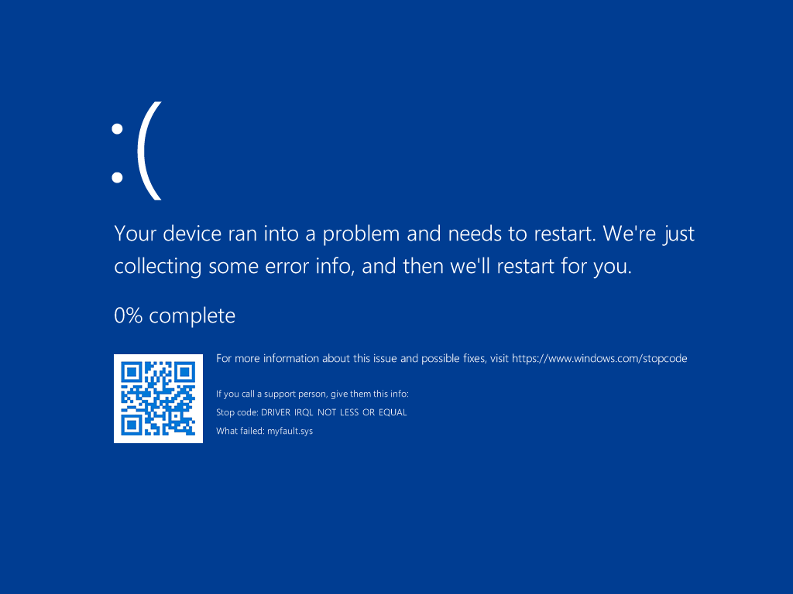
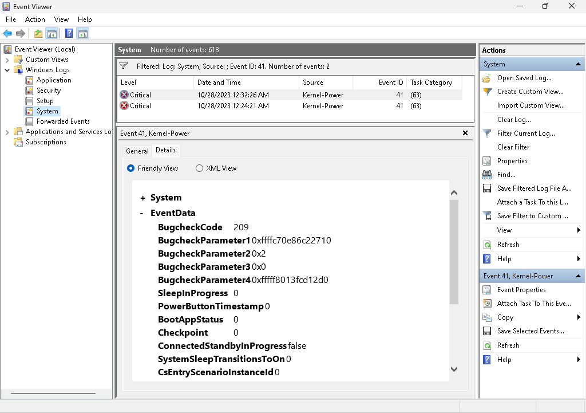
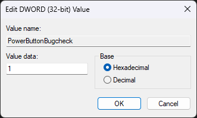
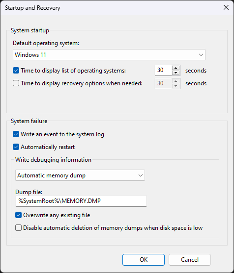
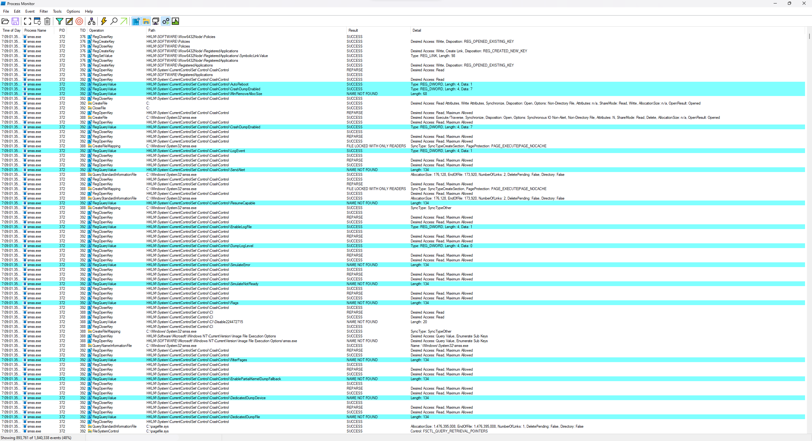
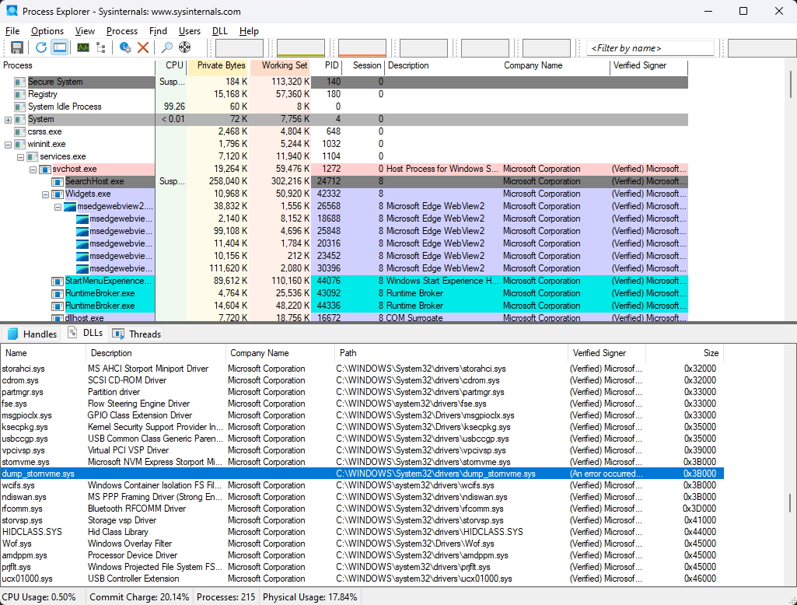

# 블루스크린


[블루스크린](https://ko.wikipedia.org/wiki/블루스크린), 일명 BSOD(Blue Screen of Death; 죽음의 파란 화면)는 시스템을 망가뜨릴 수 있는 손상이 가해지는 것을 방지하기 위한 파란색 ([윈도우 참가자 프로그램](https://support.microsoft.com/en-us/windows/windows-참가자-프로그램에-참여하기-ef20bb3d-40f4-20cc-ba3c-a72c844b563c)일 경우 초록색) 화면이며, 블루스크린 원인을 알려주는 [버그 검사 코드](#버그-검사-코드)를 표시하고 분석에 필요한 [메모리 덤프](Dump.md#커널-모드-덤프) 파일을 생성한다. 시스템은 아래의 사유가 발생하면 블루스크린이 나타난다.

> 윈도우 부팅 시 나타나는 또 다른 파란색 오류 화면인 "[복구 모드](WinRE.md#복구-모드)"는 BSOD와 전혀 다른 증상이므로 혼돈하지 않도록 유의한다.

* **시스템 충돌**: 운영체제 커널상 처리되지 않은 [오류](https://ko.wikipedia.org/wiki/예외_처리), 일명 커널 모드 충돌이다 (예시. [0x19 BAD_POOL_HEADER](https://learn.microsoft.com/en-us/windows-hardware/drivers/debugger/bug-check-0x19--bad-pool-header)).
* **유효하지 않은 동작**: 운영체제가 본래 설계에 벗어난 동작을 하였을 때, 복구가 불가하다고 판정되면 커널 초기화를 명분으로 발생한다 (예시. [0x133 DPC_WATCHDOG_VIOLATION](https://learn.microsoft.com/en-us/windows-hardware/drivers/debugger/bug-check-0x133-dpc-watchdog-violation)).

## 버그 검사 코드
버그 검사 코드(bug check code) 혹은 중지코드(stop code)는 블루스크린이 발생한 원인을 설명하는 [십육진수](https://ko.wikipedia.org/wiki/십육진법)의 운영체제 오류 번호이다. [`KeBugCheckEx()`](https://learn.microsoft.com/en-us/windows-hardware/drivers/ddi/wdm/nf-wdm-kebugcheckex) 함수에서 중지코드를 전달받는 첫 번째 매개변수의 명칭인 `BugCheckCode`에서 유래되었다. 해당 함수는 네 개의 추가 매개변수들이 있어 증상의 유형이나 문제가 발생한 [메모리 주소](C.md#포인터) 등의 구체적인 정보를 제공한다.

시스템에 발생한 BSOD 이력과 중지코드를 확인하려면 [이벤트 뷰어](https://ko.wikipedia.org/wiki/이벤트_뷰어)의 시스템 이벤트 로그에서 Kernel-Power 41을 살펴보도록 한다.

> 중지코드를 알려주는 BugcheckCode의 값은 십진수이기 때문에 십육진수로 변환이 필요하다: 0n209 =  [0xD1 DRIVER_IRQL_NOT_LESS_OR_EQUAL](https://learn.microsoft.com/en-us/windows-hardware/drivers/debugger/bug-check-0xd1--driver-irql-not-less-or-equal)



## 강제 시스템 충돌
간혹 시스템이 아무런 반응이 없는 [프리징](https://ko.wikipedia.org/wiki/프리징_(컴퓨팅)) 상태에 걸리면, 해당 증상의 원인 분석에 필요한 덤프 파일을 생성하기 위해 블루스크린이 강요된다. 다음은 블루스크린을 강제로 발생기키는 방법을 소개한다.

* **[NMI](https://en.wikipedia.org/wiki/Non-maskable_interrupt)**

    가장 최우선적으로 처리되어 시스템이 절대 무시할 수 없는 [인터럽트](Processor.md#인터럽트) 신호이다. 흔히 서버용 PC는 NMI 버튼이 존재하여, 누를 시 중지코드 [0x80 NMI_HARDWARE_FAILURE](https://learn.microsoft.com/en-us/windows-hardware/drivers/debugger/bug-check-0x80--nmi-hardware-failure)가 발생한다. 블루스크린을 일으키기에 가장 확실한 방법이지만, 일반적으로 [PowerEdge R720](https://www.dell.com/support/manuals/ko-kr/poweredge-r720/720720xdom-v3/전면-패널-구조-및-표시등?guid=guid-23ecb1eb-0086-4839-80a9-9f5f3e679dbf)과 같은 서버용 컴퓨터에서 트러블슈팅 용도로 존재한다.

    * **[`Debug-VM`](https://learn.microsoft.com/en-us/powershell/module/hyper-v/debug-vm)**

        [PowerShell](PowerShell.md) [명령어](PowerShell.md#cmdlet)로 마이크로소프트에서 개발한 [하이퍼바이저](https://ko.wikipedia.org/wiki/하이퍼바이저), 즉 [하이퍼-V](https://ko.wikipedia.org/wiki/하이퍼-V) 가상 머신에 NMI 신호를 전송하여 블루스크린을 유발할 수 있다. 관리자 권한으로 실행되어야 하며, 가상 머신의 이름은 [`Get-VM`](https://learn.microsoft.com/en-us/powershell/module/hyper-v/get-vm) 명령어로 식별할 수 있다.
    
        ```powershell
        Debug-VM -Name "<VM name>" -InjectNonMaskableInterrupt
        ```

    * **[대역 외 관리](https://en.wikipedia.org/wiki/Out-of-band_management)**

        일명 OOBM(Out-of-band management)은 네트워크 인프라구조를 구성하는 장비들을 원격으로 접근하고 관리할 수 있도록 하는 솔루션이다. 흔히 서버 장비들을 대상으로 사용되며, NMI 신호 주입 외에도 CPU 및 메모리 사용량 모니터링 등을 제공한다. 대표적으로 [HP](https://ko.wikipedia.org/wiki/휴렛_팩커드_엔터프라이즈)의 [iLO](https://en.wikipedia.org/wiki/HP_Integrated_Lights-Out), [Dell](https://ko.wikipedia.org/wiki/델)의  [iDRAC](https://en.wikipedia.org/wiki/Dell_DRAC), [Lenovo](https://ko.wikipedia.org/wiki/레노버)의 [XClarity Controller](https://www.lenovo.com/kr/ko/data-center/software/systems-management/xclarity-controller/) 등이 있다.

* **[키보드](https://learn.microsoft.com/en-us/windows-hardware/drivers/debugger/forcing-a-system-crash-from-the-keyboard)**

    키보드로부터 커널에 `KeBugCheck()` 루틴을 호출하므로써 윈도우 운영체제에 [0xE2 MANUALLY_INITIATED_CRASH](https://learn.microsoft.com/en-us/windows-hardware/drivers/debugger/bug-check-0xe2--manually-initiated-crash)를 발생시키는 방법이다. [PS/2](https://ko.wikipedia.org/wiki/PS/2_단자) 혹은 [USB](https://ko.wikipedia.org/wiki/USB) 키보드를 사용할 수 있으나, [IRQL](Processor.md#IRQL)이 상대적으로 높은 PS/2 키보드를 사용하는 걸 권장한다. 강제 블루스크린을 설정하는 방법은 아래의 둘 중 오로지 하나만이 적용되며 재부팅이 요구된다.

    1. **`CTRL`+`SCROLL` 단축키**

        우측 `CTRL`를 누르는 동시에 `SCROLL LOCK` 키를 두 번 클릭하여 시스템 충돌을 발생시키려면 사용하고 있는 키보드에 따라 지정된 레지스트리 키로 이동한 다음, 아래와 같이 `CrashOnCtrlScroll`이란 새로운 DWORD (32-bit) 레지스트리 값을 생성한다.

        <table style="width: 80%; margin-left: auto; margin-right: auto;"><caption style="caption-side: top;"><code>CTRL</code>+<code>SCROLL</code> 단축키 강제 블루스크린 설정</caption><colgroup><col style="width: 20%;"/><col style="width: 80%;"/></colgroup><thead><tr><th style="text-align: center;">키보드</th><th style="text-align: center;">레지스트리 키</th></tr></thead><tbody><tr><td style="text-align: center;">PS/2</td><td><code>HKLM\SYSTEM\CurrentControlSet\Services\i8042prt\Parameters</code></td></tr><tr><td style="text-align: center;">USB</td><td><code>HKLM\SYSTEM\CurrentControlSet\Services\kbdhid\Parameters</code></td></tr><tr><td style="text-align: center;">가상 머신</td><td><code>HKLM\SYSTEM\CurrentControlSet\Services\hyperkbd\Parameters</code></td></tr></tbody></table>

        

    2. **대안 키보드 단축키**

        현재 대부분의 키보드는 `SCROLL LOCK` 키가 없어 블루스크린을 강제할 대안의 단축키가 필요하다. 만일 `CrashOnCtrlScroll` 레지스트리 값이 이미 존재하면 대안 단축키가 인식되지 않으므로 삭제하도록 한다. 사용하고 있는 키보드에 따라 아래 레지스트리 키로 이동한 다음, 아래와 같이 두 DWORD (32-bit) 레지스트리 값을 생성한다.

        <table style="width: 80%; margin-left: auto; margin-right: auto;"><caption style="caption-side: top;">대안 키보드 단축키 강제 블루스크린 설정</caption><colgroup><col style="width: 20%;"/><col style="width: 80%;"/></colgroup><thead><tr><th style="text-align: center;">키보드</th><th style="text-align: center;">레지스트리 키</th></tr></thead><tbody><tr><td style="text-align: center;">PS/2</td><td><code>HKLM\SYSTEM\CurrentControlSet\Services\i8042prt\crashdump</code></td></tr><tr><td style="text-align: center;">USB</td><td><code>HKLM\SYSTEM\CurrentControlSet\Services\kbdhid\crashdump</code></td></tr><tr><td style="text-align: center;">가상 머신</td><td><code>HKLM\SYSTEM\CurrentControlSet\Services\hyperkbd\crashdump</code></td></tr></tbody></table>

        * `Dump1Keys`: 첫 번째 단축키 조합으로 좌측/우측 `SHIFT`, `CTRL`, 혹은 `ALT` 키 중 택한다.
        * `Dump2Key`: 두 번째 단축키 조합으로 두 번 클릭할 버튼을 지정한다. 레지스트리 값에 들어갈 데이터로 배열에 기입된 키보드 스캔 코드의 인덱스를 입력한다.

            ```c
            const UCHAR keyToScanTbl[134] = {
                0x00,0x29,0x02,0x03,0x04,0x05,0x06,0x07,0x08,0x09,
                0x0A,0x0B,0x0C,0x0D,0x7D,0x0E,0x0F,0x10,0x11,0x12,
                0x13,0x14,0x15,0x16,0x17,0x18,0x19,0x1A,0x1B,0x00,
                0x3A,0x1E,0x1F,0x20,0x21,0x22,0x23,0x24,0x25,0x26,
                0x27,0x28,0x2B,0x1C,0x2A,0x00,0x2C,0x2D,0x2E,0x2F,
                0x30,0x31,0x32,0x33,0x34,0x35,0x73,0x36,0x1D,0x00,
                0x38,0x39,0xB8,0x00,0x9D,0x00,0x00,0x00,0x00,0x00,
                0x00,0x00,0x00,0x00,0x00,0xD2,0xD3,0x00,0x00,0xCB,
                0xC7,0xCF,0x00,0xC8,0xD0,0xC9,0xD1,0x00,0x00,0xCD,
                0x45,0x47,0x4B,0x4F,0x00,0xB5,0x48,0x4C,0x50,0x52,
                0x37,0x49,0x4D,0x51,0x53,0x4A,0x4E,0x00,0x9C,0x00,
                0x01,0x00,0x3B,0x3C,0x3D,0x3E,0x3F,0x40,0x41,0x42,
                0x43,0x44,0x57,0x58,0x00,0x46,0x00,0x00,0x00,0x00,
                0x00,0x7B,0x79,0x70 };
            ```

* **[전원 버튼](https://learn.microsoft.com/en-us/windows-hardware/drivers/debugger/forcing-a-system-crash-with-the-power-button)**

    전원 버튼을 7초 동안 누르고 있으면 [0x1C8 MANUALLY_INITIATED_POWER_BUTTON_HOLD](https://learn.microsoft.com/en-us/windows-hardware/drivers/debugger/bug-check-0x1c8--manually-initiated-power-button-hold)가 반환된다 (하지만 10초 이상 누르면 [UEFI](Boot.md#uefi) 재설정이 되므로 그 전에 전원 버튼에 손을 떼도록 한다). 전원 버튼으로 블루스크린을 발생키려면 반드시 하드웨어, 펌웨어, 그리고 운영체제 요건이 충족되어야 한다:

    1. [GPIO](https://ko.wikipedia.org/wiki/GPIO) 기반의 전원 버튼
    2. 전원 이벤트를 Windows Power Manager로 전달하는 펌웨어
    3. [윈도우 10](https://ko.wikipedia.org/wiki/윈도우_10) ([버전 1809](https://ko.wikipedia.org/wiki/윈도우_10#레드스톤_5)) 혹은 [윈도우 서버 2019](https://ko.wikipedia.org/wiki/윈도우_서버_2019) 이상의 운영체제

    위의 요건을 모두 충족한다면 아래의 레지스트리 키로 이동하여 `PowerButtonBugcheck`이란 새로운 DWORD (32-bit) 값을 생성한다. 해당 레지스트리 값을 새로 생성해야 한다면 재부팅이 필요할 수 있다.
    
    ```terminal
    HKLM\SYSTEM\CurrentControlSet\Control\Power
    ```

    

* **[WinDbg](https://learn.microsoft.com/en-us/windows-hardware/drivers/debugger/forcing-a-system-crash-from-the-debugger)**

    [WinDbg](WinDbg.md)는 윈도우 운영체제를 [디버깅](https://ko.wikipedia.org/wiki/디버그)하는 프로그램으로 커널 모드에서 [`.crash`](https://learn.microsoft.com/en-us/windows-hardware/drivers/debugger/-crash--force-system-crash-) 명령어를 입력하여 시스템 강제 충돌을 일으킬 수 있다. `KeBugCheck()` 루틴으로부터 [0xE2 MANUALLY_INITIATED_CRASH](https://learn.microsoft.com/en-us/windows-hardware/drivers/debugger/bug-check-0xe2--manually-initiated-crash)가 반환되는데, 만일 시스템 충돌이 발생하지 않으면 중단점 탈출을 시도한다.

* **[NotMyFault](NotMyFault.md)**

    [Sysinternals](Sysinternals.md) 유틸리티 중에서 몇 가지 방식으로 시스템 충돌을 일으킬 수 있는 프로그램이다. 비록 시스템 응답이 없는 상태에서 적합하지 않으나, 일반적인 상황에서 BSOD를 일으킬 때는 유용하다.

# BSOD 설정
[BSOD](#블루스크린)가 발생하면 시스템은 기본적으로 [자동 메모리 덤프](Dump.md#자동-메모리-덤프)(혹은 [커널 메모리 덤프](Dump.md#커널-메모리-덤프))를 생성하고 재부팅한다. 하지만 상황에 따라 덤프 유형이나 BSOD 동작을 달리 설정해야 하는 경우가 존재한다. 아래 레지스트리 키에서 덤프를 설정할 수 있으며 변경 사항을 적용하려면 반드시 재부팅이 필요하다.

```terminal
HKLM\SYSTEM\CurrentControlSet\Control\CrashControl
```

CrashControl 레지스트리 키에서 설정할 수 있는 값들은 알파벳 순서대로 나열하였다:

<table style="width: 95%; margin-left: auto; margin-right: auto;">
<caption style="caption-side: top;">CrashControl 레지스트리 키 구성</caption>
<colgroup><col style="width: 25%;"/><col style="width: 15%;"/><col style="width: 60%;"/></colgroup>
<thead><tr><th style="text-align: center;">레지스트리 값</th><th style="text-align: center;">종류</th><th style="text-align: center;">설명</th></tr></thead>
<tbody><tr><td><code>AlwaysKeepMemoryDump</code></td><td style="text-align: center;">REG_DWORD</td><td>드라이브 여유 공간이 25 GB 미만이어도 메모리 덤프를 유지한다(반면, 삭제될 시 이벤트 ID 1008 기록).<br/><ul><li>0x0: 비활성</li><li>0x1: 활성</li></ul></td></tr>
<tr><td><code>AutoReboot</code></td><td style="text-align: center;">REG_DWORD</td><td>덤프 수집이 100% 완료되면 시스템 재부팅을 자동으로 실행한다.<br/><ul><li>0x0: 비활성</li><li>0x1: 활성</li></ul></td></tr><tr><td><code>CrashDumpEnabled</code></td><td style="text-align: center;">REG_DWORD</td><td>메모리 덤프 유형을 선택한다.<br/><ul><li>0x0: (없음)</li><li>0x1: <a href="Dump.md#전체-메모리-덤프">전체 메모리 덤프</a> <i>혹은</i> <a href="Dump.md#활성-메모리-덤프">활성 메모리 덤프</a></li><li>0x2: <a href="Dump.md#커널-메모리-덤프">커널 메모리 덤프</a></li><li>0x3: <a href="Dump.md#작은-메모리-덤프">작은 메모리 덤프</a></li><li>0x7: <a href="Dump.md#자동-메모리-덤프">자동 메모리 덤프</a></li></ul></td></tr><tr><td><code>DisableEmoticon</code></td><td style="text-align: center;">REG_DWORD</td><td>BSOD에서 <code>:(</code> 이모티콘을 표시하지 않는다.<br/><ul><li>0x0: 비활성</li><li>0x1: 활성</li></ul></td></tr><tr><td><code>DisplayParameters</code></td><td style="text-align: center;">REG_DWORD</td><td>BSOD 좌측 상단에 네 개의 <code>KeBugcheckEx()</code> 매개변수를 표시한다.<br/><ul><li>0x0: 비활성</li><li>0x1: 활성</li></ul></td></tr><tr><td><code>DumpFile</code></td><td style="text-align: center;">REG_EXPAND_SZ</td><td>메모리 덤프 파일의 경로 및 이름을 지정한다(기본값: <code>%SystemRoot%\MEMORY.DMP</code>).</td></tr><tr><td><code>DumpFilters</code></td><td style="text-align: center;">REG_MULTI_SZ</td><td>페이징 파일로 덤프를 수집하기 위해 필요한 필터 드라이버의 목록이다.<br/><ul><li><code>dumpfve.sys</code>: BitLocker Drive Encryption Crashdump Filter Driver</li></ul></td></tr><tr><td><code>DumpLogLevel</code></td><td style="text-align: center;">REG_DWORD</td><td><a href="#덤프-로그">DumpStack.log</a> 활성 시, 덤프 수집에 대한 성능 수치를 함께 기록한다.<br/><ul><li>0x0: 비활성</li><li>0x1: 활성</li></ul></td></tr><tr><td><code>EnableLogFile</code></td><td style="text-align: center;">REG_DWORD</td><td>덤프 수집 과정에서 <a href="#덤프-로그">DumpStack.log</a> 로그 파일을 생성한다.<br/><ul><li>0x0: 비활성</li><li>0x1: 활성</li></ul></td></tr><tr><td><code>FilterPages</code></td><td style="text-align: center;">REG_DWORD</td><td>트러블슈팅에 불필요한 페이지를 메모리 덤프에서 제외시킨다.<br/><ul><li>0x0: 비활성</li><li>0x1: 활성 (<a href="Dump.md#활성-메모리-덤프">활성 메모리 덤프</a>를 위한 필요 조건)</li></ul></td></tr><tr><td><code>LogEvent</code></td><td style="text-align: center;">REG_DWORD</td><td>BSOD가 발생하면 이벤트 ID 1001 BugCheck를 기록한다.<br/><ul><li>0x0: 비활성</li><li>0x1: 활성</li></ul></td></tr><tr><td><code>MinidumpDir</code></td><td style="text-align: center;">REG_EXPAND_SZ</td><td>작은 메모리 덤프를 저장할 경로를 지정한다(기본값: <code>%SystemRoot%\Minidump</code>)</td></tr><tr><td><code>MinidumpsCount</code></td><td style="text-align: center;">REG_DWORD</td><td>지정된 경로에 저장될 수 있는 작은 메모리 덤프의 최대 개수이다.</td></tr><tr><td><s><code>NMICrashDump</code></s></td><td style="text-align: center;"><s>REG_DWORD</s></td><td>(<a href="https://learn.microsoft.com/en-us/troubleshoot/windows-client/performance/nmi-hardware-failure-error">Deprecated</a>) <s><a href="https://en.wikipedia.org/wiki/Non-maskable_interrupt">NMI</a> 신호를 주입하여 BSOD를 일으킬 수 있도록 한다.</s><br/><ul><li><i>윈도우 8 및 서버 2012부터 해당 값은 필요하지 않으며 아무런 영향을 주지 않는다.</i></li></ul></td></tr><tr><td><code>Overwrite</code></td><td style="text-align: center;">REG_DWORD</td><td>기존의 메모리 덤프를 덮어씌운다.<br/><ul><li>0x0: 비활성</li><li>0x1: 활성</li></ul></td></tr><tr><td><code>PageFileTooSmall</code></td><td style="text-align: center;">REG_QWORD</td><td>페이징 파일 크기 부족으로 덤프 수집을 실패할 시 생성된다. 이를 토대로 재부팅이 되면 덤프 수집에 필요한 크기만큼 페이징 파일을 확장시켜 4주간 유지한다.</td></tr></tbody>
</table>

CrashControl 레지스트리 키의 값들은 아래 "시작 및 복구(Startup and Recovery)" GUI 창에서도 변경이 가능하지만, 레지스트리 편집기에 비해 설정할 수 있는 항목들이 제한적이다. 해당 창을 열려면 View advanced system settings을 검색(혹은 `systempropertiesadvanced.exe` 실행)하여 찾을 수 있다.



### 덤프 로그
DumpStack.log 파일은 덤프가 수집되는 과정을 로그로 기록한 파일이며, 페이징 파일이 위치한 드라이브에 생성된다. 다음은 CrashControl의 `EnableLogFile` 값을 활성화하였을 때 기록된 DumpStack.log 내용의 일부를 보여준다.

```
DLOGFILE00010000DUMPù!          
Dump stack initialized at UTC: 2023/05/22 05:16:03, local time: 2023/05/21 22:16:03.
#BugCheckCode 0x00000000000000D1
#BugCheckP1 0xFFFFC4899E155720
#BugCheckP2 0x0000000000000002
#BugCheckP3 0x0000000000000000
#BugCheckP4 0xFFFFF803999612D0
Progress 0x00000042
Elapsed BugCheck duration 00005252ms
Starting get secondary dump callbacks size.
Progress 0x00000052
Finish get secondary dump callbacks size.
Dump Type: 5, Total Dump Size: 4293943782, Secondary Dump Size: 127462.
Starting write of dump header.
Finish write of dump header.
Starting write of full bitmap dump header.
Finish write of bitmap dump header.
Starting write of memory dump data.
Elapsed BugCheck duration 00005274ms
Dumping physical memory to disk:  0% 
Dumping physical memory to disk:  5% 
Dumping physical memory to disk:  10% 
Dumping physical memory to disk:  15% 
Dumping physical memory to disk:  20% 
Dumping physical memory to disk:  25% 
Dumping physical memory to disk:  30% 
Dumping physical memory to disk:  35% 
Dumping physical memory to disk:  40% 
Dumping physical memory to disk:  45% 
Dumping physical memory to disk:  50% 
Dumping physical memory to disk:  55% 
Dumping physical memory to disk:  60% 
Dumping physical memory to disk:  65% 
Dumping physical memory to disk:  70% 
Dumping physical memory to disk:  75% 
Dumping physical memory to disk:  80% 
Dumping physical memory to disk:  85% 
Dumping physical memory to disk:  90% 
Dumping physical memory to disk:  95% 
Dumping physical memory to disk:  100% 
Finish write of bitmap dump data. Total pages:1048259 Pages written:1048259
Dump ended at UTC: 2023/05/22 05:16:03, local time: 2023/05/21 22:16:03.
Elapsed BugCheck duration 00053316ms
Dump completed successfully.
```

만일 `DumpLogLevel` 값도 함께 활성화 되었을 시, 덤프 수집 진행률 외에 저장된 페이지 및 초당 MB 수치가 구체적으로 기록된다.

```
Dumping physical memory to disk:  0% 
WriteBitmapDump: page written = 52505, MB per sec = 41.
```

## 페이징 파일
> *참고: [How to determine the appropriate page file size for 64-bit versions of Windows - Windows Client | Microsoft Learn](https://learn.microsoft.com/en-us/troubleshoot/windows-client/performance/how-to-determine-the-appropriate-page-file-size-for-64-bit-versions-of-windows)*

[페이징 파일](Memory.md#페이징-파일)(paging file)은 HDD나 SSD와 같은 디스크 저장공간에 상주하여 물리 메모리를 보조하며, BSOD가 발생할 덤프를 저장하는 공간으로도 활용된다. 즉, 페이징 파일에 충분한 공간이 확보되지 않을 경우에 덤프 수집이 실패할 수 있다. 페이징 파일이 크게 설정할 수 있으나 그만큼 저장공간의 여유가 줄어드는 점에 유의해야 하기 때문에, 아래는 필자가 각 덤프 종류마다 추천하는 페이징 파일 크기이다.

* **[전체 메모리 덤프](Dump.md#전체-메모리-덤프)**: RAM 크기 + 257 MB  (잠재적 [보조 덤프 정보](Dump.md#보조-덤프-정보) & 덤프 헤더 고려) 이상
* **[커널](Dump.md#커널-메모리-덤프), [활성](Dump.md#활성-메모리-덤프), [작은](Dump.md#작은-메모리-덤프), 그리고 [자동 메모리 덤프](Dump.md#자동-메모리-덤프)**: 시스템이 관리하는 크기

아래 레지스트리 키에서 페이징 파일 크기를 설정할 수 있으며 변경 사항을 적용하려면 반드시 재부팅이 필요하다.

```terminal
HKLM\SYSTEM\CurrentControlSet\Control\Session Manager\Memory Management
```

Memory Management 레지스트리 키에서 설정할 수 있는 값들은 알파벳 순서대로 나열하였다:

<table style="width: 95%; margin-left: auto; margin-right: auto;">
<caption style="caption-side: top;">Memory Management 레지스트리 키 구성</caption>
<colgroup><col style="width: 25%;"/><col style="width: 15%;"/><col style="width: 60%;"/></colgroup>
<thead><tr><th style="text-align: center;">레지스트리 값</th><th style="text-align: center;">종류</th><th style="text-align: center;">설명</th></tr></thead>
<tbody><tr><td><code>ExistingPageFiles</code></td><td style="text-align: center;">REG_MULTI_SZ</td><td>[변경 금지] 덤프 헤더 파일을 찾기 위해 살펴볼 마지막 부팅 당시에 등록된 페이징 파일이 나열되어 있다. 시스템 내부 동작을 위한 레지스트리 값이다.</td></tr><tr><td><code>PagingFiles</code></td><td style="text-align: center;">REG_MULTI_SZ</td><td>설정된 페이징 파일이 다음 부팅 때 세션 관리자에 의해 반영된다.<br/><ul><li><code>?:\pagefile.sys</code>: OS 드라이브에만 "시스템이 관리하는 크기"로 설정</li><li><code>C:\pagefile.sys 2048 4096</code>: C 드라이브에 최초 2 GB, 최대 4 GB 설정</li><li><code>D:\pagefile.sys 0 0</code>: D 드라이브에 "시스템이 관리하는 크기"로 설정</li></ul></td></tr></tbody>
</table>

## 전용 덤프
전용 덤프(dedicated dump)는 가상 메모리로 사용이 불가한, 오로지 덤프 수집만을 위해 존재하는 페이징 파일을 가리킨다. 윈도우 7 이전까지만 해도 OS 드라이브에 용량이 부족할 시, 타 드라이브에 메모리 덤프를 수집하려면 전용 덤프가 유일한 방법이었다. 비록 전용 덤프의 활용도가 축소되었으나, 아래의 두 가지 특징을 지닌다.

1. 페이징 파일이 존재하여도 메모리 덤프를 수집할 때에는 전용 덤프가 사용된다.
2. 전용 덤프를 구성할 디스크 용량이 부족하면 아예 반영이 되지 않는다.

다음은 전용 덤프를 설정하기 위해 필요한 레지스트리 값이다.

<table style="width: 95%; margin-left: auto; margin-right: auto;">
<caption style="caption-side: top;">CrashControl 레지스트리: 전용 덤프</caption>
<colgroup><col style="width: 25%;"/><col style="width: 15%;"/><col style="width: 60%;"/></colgroup>
<thead><tr><th style="text-align: center;">레지스트리 값</th><th style="text-align: center;">종류</th><th style="text-align: center;">설명</th></tr></thead>
<tbody><tr><td><code>DedicatedDumpFile</code></td><td style="text-align: center;">REG_SZ</td><td>덤프 전용의 페이징 파일 경로 및 이름을 지정한다.</td></tr><tr><td><code>DumpFileSize</code></td><td style="text-align: center;">REG_DWORD</td><td>덤프 전용의 페이징 파일 크기를 <a href="https://ko.wikipedia.org/wiki/메가바이트">MB</a> 단위로 지정한다.<br/><ul><li>0x0: 시스템이 관리하는 크기 (기본값)</li></ul></td></tr></tbody>
</table>

단, 저장될 덤프 파일의 경로 및 이름은 `DumpFile` 레지스트리 값을 그대로 사용한다.

# BSOD 원리
본 내용은 [윈도우](Windows.md) [OS](https://ko.wikipedia.org/wiki/운영체제)에서 [BSOD](#블루스크린)가 나타나 [메모리 덤프](Dump.md#커널-모드-덤프)가 생성되는 원리를 세 가진 단계로 나누어 설명한다. 자세한 내용은 [Mark Russinovich](https://ko.wikipedia.org/wiki/마크_러시노비치)([Sysinternals](Sysinternals.md) 공동 창시자)를 포함한 [마이크로소프트](https://www.microsoft.com/) 엔지니어들이 저자로 참여한 [*Windows Internals*](https://learn.microsoft.com/en-us/sysinternals/resources/windows-internals) 도서를 읽어볼 것을 권장한다.

1. **[설정 초기화](#설정-초기화)**: 부팅 시 덤프를 수집할 수 있도록 [CrashControl](#bsod-설정)에 설정된 항목들을 시스템에 적용하는 단계
1. **[시스템 충돌](#시스템-충돌)**: 시스템 충돌이 발생할 때 RAM에 담겨진 데이터를 [페이징 파일](#페이징-파일)로 수집하는 단계
1. **[덤프 생성](#덤프-생성)**: 충돌 이후 재부팅 과정에서 페이징 파일을 .dmp [덤프 파일](Dump.md#커널-모드-덤프)로 변환하는 단계

## 설정 초기화
[세션 관리자](Process.md#세션-관리자)(smss.exe)는 시스템이 부팅되는 시점에 [입출력 관리자](Kernel.md#입출력-관리자)를 통해 [CrashControl](#bsod-설정) 레지스트리 키의 값들을 읽는다. 이들을 토대로 BSOD가 발생할 경우 어떠한 동작을 취할 것인지, 덤프는 어떻게 수집할 것인지 등의 설정을 시스템에 적용한다. 다른 의미로 해석하자면 CrashControl 레지스트리 키의 변경 사항을 시스템에 적용하려면 반드시 재부팅을 해야 한다.

아래는 [프로세스 모니터](Procmon.md)로 수집된 시스템 부팅 과정에서 smss.exe가 CrashControl의 값들을 탐색하는 작업을 보여준다.



* Smss.exe가 CrashControl 레지스트리 키의 값들을 RegQueryValue 작업으로 BSOD 관련 설정들을 살펴보는 걸 확인할 수 있다. 이후 smss.exe는 [Memory Management](#페이징-파일) 레지스트리 키의 `PagingFiles` 값을 토대로 페이징 파일을 생성한다.

시스템 충돌 시 덤프를 디스크에 저장하기 위해 필요한 스토리지 포트 및 미니포트 드라이버를 smss.exe가 메모리상 복제하여 `dump_` 접두사를 붙여 명명한다. 아래는 [프로세스 탐색기](Procexp.md)로부터 [stornvme.sys](https://ko.wikipedia.org/wiki/NVM_익스프레스)를 덤프 전용의 미니포트 드라이버로 활용하기 위해 [복제](https://devblogs.microsoft.com/oldnewthing/20160913-00/?p=94305)한 dump_stornvme.sys의 존재를 확인한다.

> 스토리지 포트 드라이버를 대신해, 커널은 [diskdump.sys](https://learn.microsoft.com/en-us/windows-hardware/drivers/storage/restrictions-on-miniport-drivers-that-manage-the-boot-drive) 드라이버를 호출하여 파일 시스템을 우회하고 직접 디스크 입출력에 관여할 수 있다.



* 드라이버 파일이 복사되어 로드된 게 아니므로 예시의 dump_stornvme.sys 드라이버는 파일로 존재하지 않고 단순히 메타데이터만 표시된 것이다. 스토리지 관련 드라이버에 문제가 발생한 경우에 혹여나 가해지는 손상을 방지하기 위한 조치이며, 시스템 충돌이 발생할 때에만 로드된다.

## 시스템 충돌
시스템 내부적으로 오류나 문제가 발생하면 [`KeBugCheckEx()`](https://learn.microsoft.com/en-us/windows-hardware/drivers/ddi/wdm/nf-wdm-kebugcheckex) 루틴이 호출되고 파란색 화면이 나타나며 모든 작업이 중지된다. 당시 [물리 메모리](Memory.md)에 들어있는 데이터를 디스크의 페이징 파일로 옮기는, 즉 덤핑(dumping)을 진행하는데 일반적인 파일 입출력과 다른 스토리지 스택을 거쳐 저장한다. 화면에 나타난 백분율(%)이 바로 얼마나 덤핑 진행률을 나타낸다.


<table style="width: 60%; margin-left: auto; margin-right: auto;"><caption style="caption-side: top;">파일 시스템과 충돌 덤프의 I/O <a href="https://learn.microsoft.com/en-us/windows-hardware/drivers/gettingstarted/driver-stacks">드라이버 스택</a></caption><colgroup><col style="width: 50%;" /><col style="width: 50%;" /></colgroup><thead><tr><th style="text-align: center;">파일 시스템</th><th style="text-align: center;">충돌 덤프</th></tr></thead><tbody style="text-align: center;"><tr style="vertical-align: bottom;"><td><a href="https://ko.wikipedia.org/wiki/파일_시스템">파일 시스템</a> <br/>↓<br/><a href="https://ko.wikipedia.org/wiki/볼륨_(컴퓨팅)">볼륨</a>/<a href="https://ko.wikipedia.org/wiki/디스크_파티션">파티션</a><br/>↓<br/><a href="https://en.wikipedia.org/wiki/Class_driver">클래스 드라이버</a><br/>↓</td><td>커널<br/>↓<br/>Crashdmp.sys<br/>(w/ 덤프 필터 드라이버)<br/>↓</td></tr><tr><td colspan="2">스토리지 포트 & 미니포트<br/>↓<br/>하드웨어 (저장소)</td></tr></tbody></table>

[NTFS](https://ko.wikipedia.org/wiki/NTFS) 또는 [볼륨](https://ko.wikipedia.org/wiki/볼륨_(컴퓨팅))/[파티션](https://ko.wikipedia.org/wiki/디스크_파티션) 드라이버에 문제가 있을 수 있어, 충돌 덤프 드라이버(Crashdmp.sys)는 이들을 우회하여 직접 디스크의 [페이징 파일](#페이징-파일)에 덤프를 저장한다.

* 반면, 페이징 파일을 지원하지 않는 [NFS](https://learn.microsoft.com/en-us/windows-server/storage/nfs/nfs-overview) 및 [ReFS](https://learn.microsoft.com/en-us/windows-server/storage/refs/refs-overview) 등의 [파일 시스템](https://ko.wikipedia.org/wiki/파일_시스템), 그리고 [UWF](https://learn.microsoft.com/en-us/windows/iot/iot-enterprise/customize/unified-write-filter)로 보호된 볼륨에는 BSOD로 인한 메모리 덤프 수집이 불가하다.

파일 입출력 스택에 개입되었던 [필터 드라이버](Driver.md)가 덤프 수집에 누락되면 디스크에 저장할 수 없기 때문에, 이를 보완하기 위해 [덤프 필터 드라이버](https://learn.microsoft.com/en-us/windows-hardware/drivers/storage/crash-dump-filter-drivers)가 도입되었으며 CrashControl 레지스트리 키의 `DumpFilters` 값에 기입된다. 만일 진행률이 0%로 머물러 있다면 덤프 필터 드라이버를 살펴보는 것을 권장한다.

> [BitLocker](https://ko.wikipedia.org/wiki/비트로커)의 필터 드라이버와 덤프 필터 드라이버는 각각 fvevol.sys 그리고 dumpfve.sys이다.

BSOD 화면에서 덤프 수집이 100% 완료되었으면 시스템을 강제 종료하여도 된다. 다만, 현 시점에서 분석에 사용되는 .dmp 덤프 파일이 아직 존재하지 않는다.

## 덤프 생성
[시스템 충돌](#시스템-충돌) 이후 재부팅이 될 때 smss.exe는 [Memory Management](#페이징-파일) 레지스트리 키의 `ExistingPageFiles`에 나열된 페이징 파일들을 확인한다. 만일 헤더 정보에 `PAGEDUMP`(혹은 `PAGEDU64`)가 기입된 페이징 파일이 발견되면 덤핑에 사용된 것으로 인식한다. Smss.exe는 덤프를 저장하기에 여유 공간이 충분한지 [볼륨 정보를 확인](https://learn.microsoft.com/en-us/windows-hardware/drivers/ddi/ntddk/nf-ntddk-zwqueryvolumeinformationfile)한 다음, 페이징 파일을 헤더에 기록된 덤프 파일의 크기만큼 축소시킨다.

[CrashControl](#bsod-설정) 레지스트리 키에 설정된 덤프 저장 경로와 덤핑에 사용된 페이징 파일이 동일한 볼륨에 위치한지 여부에 따라 덤프 생성 절차가 달라진다.

<table style="width: 95%; margin-left: auto; margin-right: auto;"><caption style="caption-side: top;">볼륨 일치 여부에 따른 덤프 생성 절차 비교</caption><colgroup><col style="width: 50%;" /><col style="width: 50%;" /></colgroup><thead><tr><th style="text-align: center;">볼륨 일치</th><th style="text-align: center;">볼륨 상이</th></tr></thead><tbody style="text-align: left;"><tr><td>SetRenameInformationFile 작업을 통해 페이징 파일의 이름을 지정된 덤프 파일명(대표적으로 MEMORY.DMP)으로 바꾼다.</td><td>SetRenameInformationFile 작업을 통해 페이징 파일의 이름을 임시로 DUMP7c83.tmp와 같은 형식의 이름으로 바꾼다.</td></tr></tbody></table>

이후 smss.exe는 CrashControl 하에 MachineCrash이란 휘발성 하위 레지스트리 키를 생성하며 아래 값들을 포함한다.

* `DumpFile`: 현재 덤프 정보가 담겨있는 (MEMORY.DMP 또는 DUMP7c83.tmp) 파일 경로 
* `FinalDumpFileLocation`: CrashControl의 `DumpFile`에 명시된 최종 덤프 저장 경로
* `TempDestination`: 위의 두 값의 경로를 비교하여 볼륨 일치 여부에 따라 덤프가 아직 임시 파일에 머물러 있는지 인지한다.

부팅 도중에 Wininit.exe 프로그램은 MachineCrash 레지스트리 키의 존재를 확인하고 WerFault.exe를 실행시켜 `TempDestination` 값을 확인하도록 한다. 만일 (1) 0일 경우 덤프 저장 경로와 페이징 파일이 동일한 볼륨에 상주하는 것을 의미하여 아무런 조치가 이루어지지 않지만, (2) 1일 경우 임시 파일의 내용을 전부 읽어 최종 덤프 저장 경로에 MEMORY.DMP를 생성하고 내용을 복사한다.
