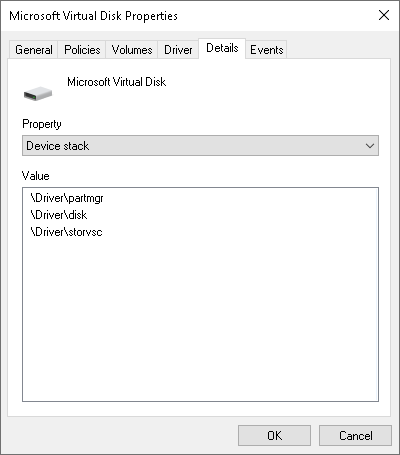

# 드라이버
**[드라이버](https://learn.microsoft.com/en-us/windows-hardware/drivers/gettingstarted/what-is-a-driver-)**(driver)는 시스템에 장착된 [하드웨어 장치](https://en.wikipedia.org/wiki/Computer_hardware)를 제어하거나 [커널](Kernel.md#커널) 서비스에 접근할 수 있는 [로드 가능한 모듈](https://ko.wikipedia.org/wiki/적재_가능_커널_모듈)(loadable kernel moduel; LKM)이다. 즉, 드라이버는 필요에 따라 언제든지 [메모리](Memory.md)에 로드 및 해제될 수 있다. 흔히 하드웨어 상호작용에 활용되기 때문에 일반적으로 [*장치 드라이버*](#장치-드라이버)를 지칭하는 경우가 대다수이지만, 그렇지 않고 단지 [운영체제](https://ko.wikipedia.org/wiki/운영체제) 커널에서만 접근이 가능한 데이터를 다루기 위한 [*소프트웨어 드라이버*](https://learn.microsoft.com/en-us/windows-hardware/drivers/gettingstarted/what-is-a-driver-#software-drivers)도 존재한다.

본 문서는 (레거시 NT 드라이버가 아닌) [WDM](#윈도우-드라이버-모델) 형식의 드라이버 모델을 위주로 설명한다.

### 드라이버 객체
**[드라이버 객체](https://learn.microsoft.com/en-us/windows-hardware/drivers/kernel/introduction-to-driver-objects)**(driver object)는 시스템에 설치되어 메모리에 로드된 각 드라이버를 나타내는 [DRIVER_OBJECT](https://learn.microsoft.com/en-us/windows-hardware/drivers/ddi/wdm/ns-wdm-_driver_object) [구조체](C.md#구조체)의 객체이다. 마치 .exe 확장자의 프로그램 이미지를 실행하는 [프로세스](Process.md)와 동일한 개념이다. 커널의 [입출력 관리자](Kernel.md#입출력-관리자)가 관리하며, 드라이버의 [DriverEntry](https://learn.microsoft.com/en-us/windows-hardware/drivers/ddi/wdm/nc-wdm-driver_initialize) 루틴 호출 시 해당 드라이버 객체의 주소를 제공한다. 드라이버 객체 안에는 [표준 드라이버 루틴](https://learn.microsoft.com/en-us/windows-hardware/drivers/kernel/introduction-to-standard-driver-routines)들의 [진입점](C.md#진입점)들이 저장되어 있다.

* DRIVER_OBJECT 구조체의 `DeviceObject` 필드는 해당 드라이버에 의해 생성된 첫 번째 [디바이스 객체](#디바이스-객체)의 [포인터](C.md#포인터)가 저장된다.

## 윈도우 드라이버 모델
> *참고: [Introduction to WDM - Windows drivers | Microsoft Learn](https://learn.microsoft.com/en-us/windows-hardware/drivers/kernel/introduction-to-wdm)*

**[윈도우 드라이버 모델](https://ko.wikipedia.org/wiki/윈도우_드라이버_모델)**(Windows Driver Model; WDM)은 [윈도우 98](https://en.wikipedia.org/wiki/Windows_98) 및 [윈도우 2000](https://en.wikipedia.org/wiki/Windows_2000)과 함께 소개되어 [윈도우 NT](Windows.md)에서 동작할 장치 드라이버 설계를 규정 및 표준화하는 프레임워크이다. 윈도우 운영체제가 [MS-DOS](https://en.wikipedia.org/wiki/MS-DOS) 기반에서 NT 계열로 전환되면서 이전에 사용하던 [VxD](https://en.wikipedia.org/wiki/VxD) 프레임워크를 대체한다. WDM은 [상위호환](https://en.wikipedia.org/wiki/Forward_compatibility)을 지원하도록 설계되어, 빌드 대상보다 이전 버전의 윈도우 OS에서는 정상 동작을 보장하지 않지만 이후 버전에서는 문제없이 구동된다.

### 윈도우 드라이버 프레임워크
**[윈도우 드라이버 프레임워크](https://ko.wikipedia.org/wiki/윈도우_드라이버_프레임웍스)**(Windows Driver Frameworks; WDF), 혹은 윈도우 드라이버 파운데이션(Windows Driver Foundation)는 [WDM](#윈도우-드라이버-모델) 기반의 커널 모드 및 사용자 모드 드라이버를 훨씬 간편하고 효율적으로 작성할 수 있도록 하는 [오픈 소스](https://github.com/Microsoft/Windows-Driver-Frameworks) "개발 프레임워크"이다.

<table style="width: 95%; margin-left: auto; margin-right: auto;"><caption style="caption-side: top;">WDF에서 제공하는 프레임워크</caption><colgroup><col style="width: 33.4%;"/><col style="width: 33.3%;"/><col style="width: 33.3%;"/></colgroup><thead><tr><th rowspan="2" style="text-align: center;"><a href="https://en.wikipedia.org/wiki/Kernel-Mode_Driver_Framework">커널 모드 드라이버 프레임워크</a>(KMDF)</th><th colspan="2" style="text-align: center; border-bottom-style: none;"><a href="https://en.wikipedia.org/wiki/User-Mode_Driver_Framework">사용자 모드 드라이버 프레임워크</a>(UMDF)</th></tr><th style="text-align: center;">버전 1</th><th style="text-align: center;">버전 2</th><tr></tr></thead><tbody><tr><td>WDM을 직접 작성하는 것보다 간편하고 효율적인 개발을 가능케 하는 객체 기반이다.</td><td>어플리케이션 개발자에게 친숙한 <a href="Cpp.md">C++</a> 및 COM을 활용하지만 KMDF와 상당히 이질적이다.</td><td>KMDF와 동일한 객체 모델을 채택한다.</td></tr></tbody></table>

윈도우 NT의 WDM 드라이버 구조를 이해하는 건 매우 중요하지만, 개발을 할 때는 WDF를 사용하는 걸 마이크로소프트는 강력하고 권장한다.

## 장치 드라이버
**[장치 드라이버](https://en.wikipedia.org/wiki/Device_driver)**(device driver)는 시스템과 하드웨어 장치 간 상호작용에 관여하는 드라이버를 가리킨다. [윈도우 NT](Windows.md) 운영체제는 [장치 관리자](https://en.wikipedia.org/wiki/Device_Manager)에서 각 장치마다 사용되는 장치 드라이버를 살펴볼 수 있다. 아래는 Microsoft Virtual Disk [디스크](Storage.md) 장치의 *Device Stack* 속성에서 나열한 장치 드라이버 순서대로 유형을 소개한다.

<table style="width: 95%; margin-left: auto; margin-right: auto;"><caption style="caption-side: top;">장치 드라이버 유형별 소개</caption><colgroup><col style="width: 40%;"><col style="width: 15%;"/><col style="width: 45%;"/></colgroup><thead><tr><th style="text-align: center;">예시</th><th style="text-align: center;">장치 드라이버</th><th style="text-align: center;">설명</th></tr></thead><tbody><tr><td rowspan="3" style="text-align: center;"></td><td style="text-align: center;"><a href="https://learn.microsoft.com/en-us/windows-hardware/drivers/kernel/filter-drivers">필터 드라이버</a> (filter driver)</td><td>장치나 기존 드라이버에 기능을 추가, 혹은 입출력 요청이나 응답을 수정하는 부가적인 장치 드라이버이다. 개수에 제한이 없고 선택사항이며, 관여하는 시점에 따라 아래와 같이 분류된다.<ul><li><i>상위 필터 드라이버</i>&nbsp;(본 예시에 해당)</li><li><i>하위 필터 드라이버</i></li><li><i>버스 필터 드라이버</i></li></ul>하드웨어 제조사는 흔히 필터 드라이버를 활용해 장치로부터 발견된 이슈를 해결하곤 한다.</td></tr><tr><td style="text-align: center;"><a href="https://learn.microsoft.com/en-us/windows-hardware/drivers/kernel/function-drivers">기능 드라이버</a> (function driver)</td><td>장치를 제어하기 위해 필요한 인터페이스를 제공하는 필수적인 장치 드라이버이다. 해당 하드웨어에 대하여 가장 잘 알고 있으며, 장치에 내장된 <a href="https://ko.wikipedia.org/wiki/하드웨어_레지스터">레지스터</a> 접근이 가능하다.</td></tr><tr><td style="text-align: center;"><a href="https://learn.microsoft.com/en-us/windows-hardware/drivers/kernel/bus-drivers">버스 드라이버</a> (bus driver)</td><td>연결된 장치를 열거하여 새로 인식된 자식 장치를 탐색하는 <a href="https://en.wikipedia.org/wiki/Bus_(computing)">버스</a>(예를 들어, <a href="https://en.wikipedia.org/wiki/Adapter_(computing)">어댑터</a> 등)의 기능 드라이버이다. 자식 장치의 버스 드라이버로 동작하여 <a href="#디바이스-객체">디바이스 스택</a>의 기반이 될 <a href="#디바이스-객체">PDO</a>를 생성한다.</td></tr></tbody></table>

> 윈도우 시스템에 연결된 장치는 반드시 두 개 이상의 장치 드라이버를 가진다: (1) *기능 드라이버*, 그리고 (2) *버스 드라이버*이다.

장치 관리자의 *Device Stack* 속성은 명칭대로 [스택](https://en.wikipedia.org/wiki/Stack_(abstract_data_type)) 구조이기 때문에 장치 드라이버의 개입 순서를 직관적으로 파악할 수 있다; 위의 예시에서 Microsoft Virtual Disk의 디바이스 스택의 버스 드라이버는 `\Driver\storvsc`이며, 이후 시스템은 장치에 가장 적합한 기능 드라이버와 상위 필터 드라이버를 각각 `\Driver\disk` 그리고 `\Driver\partmgr` 장치 드라이버 순서대로 장식한다.

* 본 부문에서 디바이스 스택을 논할 때 장치 드라이버를 위주로 설명하였으나, 실제로 스택을 구성하는 건 장치 드라이버와 직결된 [디바이스 객체](#디바이스-객체)이다.

### 디바이스 객체
**[디바이스 객체](https://learn.microsoft.com/en-us/windows-hardware/drivers/kernel/introduction-to-device-objects)**(device object; DO)는 시스템에 연결된 물리, 논리, 또는 가상 장치의 관계를 [PnP 관리자](Kernel.md#pnp-관리자)가 체계화할 수 있도록 데이터로 표현한 [DEVICE_OBJECT](https://learn.microsoft.com/en-us/windows-hardware/drivers/ddi/wdm/ns-wdm-_device_object) [구조체](C.md#구조체)의 객체이다. 장치에 사용되는 드라이버마다 디바이스 객체가 생성되어 {[드라이버 객체](#드라이버-객체), 디바이스 객체} 쌍을 이루며, 드라이버가 처리할 [IRP](#입출력-요청-패킷)를 안내한다. 그리고 "장치 드라이버 순서에 따라 정렬된 디바이스 객체의 묶음"을 [**디바이스 스택**](https://learn.microsoft.com/en-us/windows-hardware/drivers/gettingstarted/device-nodes-and-device-stacks#device-objects-and-device-stacks)이라 부른다.

아래는 Microsoft Virtual Disk와 동일한 디바이스 스택 구조를 보이는 가상의 *Proseware Gizmo* 장치와 함께 디바이스 객체의 유형을 소개한다.

<table style="width: 95%; margin-left: auto; margin-right: auto;"><caption style="caption-side: top;">디바이스 객체 유형별 소개</caption><colgroup><col style="width: 25%;"><col style="width: 20%;"/><col style="width: 8%;"/><col style="width: 47%;"/></colgroup><thead><tr><th style="text-align: center;">예시</th><th colspan="2" style="text-align: center;">디바이스 객체</th><th style="text-align: center;">설명</th></tr></thead><tbody><tr><td rowspan="3"></td><td style="text-align: center;"><a href="https://learn.microsoft.com/en-us/windows-hardware/drivers/kernel/filter-drivers">필터 디바이스 객체</a> (filter device object)</td><td>Filter DO</td><td><a href="https://learn.microsoft.com/en-us/windows-hardware/drivers/kernel/filter-drivers">필터 드라이버</a>와 쌍을 이루는 디바이스 객체이다.<ul><li>Microsoft Virtual Disk 대응 드라이버: <code>\Driver\partmgr</code></li><ul></td></tr><tr><td style="text-align: center;"><a href="https://learn.microsoft.com/en-us/windows-hardware/drivers/kernel/function-drivers">기능 디바이스 객체</a> (functional device object)</td><td>FDO</td><td><a href="https://learn.microsoft.com/en-us/windows-hardware/drivers/kernel/function-drivers">기능 드라이버</a>와 쌍을 이루는 디바이스 객체이다.<ul><li>Microsoft Virtual Disk 대응 드라이버: <code>\Driver\disk</code></li><ul></td></tr><tr><td style="text-align: center;"><a href="https://learn.microsoft.com/en-us/windows-hardware/drivers/kernel/bus-drivers">물리 디바이스 객체</a> (physical device object)</td><td>PDO</td><td><a href="https://learn.microsoft.com/en-us/windows-hardware/drivers/kernel/bus-drivers">버스 드라이버</a>와 쌍을 이루는 디바이스 객체이다. 버스가 새로 인식한 장치에 PDO를 생성하여 디바이스 스택의 기반을 마련한다.<ul><li>Microsoft Virtual Disk 대응 드라이버: <code>\Driver\storvsc</code></li><ul></td></tr></tbody></table>

비록 디바이스 객체는 드라이버 객체와 쌍을 이루지만, 디바이스 스택은 결국 (후자가 아닌) 전자에 의해 만들어진다. Pci.sys (Microsoft Virtual Disk의 경우, storvsc.sys) 드라이버가 PDO를 생성한 이후, 시스템에서 불러온 Proseware.sys (Microsoft Virtual Disk의 경우, disk.sys) 드라이버의 FDO가 PDO 위에 올라가면서 디바이스 스택이 구성된다.

* `AttachedDevice`: 스택상 상위 디바이스 객체의 [포인터](C.md#포인터)를 가리킨다. Proseware.sys의 FDO 경우, 상위 디바이스 객체는 AfterThought.sys의 Filter DO가 해당한다. [WinDbg](WinDbg.md)에서 [`!devobj`](https://learn.microsoft.com/en-us/windows-hardware/drivers/debugger/-devobj) 명령을 입력하면 `AttachedTo` 항목이 있어 하위 디바이스 객체를 알 수 있지만, 이는 DEVICE_OBJECT의 필드가 아니다.

* `DriverObject`: 해당 객체를 생성한 장치 드라이버의 드라이버 객체를 가리키는 포인터이다.

* `NextDevice`: 해당 객체를 생성한 장치 드라이버의 또 다른 디바이스 객체를 가리키는 포인터이다.

### 디바이스 노드
개별 장치마다 보유하는 디바이스 스택은 유일무이하고, 부모의 기능 드라이버는 자식의 버스 드라이버로 상속되는 걸 설명하였다. PnP 관리자는 장치의 부모와 자식 관계를 아래 그림과 같이 [*디바이스 트리*](https://en.wikipedia.org/wiki/Tree_(data_structure))로 체계화하였으며, 각 [노드](https://en.wikipedia.org/wiki/Node_(computer_science))는 장치 "그 자체"를 나타내는 일명 **[디바이스 노드](https://learn.microsoft.com/en-us/windows-hardware/drivers/gettingstarted/device-nodes-and-device-stacks)**(device node)이다.

> 장치 관리자에서 디바이스 트리를 직관적으로 보고 싶을 경우, 메뉴에서 *View > Devices by connection*으로 변경한다.

디바이스 노드는 *[USB Device](https://en.wikipedia.org/wiki/USB)*, *[Audio Device](https://en.wikipedia.org/wiki/Computer_speakers)*, *[Monitor](https://en.wikipedia.org/wiki/Computer_monitor)* 등 외에도 시스템과 통신할 수 있도록 장치를 연결하는 [버스](https://en.wikipedia.org/wiki/Bus_(computing))도 장치로 인식한다: *[USB Host Controller](https://en.wikipedia.org/wiki/Host_adapter)* *[Display Adapater](https://en.wikipedia.org/wiki/Graphics_card)*, *[PCI Express Port](https://en.wikipedia.org/wiki/PCI_Express)* 등이 해당한다. 다만, 디바이스 노드가 장치인지 버스인지 판별하는 건 관점에 따라 다르다.

1. *Display Adapter*는 화면에 나타날 프레임을 마련하는 핵심 역할의 "장치"
1. *Display Adpater*에 연결된 *Monitor*를 감지, 열거, 그리고 영상 신호로 변환하여 송출하는 역할의 "버스"

위의 예시로 소개한 Microsoft Virtual Disk도 PnP 관리자 과점에서 하나의 디바이스 노드로 트리를 구성한다.

## 입출력 요청 패킷
**[입출력 요청 패킷](https://learn.microsoft.com/en-us/windows-hardware/drivers/gettingstarted/i-o-request-packets)**(I/O request packet; [IRP](https://learn.microsoft.com/en-us/windows-hardware/drivers/ddi/wdm/ns-wdm-_irp))은 장치로부터 무언가를 요청할 때, 이를 처리할 장치 드라이버에게 [입출력 관리자](kernel.md#입출력-관리자)가 전달하는 구조체이다.
