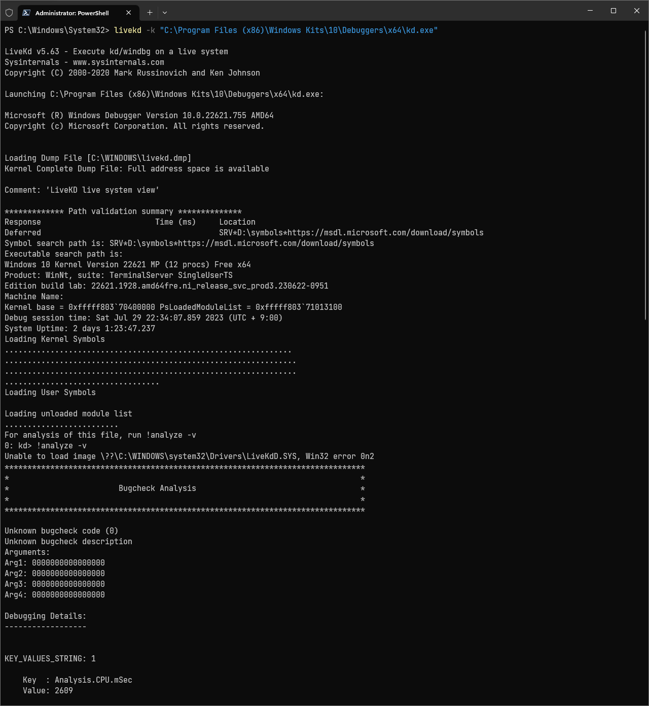

# LiveKD
[**LiveKD**](https://aka.ms/livekd)는 현 시스템 상태를 분석하기 위해 강제로 [BSOD](BSOD.md)를 일으켜 [메모리 덤프](Dump.md#커널-모드-덤프)를 생성할 필요 없이 곧바로, 즉 "라이브"로 [커널](Kernel.md#커널)을 디버깅할 수 있도록 지원하는 Sysinternals 유틸리티 프로그램이다. 디버깅은 오로지 LiveKD를 실행한 찰나, 즉 스냅샷에 국한되며 실시간으로 시스템 상태가 그대로 반영되는 게 절대 아니다.

> 만일 시스템을 실시간으로 디버깅을 해야 한다면 WinDbg의 "Attach to kernel" 옵션을 활용하도록 한다.

LiveKD는 단독적으로 사용될 수 없으며 반드시 [kd.exe](https://learn.microsoft.com/en-us/windows-hardware/drivers/debugger/debuggers-in-the-debugging-tools-for-windows-package#kd) (또는 [windbg.exe](https://learn.microsoft.com/en-us/windows-hardware/drivers/debugger/debuggers-in-the-debugging-tools-for-windows-package#windbg-classic)) 디버거 도구가 함께 동반되어야 한다. [윈도우 SDK](https://developer.microsoft.com/en-us/windows/downloads/windows-sdk/) 다운로드 및 설치 과정에서 *Debugging Tools for Windows* 옵션을 선택하여 디버거 도구를 확보한다. 아래는 kd.exe가 설치된 경로를 명시하여 LiveKD를 실행한 모습이다.



## 메모리 덤프 생성
LiveKD로 시스템 디버깅이 가능하다면 메모리 덤프도 수집이 가능하다는 걸 의미한다. 명령에 옵션 -o와 함께 덤프 파일 경로를 지정하면 [전체 메모리 덤프](Dump.md#커널-모드-덤프)가 생성된다. 해당 방법은 최소한 [ntoskrnl.exe](Kernel.md#nt-커널)의 [심볼](Symbol.md)이 반드시 필요하며, 심볼을 수동으로 다운로드를 받는 방법은 [symchk.exe](Symbol.md#심볼-검증)를 참고하도록 한다.

### 대안 프로그램
* 마이크로소프트의 [트러블슈팅 스크립트](https://learn.microsoft.com/en-us/troubleshoot/windows-client/windows-troubleshooters/introduction-to-troubleshootingscript-toolset-tss), 일명 [TSS](https://aka.ms/getTSS)는 LiveKD를 활용하여 메모리 덤프를 수집하는 옵션을 제공한다. 위에서 kd.exe 경로를 지정한 방식과 달리 -ml 옵션을 사용하여 (전체 메모리 덤프 대신에) [커널 메모리 덤프](Dump.md#커널-메모리-덤프)를 생성한다. [파워셸](PowerShell.md) 명령을 입력하여 LiveKD 메모리 덤프 수집이 가능하다.

    ```powershell
    . .\TSS.ps1 -LiveKD [Start | Stop | Both]
    ```

* [작업 관리자](https://ko.wikipedia.org/wiki/작업_관리자_(윈도우))(Task Manager): [윈도우 11](https://ko.wikipedia.org/wiki/윈도우_11), [22H2](https://ko.wikipedia.org/wiki/윈도우_11_버전_역사#22H2)의 2023년 7월 업데이트, 즉 [KB5027303](https://support.microsoft.com/en-us/topic/july-11-2023-kb5028185-os-build-22621-1992-605fa18f-bd49-41d8-80b1-245080e26c3d)부터 작업 관리자에서 시스템 프로세스(PID 4)의 우클릭 메뉴를 열면 라이브 메모리 덤프를 생성하는 선택지가 추가되었다. 자세한 내용은 [마이크로소프트 공식 문서](https://learn.microsoft.com/en-us/windows-hardware/drivers/debugger/task-manager-live-dump)를 확인하도록 한다.
