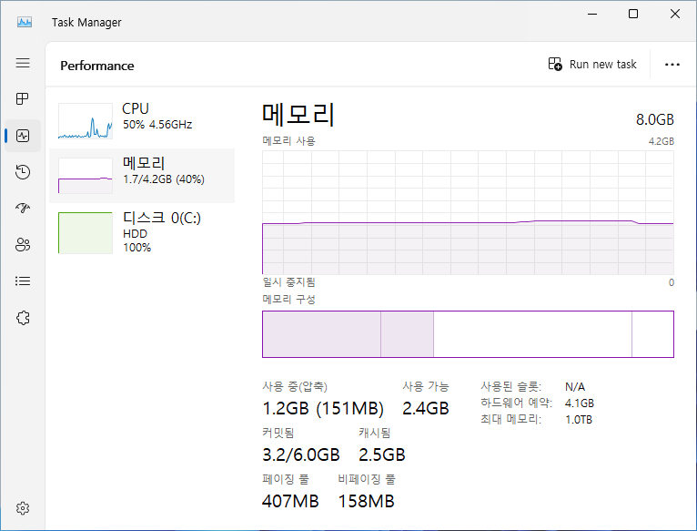

# 메모리
**[메모리](https://en.wikipedia.org/wiki/Computer_memory)**(memory)는 시스템에서 즉각적으로 사용할 데이터를 저장하는 공간이다. 흔히 물리 메모리 (일명 주요 메모리)인 [RAM](https://ko.wikipedia.org/wiki/랜덤_액세스_메모리)을 언급하는 경우가 대다수이며, 작업 속도가 매우 빠르고 [휘발성](https://en.wikipedia.org/wiki/Volatile_memory)인 특징을 가지고 있다. 또한 [프로세서](Processor.md)와 물리적으로 근접하여 연산시 데이터 접근 속도가 순식간이기 때문에 단기기억 역할을 담당한다. 그러므로 메모리는 시스템의 성능을 결정하는 중요한 요소로 작용한다.

다음은 물리 메모리 (일명 주요 메모리)를 제외한 다른 유형의 메모리를 각각 소개한다.

* [보조 메모리](Storage.md): *데이터를 오래 저장할 수 있는 [비휘발성](https://en.wikipedia.org/wiki/Non-volatile_random-access_memory) 메모리이며, 대표적으로 [HDD](Storage.md#디스크) 및 [SSD](https://ko.wikipedia.org/wiki/솔리드_스테이트_드라이브) 등의 저장 장치가 해당한다.*
* [가상 메모리](#가상-메모리): *하드웨어 실존 여부와 무관하게 [운영체제](https://en.wikipedia.org/wiki/Operating_system)로부터 표현된 메모리이며, 구성원으로 [페이징 파일](#페이징-파일)이 존재한다.*

각 메모리가 의미하는 바가 무엇인지 이해를 돕기 위해 다음 8 GB 물리 메모리가 설치된 시스템의 [작업 관리자](https://ko.wikipedia.org/wiki/작업_관리자)를 예시로 설명한다.

시스템의 실질적 메모리 사용은 4.2 GB이며, 아래와 같이 수치를 살펴볼 수 있다. 자세한 내용을 이해하려면 하기 부문들을 읽기를 적극 권장한다.

<table style="table-layout: fixed; width: 95%; margin-left: auto; margin-right: auto;"><caption style="caption-side: top;">물리 메모리의 구성원 소개</caption><colgroup><col style="width: 15%;"/><col style="width: 12%;"/><col style="width: 8%;"/><col/></colgroup><thead><tr><th style="text-align: center;">메모리 구성</th><th style="text-align: center;">그룹</th><th style="text-align: center;">유형</th><th style="text-align: center;">설명</th></tr></thead><tbody><tr><td style="text-align: center;"><b><a href="#작업-집합">사용 중</a></b> (1.2 GB)</td><td style="text-align: center;">-</td><td style="text-align: center;">-</td><td><a href="Kernel.md">커널</a> 및 <a href="Driver.md">드라이버</a>, <a href="Process.md#프로세스">프로세스</a>을 포함한 시스템 전반에서 사용 중인 물리 메모리 크기이다.<ul><li>사용 중인 메모리 내에서도 공간 절약이 가능하여 <a href="Process.md#시스템-프로세스">압축</a>된 메모리는 151 MB이다.</li></ul></td></tr><tr><td rowspan="3" style="text-align: center;"><b>사용 가능</b> (2.4 GB)</td><td rowspan="2" style="text-align: center;"><i>여유</i> (448 MB)</td><td style="text-align: center;">영값</td><td>메모리가 전부 영값으로 비워져 (혹은 채워져) 아무런 데이터가 없어 곧장 사용될 수 있다.<ul><li>오로지 영값으로 정리된 페이지만 타 프로그램에서 확보하여 사용할 수 있다.</li></ul></td></tr><tr><td style="text-align: center;">해제</td><td>프로그램이 종료되면서 함께 해제된 메모리이다. 당시 데이터가 잔여하기 때문에 차후 시스템 스레드에 의해 영값으로 정리된다.<ul><li>영값 페이지가 고갈될 시 대신 제공하지만, 데이터를 정리하는 데 시간이 다소 소모된다.</li></ul></td></tr><tr><td rowspan="2" style="text-align: center;"><i><a href="https://en.wikipedia.org/wiki/Cache_(computing)">캐시</a></i> (2.5 GB)</td><td style="text-align: center;">대기</td><td>물리 메모리에 프로세스의 가상 메모리와 매핑되었을 당시 데이터가 잔여하여, 만일 프로세스가 해당 페이지를 다시 필요할 경우 단순 매핑만으로 곧바로 사용할 수 있다.</td></tr><tr><td style="text-align: center;"><b>기타</b> (544 MB)</td><td style="text-align: center;">수정</td><td>물리 메모리에 프로세스의 가상 메모리와 매핑되었을 당시 데이터를 먼저 디스크에 저장을 완료한 다음에 대기 페이지로 전환되기 때문에 <i>사용 중</i> 또는 <i>사용 가능</i> 메모리에 속하지 않는다.</td></tr></tbody></table>

## 가상 메모리
**[가상 메모리](https://en.wikipedia.org/wiki/Virtual_memory)**(virtual memory)는 일종의 [메모리 관리](https://en.wikipedia.org/wiki/Memory_management_(operating_systems)) 기술이며, 컴퓨터에 탑재된 실제 물리 메모리와 무관하게 [운영체제](https://en.wikipedia.org/wiki/Operating_system)에 의해 표현된 "가상"의 메모리이다. ([커널](Kernel.md)을 포함한) 모든 프로그램들은 가상 메모리에서 실행되며, 각 프로세스마다 주어진 [가상 주소 공간](Process.md#가상-주소-공간)(일명 VAS)에 메모리를 할당받는다. 가상 공간에 할당된 메모리의 주소는 프로세서에 내장된 [MMU](#메모리-관리-장치)에 의해 물리 메모리의 주소로 변환되어 접근된다.

> 윈도우 운영체제의 가상 메모리는 "물리 메모리 + [페이징 파일](#페이징-파일)"로 구성되며, 후자는 차후 본문에서 소개할 예정이다.

가상 메모리를 활용한 시스템은 다음과 같은 이점을 지닌다:

1. 메모리 체계(예를 들어, 공유 메모리 등)를 커널에서 관리하기 때문에 프로그램 개발의 편리
1. [페이징](#페이징-파일) 기술을 통해 물리적으로 사용할 수 있는 메모리보다 더 많은 주소 공간 확보
1. 메모리 격리에 의한 시스템 보안 강화

### 페이지
**[페이지](https://en.wikipedia.org/wiki/Page_(computer_memory))**(page)는 운영체제에서 관리하는 가장 작은 단위의 가상 메모리 조각이며, 일반적으로 4 KB로 고정된다. 페이지와 일대일 매핑된 물리 메모리의 주소 영역을 **[페이지 프레임](https://en.wikipedia.org/wiki/Page_(computer_memory))**(page frame; 일명 프레임)이라고 부른다. 페이지에는 세 가지 [상태](https://learn.microsoft.com/en-us/windows/win32/memory/page-state)가 존재하며, 이에 따라 가상 메모리의 가용 여부가 결정된다.

<table style="width: 85%; margin-left: auto; margin-right: auto;"><caption style="caption-side: top;">가상 메모리의 페이지 상태</caption><colgroup><col style="width: 15%;"/><col style="width: 85%;"/></colgroup><thead><tr><th style="text-align: center;">상태</th><th style="text-align: center;">설명</th></tr></thead><tbody><tr><td style="text-align: center;">여유 (Free)</td><td>사용되고 있지 않는 가상 메모리이다.</td></tr><tr><td style="text-align: center;">예약됨 (Reserved)</td><td>가상 주소 공간에 할당되었으나, 시스템 성능에 실질적으로 기여하지 않는 가상 메모리이다.</td></tr><tr><td style="text-align: center;"><a href="https://learn.microsoft.com/en-us/troubleshoot/windows-client/performance/introduction-to-the-page-file#system-committed-memory">커밋됨</a> (Committed)</td><td>가상 주소 공간에는 할당된 동시에 시스템 성능에 실질적으로 기여하는 가상 메모리이다. 해당 페이지에 R/W 작업이 있기 전에는 물리 메모리가 매핑되지 않는다. "물리 메모리 + <a href="#페이징-파일">페이징 파일</a>"이 커밋 한도(commit limit)이다.</td></tr></tbody></table>

### 메모리 관리 장치
> *참고: [Converting Virtual Addresses to Physical Addresses - Windows drivers | Microsoft Learn](https://learn.microsoft.com/en-us/windows-hardware/drivers/debugger/converting-virtual-addresses-to-physical-addresses)*

**[메모리 관리 장치](https://en.wikipedia.org/wiki/Memory_management_unit)**(memory management unit; MMU)는 [프로세서](Processor.md)에 내장되어 있는 반도체로 가상 메모리에서 물리 메모리로 주소를 변환하는 역할을 전담한다. 메모리 주소를 변환하는 절차는 결국 프로세서 아키텍처에 의해 정의되며, 변환 과정에 대한 상세한 내용은 [페이지 테이블](PageTable.md) 문서를 참고한다.

## 작업 집합
**[작업 집합](https://en.wikipedia.org/wiki/Working_set)**(working set)은 커밋된 가상 메모리 중에서 물리 메모리에 상주하는 페이지들을 가리킨다.

> 그러므로 작업 관리자의 *사용 중* 메모리는 시스템 전반의 작업 집합을 의미한다.

프로세서에 의해 처리되어야 할 코드는 반드시 (페이징 파일이 아닌) 물리 메모리에 상주해야 하기 때문에 작업 집합은 시스템 성능과 직결된다. 온전한 시스템 성능을 유지하는 차원에서, 운영체제는 작업 집합이 특정 크기에 도달하였을 경우 (즉, 물리 메모리가 고갈되려 할 때) 오랜 기간동안 사용되지 않은 페이지를 "트리밍(trimming)"한다. 간단히 말해, 물리 메모리에 상주하는 일부 페이지를 다른 [임시 공간](#페이징-파일)에 옮겨 여유 공간을 확보하는 작업이다.

트리밍이 된 페이지는 물리 메모리에 더 이상 매핑되지 않아, 만일 해당 페이지을 시도하면 [페이지 부재](https://en.wikipedia.org/wiki/Page_fault)가 발생한다. 다만, 운영체제가 메모리를 관리하는 과정에서 일어나는 매우 자연스러운 현상이기 때문에 일반적인 경우에는 문제가 되지 않는다.

1. [마이너 페이지 부재](https://en.wikipedia.org/wiki/Page_fault#Minor): 접근하려는 페이지가 아직 물리 메모리에 상주하는 경우
1. [메이저 페이지 부재](https://en.wikipedia.org/wiki/Page_fault#Major): 접근하려는 페이지가 (물리 메모리에 찾을 수 없어) 저장 장치의 페이징 파일로부터 불러와야 할 경우

마이너와 메이저는 각각 소프트 및 하드 페이지 부재라고도 불리며, 전자는 물리 메모리 내에서 처리되기 때문에 상대적으로 훨씬 빨리 해결될 수 있다.

### 페이징 파일
**[페이징 파일](https://learn.microsoft.com/en-us/windows/client-management/introduction-page-file)**(page file)은 가상 메모리의 페이지를 물리 메모리가 아닌 [HDD](https://en.wikipedia.org/wiki/Hard_disk_drive)나 [SSD](https://en.wikipedia.org/wiki/Solid-state_drive)와 같은 [저장 장치](Storage.md)로 전달받을 수 있는 pagefile.sys 파일이다. 프로그램을 실행하거나 저장된 파일을 열 때 물리 메모리에 로드되지만, 파일을 편집하였으나 아직 저장되지 않는 등의 경우에는 아예 페이징 파일에서 처리되는 경향이 있다. 물리 메모리 용량이 대폭 증가하며 페이징 파일의 입지는 예전에 비해 상당히 퇴색되었으나, 일부 프로그램이나 메모리 덤프 수집에 여전히 필요한 존재이다.

물리 메모리와 페이징 파일 간 데이터가 이동하는 [페이징](https://en.wikipedia.org/wiki/Memory_paging) 기법에 대하여 간랸히 설명한다.

<table style="width: 85%; margin-left: auto; margin-right: auto;"><caption style="caption-side: top;">페이징 기법 및 설명</caption><colgroup><col style="width: 15%;"/><col style="width: 25%;"/><col style="width: 60%;"/></colgroup><thead><tr><th style="text-align: center;">메모리 페이징</th><th style="text-align: center;">방향성</th><th style="text-align: center;">설명</th></tr></thead><tbody><tr><td style="text-align: center;">페이징 아웃 (Paging out)</td><td style="text-align: center;">물리 메모리 → 페이징 파일</td><td>오랜 시간 물리 메모리에서 사용되지 않은 페이지를 저장 장치의 페이징 파일로 옮겨 메모리 여유를 확보한다.</td></tr><tr><td style="text-align: center;">페이징 인 (Paging in)</td><td style="text-align: center;">페이징 파일 → 물리 메모리</td><td>페이징 파일은 저장 장치의 기술적 한계로 물리 메모리를 대체할 수 없으므로, 참조되어야 할 페이지는 물리 메모리로 복귀된다.</td></tr></tbody></table>

페이징 파일 크기를 설정하려면 **고급 시스템 설정 보기** 검색 (혹은 `systempropertiesadvanced.exe` 실행) 이후에 *성능* 그룹의 "설정 (<u>S</u>)..." 버튼을 클릭한다. 나타난 **성능 옵션** 창의 고급 탭으로 이동하여 *가상 메모리* 그룹 하에 "변경 (<u>C</u>)..." 버튼을 클릭한다.

> 시스템은 기본적으로 "모든 드라이브에 대한 페이징 파일 크기 자동 관리 (<u>A</u>)" 체크 박스가 설정되어 있으며, 이는 OS 드라이브만 *시스템이 관리하는 크기*인 한편 나머지는 *페이징 파일 없음*과 동일하다.

다음은 각 드라이브마다 설정할 수 있는 페이징 파일 크기에 대한 세 가지 선택지를 소개한다:

1. **사용자 지정 크기**(Custom size)

    직접 페이징 파일의 처음 크기(Initial size)와 확장될 수 있는 최대 크기(Maximum size)를 [메가바이트](https://en.wikipedia.org/wiki/Megabyte) 단위로 지정한다. 단, 지정한 크기만큼 저장 장치의 여유 공간이 줄어든다는 점은 충분히 인지하고 변경하도록 한다.

1. **시스템이 관리하는 크기**(System managed size)

    [세션 관리자](Process.md#세션-관리자)는 몇 가지의 요인들을 기반하여 실시간으로 적합한 페이징 파일 크기를 유연하게 결정한다. 만일 시스템 메모리가 커밋 한도의 90%에 도달하면 페이징 파일의 크기가 확장되는데, 물리 메모리(혹은 4 GB 중 가장 큰 걸로 선정)의 세 배까지 늘어날 수 있다. 하지만 페이징 파일이 확장하여도 상주하는 드라이브 용량의 1/8로 크기가 제한된다.

    [커널](Dump.md#커널-메모리-덤프), [전체](Dump.md#전체-메모리-덤프), 그리고 [활성 메모리 덤프](Dump.md#활성-메모리-덤프)로 구성되었으면 [BSOD](BSOD.md) 발생 시 덤프를 모두 수집할 수 있도록 페이징 파일 크기를 물리 메모리와 동일하게 조정한다. [자동 메모리 덤프](Dump.md#자동-메모리-덤프)일 경우, 커널 주소 공간을 수집하는 데 일반적으로 충분하다고 판단되는 크기로 조정한다. 반면 불충분하다면 `PagefileTooSmall` 레지스트리 서브키를 생성하는데, 해당 레지스트리 값의 존재 여부에 따라 [부팅](Boot.md) 때 페이징 파일 크기를 물리 메모리와 동일하게 설정한다.

1. **페이징 파일 없음**(No paging file)

## 메모리 풀
윈도우 NT 운영체제에서 [메모리 풀](https://learn.microsoft.com/en-us/windows/win32/memory/memory-pools)(memory pools)은 [커널](https://ko.wikipedia.org/wiki/커널_(컴퓨팅)) 혹은 [장치 드라이버](https://learn.microsoft.com/en-us/windows-hardware/drivers/gettingstarted/what-is-a-driver-)에서 시스템 공간에 할당되고 관리되는 커널 [힙](https://ko.wikipedia.org/wiki/동적_메모리_할당#힙_영역) 메모리이다.

* **페이징 풀**(paged pool): 페이징 파일로 이동될 수 있는 커널 메모리이다.
* **비페이징 풀**(nonpaged pool): 페이징 파일로 이동될 수 없는 커널 메모리이다.

운영체제 및 장치 드라이버는 [ExAllocatePoolWithTag](https://learn.microsoft.com/en-us/windows-hardware/drivers/ddi/wdm/nf-wdm-exallocatepoolwithtag) 루틴에 의해 할당 당시 4바이트 크기의 태그가 지정되는데, 이를 통해 해당 메모리를 할당한 드라이버 및 목적을 파악할 수 있다. 태그 목록은 [`pooltags.txt`](./references/pooltag.txt) 파일에서 찾아볼 수 있다.

컴퓨터 과학에서 언급하는 "[메모리 풀](https://ko.wikipedia.org/wiki/메모리_풀)"과 동일한 개념으로 페이징 및 비페이징 풀로부터 할당받을 수 있는 총 커널 메모리 크기는 한정되어 있다. 운영체제와 아키텍처에 따라 한정된 용량은 상이하는 데, 64비트 NT 10 (윈도우 10 & 11, 서버 2016 등) 경우에는 각각 16 TB 그리고 RAM과 동일하거나 혹은 16 GB 중에서 가장 작은 크기로 선정된다.

> 메모리 풀의 용량 한도를 확인할 수 있는 도구로 Sysinternals의 [프로세스 탐색기](Procexp.md)(Process Explorer) 유틸리티 프로그램을 사용할 수 있다.

### Driver Locked 메모리
[운영체제 구성요소](Windows.md#운영체제-구성요소) 또는 장치 드라이버에서 직접적으로 관리되는 페이징될 수 없는 메모리 영역이다. 문맥상 비페이징 풀과 유사하지만, 중요한 데이터의 빠른 접근성을 위해 장치 드라이버에 특별히 최적화되어 상대적으로 빠른 대신 더 많은 리소스가 요구된다. [하이퍼-V](ko.HyperV.md) 또는 [VMware](https://www.vmware.com/)와 같은 하이퍼바이저의 가상 머신에 배정한 RAM 메모리가 호스트 머신에서는 Driver Locked 메모리로 할당된다.

# 같이 보기
* [Pushing the Limits of Windows: Physical Memory](https://techcommunity.microsoft.com/t5/windows-blog-archive/pushing-the-limits-of-windows-physical-memory/ba-p/723674)
* [Pushing the Limits of Windows: Paged and Nonpaged Pool](https://techcommunity.microsoft.com/t5/windows-blog-archive/pushing-the-limits-of-windows-paged-and-nonpaged-pool/ba-p/723789)
