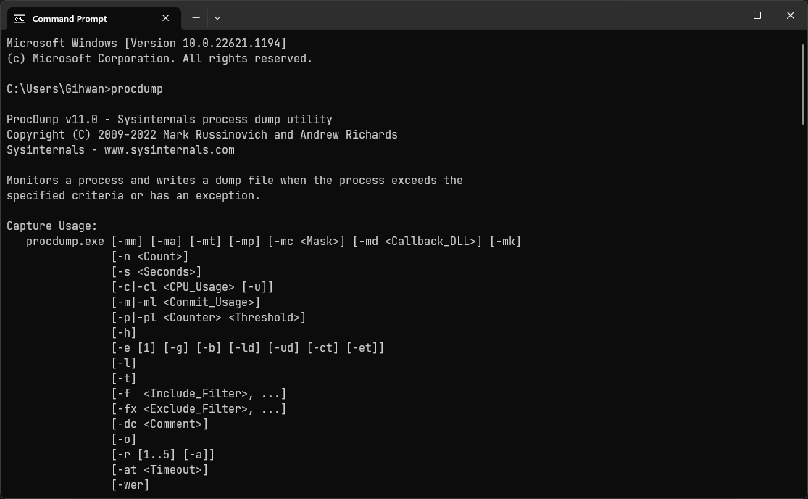

# ProcDump
[**ProcDump**](https://aka.ms/procdump)는 [프로세스](Process.md)의 [사용자 모드 덤프](Dump.md#사용자-모드-덤프)를 수집하는 [CLI](https://ko.wikipedia.org/wiki/명령_줄_인터페이스) 기반의 [Sysinternals](Sysinternals.md) 유틸리티 프로그램이다.

프로세스의 충돌 및 종료, 예외 처리, 또는 [프로세서](Processor.md)나 [메모리](Memory.md) 등의 [성능 카운터](Perfmon.md#성능-카운터)가 특정 수치에 도달하는 등의 조건부 덤프 수집도 가능하다. ProcDump의 덤프 수집에는 두 가지의 결함을 지닌다:

1. 현재 실행 중이거나 ProcDump의 `-x` 옵션으로 실행된 프로세스만 덤프를 수집할 수 있어, 차후 실행될 프로그램의 경우에는 충돌될 때만 수집이 가능하다.
2. 동명의 프로세스가 여럿 존재하면 반드시 PID를 통해 덤프를 수집하고자 하는 프로세스를 지목해야 한다.

## 덤프 종류
ProcDump는 아래의 덤프 종류를 생성할 수 있다.

<table style="width: 80%; margin-left: auto; margin-right: auto;"><caption style="caption-side: top;">ProcDump 덤프 유형 설정 매개변수</caption><colgroup><col style="width: 10%;"/><col style="width: 20%;"/><col style="width: 70%;"/></colgroup><thead><tr><th style="text-align: center;">매개변수</th><th style="text-align: center;">덤프 종류</th><th style="text-align: center;">설명</th></tr></thead><tbody><tr><td style="text-align: center;"><code>-ma</code></td><td style="text-align: center;"><a href="Dump.md#전체-덤프">전체 덤프</a></td><td>프로세스의 <a href="Process.md#가상-주소-공간">사용자 공간</a> 전체를 수집한다.</td></tr><tr><td style="text-align: center;"><code>-mm</code></td><td style="text-align: center;"><a href="Dump.md#미니-덤프">미니 덤프</a></td><td>프로세스의 사용자 공간 중에서 <a href="Thread.md">스레드</a> 및 레지스터 위주로 수집하며, ProcDump의 기본 덤프이다.</td></tr><tr><td style="text-align: center;"><code>-mp</code></td><td style="text-align: center;">미니플러스 덤프 (MiniPlus Dump)</td><td>프로세스의 프로그램 이미지를 제외한 사용자 공간 전체를 수집한다. 덤프에서 제외된 프로그램 이미지 정보는 해당 프로그램 파일이 위치한 경로를 디버깅 도구(예. <a href="WinDbg.md">WinDbg</a>)에 명시하여 보충할 수 있다.</td></tr><tr><td style="text-align: center;"><code>-mk</code></td><td style="text-align: center;">커널 덤프</td><td>프로세스에 관여한 커널 스택의 덤프를 추가로 생성한다. 단, 해당 덤프는 절대로 <a href="Dump.md#커널-메모리-덤프">커널 메모리 덤프</a>가 아니다.</td></tr></tbody></table>

## 덤프 수집 조건
ProcDump에서 덤프를 생성하는 조건을 다음과 같이 설정할 수 있다.

### 예외 처리
어플리케이션에서 처리하지 못한 [예외](Cpp.md#예외-처리)(exception)가 발생, 즉 충돌이 일어나면 프로그램이 종료되기 전에 덤프를 수집하도록 하는 `-e` 옵션이 있다. 해당 매개변수의 설명을 자세히 읽어보면 "first chance exception"이란 용어를 발견할 수 있는데, 이를 통해 예외에도 종류가 있다는 점을 확인할 수 있다.

> 만일 예외가 무엇인지 잘 모르겠으면 대표적인 예시로 0xC0000005 [STATUS_ACCESS_VIOLATION](https://learn.microsoft.com/en-us/openspecs/windows_protocols/ms-erref/596a1078-e883-4972-9bbc-49e60bebca55) 메모리 접근 오류가 존재한다.

[디버깅](https://en.wikipedia.org/wiki/Debugging) 관점에서 예외는 두 가지로 나뉘어진다:

* **[1차 시도 예외](https://learn.microsoft.com/en-us/archive/blogs/davidklinems/what-is-a-first-chance-exception)(First chance exceptions)**

    어플리케이션이 예외를 가장 처음으로 마주하였을 때를 가리킨다. 1차 시도 예외는 프로그램에 치명적인 문제가 있다는 것을 의미하지 않다; [`try`](Cpp.md#try-catch-예외-처리문)-[`catch`](Cpp.md#try-catch-예외-처리문) 등으로 훌륭한 예외 처리 코드가 마련되었다면, 1차 시도 예외의 발생 내역만 남긴 채 아무런 문제 없이 어플리케이션 실행을 이어간다. 디버깅 도구 설정을 통해 1차 시도 예외 때 어플리케이션 실행을 중단시켜 디버그 모드로 진입할 수 있다.

* **2차 시도 예외(Second chance exceptions)**

    어플리케이션이 1차 시도에서 예외를 처리하지 못하였을 때, 디버깅 도구에서 이를 처리할 수 있도록 주어진 두 번째 기회를 가리킨다. 어플리케이션은 실행이 중단되고 디버그 모드에 진입하는 데, 디버거에서 2차 시도 예외를 무사히 처리하였으면 어플리케이션 실행이 재개될 수 있다. 허나, 디버깅 도구가 없다면 어플리케이션은 2차 시도 예외를 처리하지 못한 채 그래도 충돌로 이어져 종료된다.

### 응답 없음
[GUI](https://en.wikipedia.org/wiki/Graphical_user_interface) 창이 있는 어플리케이션이 최소 5초 동안 응답 없음에 놓여진 경우에 덤프를 수집하도록 하는 `-h` 옵션이 있다.

### 성능 카운터
어플리케이션의 리소스 사용량을 [성능 카운터](Perfmon.md#성능-카운터) 기준에서 지정한 한계치를 초과하거나 미달하면 덤프를 수집하도록 할 수 있다.

<table style="width: 70%; margin-left: auto; margin-right: auto;"><caption style="caption-side: top;">ProcDump 덤프 생성 기준의 성능 카운터</caption><colgroup><col style="width: 20%;"/><col style="width: 10%;"/><col style="width: 10%;"/><col style="width: 60%;"/></colgroup><thead><tr><th rowspan="2" style="text-align: center;">성능 카운터</th><th colspan="2" style="text-align: center; border-bottom-style: none;">매개변수</th><th rowspan="2" style="text-align: center;">비고</th></tr><tr><th style="text-align: center;">초과</th><th style="text-align: center;">미달</th></tr></thead><tbody><tr><td style="text-align: center;">CPU 점유율</td><td style="text-align: center;"><code>-c</code></td><td style="text-align: center;"><code>-cl</code></td><td>퍼센트(%) 단위를 입력한다.</td></tr><tr><td style="text-align: center;"><a href="Memory.md#페이지">커밋된 메모리</a></td><td style="text-align: center;"><code>-m</code></td><td style="text-align: center;"><code>-ml</code></td><td>MB 단위를 입력한다.</td></tr><tr><td style="text-align: center;">기타</td><td style="text-align: center;"><code>-p</code></td><td style="text-align: center;"><code>-pl</code></td><td>예시: <code>"\Processor(_Total)\% Processor Time"</code></td></tr></tbody></table>

## 사후 디버깅
> *참고: [Enabling Postmortem Debugging - Windows driver | Microsoft Learn](https://learn.microsoft.com/en-us/windows-hardware/drivers/debugger/enabling-postmortem-debugging#window-sysinternals-procdump)*

**사후 디버거**(postmortem debugger)는 어플리케이션 충돌이 이미 발생하였을 때, [Windows Error Reporting](WER.md)(WER)은 [AeDebug](https://learn.microsoft.com/en-us/windows/win32/debug/configuring-automatic-debugging#configuring-automatic-debugging-for-application-crashes) 레지스트리 키에 등록되어 있는 명령어에 따라 디버거 프로세스를 실행한다. 이를 활용하여 ProcDump를 어플리케이션 충돌이 발생할 때마다 실행될 수 있도록 설정이 가능하다.

* `-i` 옵션을 입력하면 해당 프로그램을 AeDebug의 디버거 프로세스로 설치한다.
* `-u` 옵션을 입력하면 AeDebug로부터 ProcDump를 제거하여 이전 설정으로 되돌린다.
