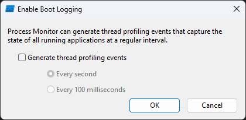

# 프로세스 모니터
**[프로세스 모니터](https://aka.ms/procmon)**(Process Monitor; 일명 Procmon)는 이벤트 활동 이력을 실시간으로 보여주는 [Sysinternals](Sysinternals.md) 유틸리티 프로그램이다. 시스템이나 [프로세스](Process.md)의 동작이나 상호작용 모니터링이 필요할 때 유용한 트러블슈팅 도구이다. 아래는 프로세스 모니터가 실행되는 장면의 스크린샷을 보여준다.

다음은 프로세스 모니터가 관측하는 이벤트 활동들을 나열 및 소개한다.

<table style="width: 80%; margin-left: auto; margin-right: auto;"><caption style="caption-side: top;">프로세스 모니터의 이벤트 활동 유형</caption><colgroup><col style="width: 15%;"/><col style="width: 85%;"/></colgroup><thead><tr><th style="text-align: center;">이벤트</th><th style="text-align: center;">모니터링 대상</th></tr></thead><tbody><tr><td style="text-align: center;"><a href="Registry.md">레지스트리</a></td><td>레지스트리 키 또는 값의 생성, 열거, 탐색, 삭제 등</td></tr><tr><td style="text-align: center;"><a href="FileSystem.md">파일 시스템</a></td><td>로컬 스토리지 및 원격에서 이루어진 파일 시스템 작업</td></tr><tr><td style="text-align: center;"><a href="Network.md">네트워크</a></td><td>UDP 및 TCP 네트워크 활동 (단, 실제로 전송 혹은 수신한 데이터는 파악 불가)</td></tr><tr><td style="text-align: center;"><a href="Process.md">프로세스</a></td><td>프로세스 및 <a href="Process.md#스레드">스레드</a>의 생성 및 종료, <a href="Process.md#가상-주소-공간">가상 주소 공간</a>에 이미지 로드 등</td></tr><tr><td style="text-align: center;"><a href="https://en.wikipedia.org/wiki/Profiling_(computer_programming)">프로파일링</a></td><td>시스템에 실행 중인 개별 프로세스마다 매초 항시 수집되는 <a href="Processor.md">CPU</a> 및 <a href="Memory.md">메모리</a>의 누적된 성능 수치 표시<ul><li><i>스레드 프로파일링 활성화는 선택적이며 초당 한 번 또는 열 번 수집하도록 설정할 수 있다.</i></li><li><i><a href="ProcDump.md">ProcDump</a>가 실행 중일 경우, 해당 프로그램으로부터 생성된 진단 결과를 공유받는다.</i></li></ul></td></tr></tbody></table>

프로세스 모니터는 런타임 때 PROCMON.sys [드라이버](Driver.md#드라이버)를 `%WinDir%\System32\Drivers` 디렉토리에 생성 및 설치하기 위해 반드시 관리자 권한으로 실행된다. 해당 드라이버는 [사용자](Processor.md#권한-수준)와 [커널 모드](Processor.md#권한-수준)의 시스템 정보를 가져오는 데 필요하며, 프로세스 모니터가 실행되면 [System](Process.md#시스템-프로세스) 프로세스에 로드된다.

## 부트 로깅
**부트 로깅**(boot logging)은 프로세스 모니터가 제공하는 기능 중 하나이며, [세션 관리자](Process.md#세션-관리자)가 시작하는 시점부터 [부팅](Boot.md) 과정에서 발생한 이벤트들을 수집 및 기록한다. GUI 창의 메뉴에서 Options > Enable Boot Logging으로 이동하면 아래와 같은 화면이 나타난다.

부트 로깅이 활성화되면 PROCMON.sys 드라이버는 부팅 시 실행되는 커널 [서비스](Service.md#서비스-제어-관리자)로 등록된다. 부트 로깅 시 수집된 데이터는 `%SystemRoot%\Procmon.PMB` 파일에 저장된다.
