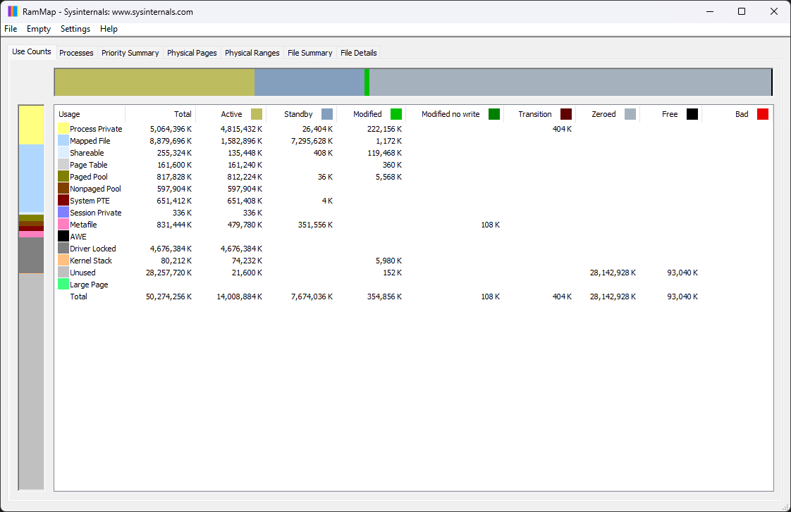

# RAMMap
[**RAMMap**](https://learn.microsoft.com/en-us/sysinternals/downloads/rammap)은 시스템의 [물리 메모리](Memory.md), 즉 [RAM](https://ko.wikipedia.org/wiki/랜덤_액세스_메모리)을 어떻게 활용하고 있는지 분석하는 [Sysinternals](Sysinternals.md) 유틸리티 프로그램이다. [윈도우](Windows.md) 운영체제에서 실행되는 [프로세스](Process.md#프로세스)나 메모리에 매핑된 [파일](FileSystem.md) 등을 확인할 수 있어, [작업 관리자](TaskMgr.md)나 [성능 모니터](Perfmon.md)로 포착할 수 없는 [작업 집합](Memory.md#작업-집합)을 파악하는 데 유용하게 사용될 수 있다.

아래는 RAMMap에서 나열하는 메모리 할당 유형들을 소개한다.

<table style="width: 80%; margin-left: auto; margin-right: auto;"><caption style="caption-side: top;">RAMMap에 나열되는 메모리 할당 유형</caption><colgroup><col style="width: 20%;"/><col style="width: 80%;"/></colgroup><thead><tr><th style="text-align: center;">메모리 할당 유형</th><th style="text-align: center;">설명</th></tr></thead><tbody><tr><td style="text-align: center;">Process Private</td><td>단일 프로세스가 전용으로 사용하기 위해 할당된 메모리이다.</td></tr><tr><td style="text-align: center;">Shareable</td><td>다수의 프로세스가 함께 사용할 수 있도록 공유 가능하다고 표식된 페이지이다.</td></tr><tr><td style="text-align: center;"><a href="https://en.wikipedia.org/wiki/Memory-mapped_file">Mapped File</a></td><td>가상 주소로 매핑된 <a href="FileSystem.md">파일</a> 내용물 중 RAM을 점유하고 있는 크기이다. 물리 메모리에 로드된 파일들은 <i>File Summary</i> 및 <i>File Detail</i> 탭에서 살펴볼 수 있다.</td></tr><tr><td style="text-align: center;"><a href="FileSystem.md#NTFS">Metafile</a></td><td>NTFS <a href="https://en.wikipedia.org/wiki/Metadata">메타데이터</a>를 담는 일종의 시스템 캐시이며, 이는 파일 시스템의 성능 향상에 도모한다.</td></tr><tr><td style="text-align: center;"><a href="Memory.md#메모리-풀">Paged Pool</a></td><td>디스크로 페이징 될 수 있는 커널 모드의 풀 메모리이다.</td></tr><tr><td style="text-align: center;"><a href="Memory.md#메모리-풀">Nonpaged Pool</a></td><td>디스크로 페이징 될 수 없는 커널 모드의 풀 메모리이다.</td></tr><tr><td style="text-align: center;"><a href="PageTable.md">Page Table</a></td><td>프로세스의 <a href="Process.md#가상-주소-공간">가상 주소 공간</a>과 RAM의 실제 주소 간의 매핑 정보를 담는 커널 모드 메모리이다.</td></tr><tr><td style="text-align: center;"><a href="PageTable.md#PTE">System PTE</a></td><td>입출력 공간, 커널 스택 등의 시스템 페이지와 RAM의 실제 주소 간에 동적으로 매핑하기 위한 시스템 PTE가 사용하는 메모리이다.</td></tr><tr><td style="text-align: center;">Session Private</td><td>특정 <a href="Logon.md#로그온-세션">로그온 세션</a>만이 사용할 수 있도록 할당된 메모리이다. 해당 메모리는 RDS 세션 호스트 서버에서 높게 측정될 것이다.</td></tr><tr><td style="text-align: center;"><a href="Memory.md#AWE">AWE</a></td><td><a href="https://en.wikipedia.org/wiki/SQL">SQL</a> 또는 <a href="https://en.wikipedia.org/wiki/Database">데이터베이스</a> 프로그램 등에서 사용하는 유형의 메모리이다.</td></tr><tr><td style="text-align: center;">Large Page</td><td>SQL 또는 오라클 프로그램 등에서 사용하는 유형의 메모리이며, (일반적인 4 KB 크기가 아닌) 2 MB로 확장된 페이지이다.</td></tr><tr><td style="text-align: center;"><a href="Memory.md#driver-locked-메모리">Driver Locked</a></td><td>드라이버에 의해 RAM에 고정된 페이지이며, 흔히 <a href="Hypervisor.md">하이퍼바이저</a>의 가상 머신에 배정된 물리 메모리 용량을 확보하기 위해 사용된다.</td></tr><tr><td style="text-align: center;">Kernel Stack</td><td>커널 스레드 스택을 담는 메모리이다.</td></tr><tr><td style="text-align: center;">Unused</td><td>미사용 중인 메모리이다.</td></tr></tbody><caption style="caption-side: bottom; text-align: left;"><i>† 참고: <a href="https://techcommunity.microsoft.com/t5/ask-the-performance-team/mystery-memory-leak-where-did-my-memory-go/ba-p/1675369">MYSTERY MEMORY LEAK: WHERE DID MY MEMORY GO?! - Microsoft Community Hub</a>.</i></caption></table>
