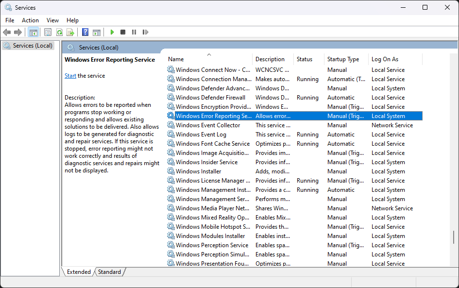

# 윈도우 오류 보고
**[윈도우 오류 보고](https://learn.microsoft.com/en-us/windows/win32/wer/windows-error-reporting)**(Windows Error Reporting; WER)는 [윈도우 비스타](Windows.md)부터 시작된 [서비스](Service.md)이며, [프로세스](Process.md)가 충돌하거나 응답이 없는 경우 [미니 덤프](ko.Dump#미니-덤프)를 생성하고 인터넷을 통해 Watson이란 [마이크로소프트](https://www.microsoft.com) 서버로 전송하여 적용 가능한 해결책을 제시한다. 이전 윈도우 운영체제에서 어플리케이션 디버깅에 사용된 [닥터 왓슨](https://en.wikipedia.org/wiki/Dr._Watson_(debugger))(Dr. Watson)의 진화형이다.



## 사용자 모드 덤프 수집
WER은 왓슨 서버로 전송되는 덤프와 별개로 로컬 시스템에서 덤프를 수집하도록 [설정](https://learn.microsoft.com/en-us/windows/win32/wer/collecting-user-mode-dumps)할 수 있다. 기본적으로 비활성화되어 있으나, 아래의 레지스트리 키를 생성하는 것만으로 충돌된 모든 어플리케이션의 덤프가 수집된다. 해당 설정은 재부팅 필요없이 곧바로 적용되며, WER 서비스를 사용하지 않아도 동작한다.

```terminal
HKEY_LOCAL_MACHINE\SOFTWARE\Microsoft\Windows\Windows Error Reporting\LocalDumps
```

<table style="width: 90%; margin-left: auto; margin-right: auto;"><caption style="caption-side: top;">WER 레지스트리 값 설정</caption><colgroup><col style="width: 15%;"/><col style="width: 45%;"/><col style="width: 15%;"/><col style="width: 25%;"/></colgroup><thead><tr><th style="text-align: center;">레지스트리 값</th><th style="text-align: center;">설명</th><th style="text-align: center;">레지스트리 종류</th><th style="text-align: center;">기본값</th></tr></thead><tbody><tr><td style="text-align: center;"><code>DumpFolder</code></td><td>어플리케이션 충돌 덤프가 저장되는 경로이다.</td><td style="text-align: center;">REG_EXPAND_SZ</td><td><code>%LOCALAPPDATA%\CrashDumps</code></td></tr><tr><td style="text-align: center;"><code>DumpCount</code></td><td>어플리케이션 충돌 덤프를 저장할 수 있는 최대 개수이다. 최대치에 도달한 상태에서 새로운 덤프가 생성되면 가장 오래된 덤프를 삭제한다.</td><td style="text-align: center;">REG_DWORD</td><td><code>0x0a</code>(10)</td></tr><tr><td style="text-align: center;"><code>DumpType</code></td><td>어플리케이션 충돌 덤프 종류를 지정한다.<ul><li><code>0x00</code>: 커스텀 덤프</li><li><code>0x01</code>: <a href="Dump.md#미니-덤프">미니 덤프</a></li><li><code>0x02</code>: <a href="Dump.md#전체-덤프">전체 덤프</a></li></ul></td><td style="text-align: center;">REG_DWORD</td><td><code>0x01</code>(1)</td></tr></tbody></table>

> 만일 아무런 레지스트리 값이 설정되어 있지 않은 상태에서 어플리케이션 충돌이 발생하면 명시된 기본값에 따라 덤프를 생성한다.

WER 사용자 모드 덤프 수집은 개별 어플리케이션마다 설정될 수 있으며, 이는 위에서 소개한 모든 어플리케이션에 전역적으로 적용되는 설정을 무효시킨다. 예를 들어 [서비스 호스트](Service.md#서비스-호스트)(`svchost.exe`) 충돌로 생성된 덤프를 별도로 설정하려면 아래의 레지스트리 키를 만들어야 한다.

```terminal
HKEY_LOCAL_MACHINE\SOFTWARE\Microsoft\Windows\Windows Error Reporting\LocalDumps\svchost.exe
```
