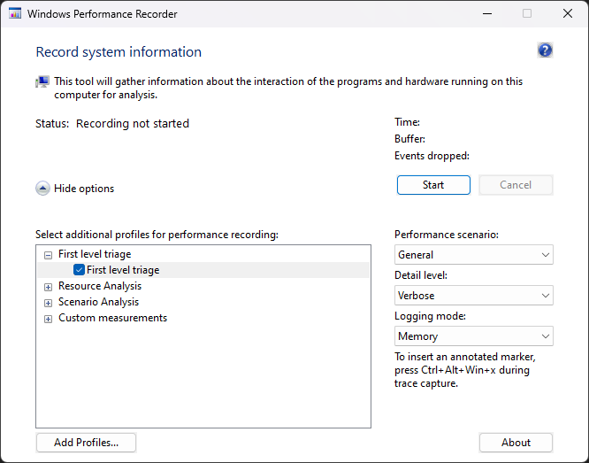

# Windows Performance Recorder
[Windows Performance Recorder](https://learn.microsoft.com/en-us/windows-hardware/test/wpt/windows-performance-recorder), 일명 WPR은 [ETW](ETW.md) 기술을 기반으로 [윈도우](Windows.md)의 성능 데이터를 매우 구체적이고 면밀하게 수집하는 도구이다. 성능 데이터를 수집하는 점에서 [성능 모니터](Performance_Monitor.md)와 WPR가 유사하지만, 전자는 시스템이나 [프로세스](Process.md)의 전반적인 성능을 진단한다면 후자는 특정 성능을 집중적으로 분석한다. 때문에 WPR은 비록 짧은 시간 동안 수집하여도 GB 단위의 [ETL](ETW.md#이벤트-추적-로그) 파일이 생성된다.

WPR은 본래 [윈도우 SDK](https://aka.ms/windowssdk)의 설치 옵션 중 하나에 해당하는 [Xperf](https://learn.microsoft.com/en-us/previous-versions/windows/it-pro/windows-8.1-and-8/hh162920(v=win.10))을 대체하기 위한 프로그램이다. [윈도우 10](https://ko.wikipedia.org/wiki/윈도우_10) 및 [서버 2016](https://ko.wikipedia.org/wiki/윈도우_서버_2016)부터 CLI 버전의 WPR이 기본적으로 탑재되면서, IT 관리자는 별도의 추가 설치가 필요 없이 트러블슈팅을 위한 성능 데이터 수집이 가능해졌다. 아래 GUI 버전의 WPR은 윈도우 SDK를 설치해야 한다.



## 프로파일
[프로파일](https://learn.microsoft.com/en-us/windows-hardware/test/wpt/recording-profiles)(profile)애는 WPR이 성능 데이터를 수집하는데 사용할 [이벤트 제공자](ETW.md) 목록, 버퍼 크기와 개수 등의 설정이 저장되어 있다. WPR에 내장된 프로파일이 있으며, 사용자가 직접 XML로 작성된 .wprp 확장자의 자체 프로파일을 제작할 수 있다. WPR의 프로파일 목록을 확인하려면 [`-profiles`](https://learn.microsoft.com/en-us/windows-hardware/test/wpt/wpr-command-line-options#profiles) 옵션을 입력한다.

```terminal
wpr -profiles
```
```
Microsoft Windows Performance Recorder Version 10.0.22621 (CoreSystem)
Copyright (c) 2022 Microsoft Corporation. All rights reserved.

        GeneralProfile              First level triage
        CPU                         CPU usage
        DiskIO                      Disk I/O activity
        FileIO                      File I/O activity
        Registry                    Registry I/O activity
        Network                     Networking I/O activity
        Heap                        Heap usage
        Pool                        Pool usage
        VirtualAllocation           VirtualAlloc usage
        Audio                       Audio glitches
        Video                       Video glitches
        Power                       Power usage
        InternetExplorer            Internet Explorer
        EdgeBrowser                 Microsoft Edge Browser
        Minifilter                  Minifilter I/O activity
        GPU                         GPU activity
        Handle                      Handle usage
        XAMLActivity                XAML activity
        HTMLActivity                HTML activity
        DesktopComposition          Desktop composition activity
        XAMLAppResponsiveness       XAML App Responsiveness analysis
        HTMLResponsiveness          HTML Responsiveness analysis
        ReferenceSet                Reference Set analysis
        ResidentSet                 Resident Set analysis
        XAMLHTMLAppMemoryAnalysis   XAML/HTML application memory analysis
        UTC                         UTC Scenarios
        DotNET                      .NET Activity
        WdfTraceLoggingProvider     WDF Driver Activity
        HeapSnapshot                Heap snapshot
```
