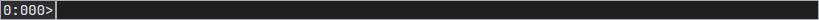
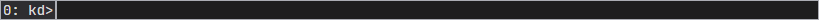
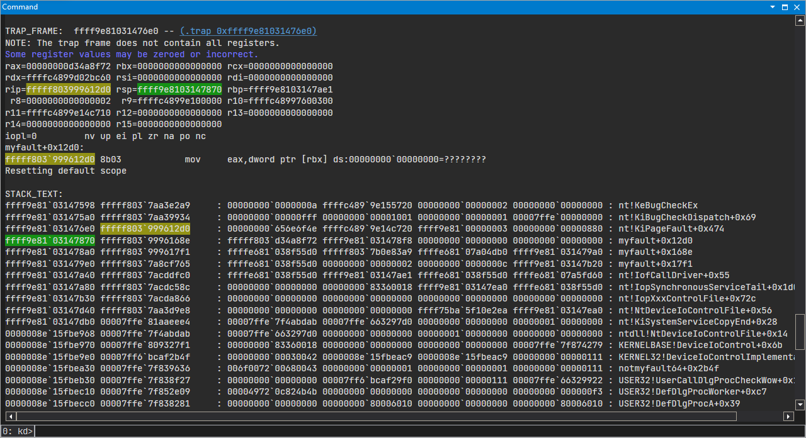
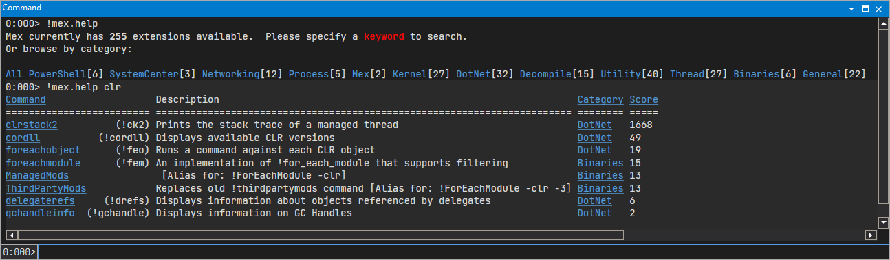
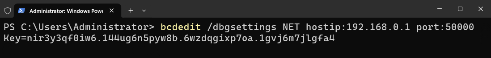

# WinDbg
**[WinDbg](https://ko.wikipedia.org/wiki/WinDbg)**<sub>([다운로드](https://apps.microsoft.com/store/detail/windbg-preview/9PGJGD53TN86))</sub>, 일명 **윈도우 디버거**(Windows Debugger)는 [윈도우](Windows.md)에서 실행되는 [어플리케이션](Process.md) 및 시스템 전체를 [디버깅](https://ko.wikipedia.org/wiki/디버그)하는 트러블슈팅 프로그램이다. 만일 레거시 버전의 WinDbg를 사용하려면 [윈도우 SDK](https://aka.ms/windowssdk)를 설치하도록 한다.


WinDbg는 흔히 어플리케이션 충돌이나 [블루스크린](BSOD.md)으로 생성된 [덤프](Dump.md) 파일을 분석하는 데 사용되며, 그 외에도 실시간 및 TTD 디버깅이 가능하다. 단, WinDbg는 [근본적인 원인 분석](https://en.wikipedia.org/wiki/Root_cause_analysis)을 위한 보조 도구에 불과하며 윈도우에서 발생한 모든 문제를 해결해 주는 게 아니다. 덤프에 남겨진 단서로부터 논리적이고 체계적인 방법론을 동원하여 합리적인 견해를 주장 및 조치 방안을 제시할 수 있어야 한다.

### 환경 변수 설정
WinDbg로부터 원활한 디버깅 작업을 진행하려면 아래와 같이 시스템 환경 변수를 설정하기를 권장한다.

<table style="width: 80%; margin-left: auto; margin-right: auto;"><caption style="caption-side: top;">WinDbg 관련 환경 변수</caption><colgroup><col style="width: 35%;"/><col style="width: 65%;"/></colgroup><thead><tr><th style="text-align: center;">환경 변수</th><th style="text-align: center;">설명</th></tr></thead><tbody><tr><td style="text-align: center;"><code>_NT_SYMBOL_PATH</code></td><td><a href="Symbol.md">심볼</a> 서버 및 캐시 경로를 지정한다.</td></tr><tr><td style="text-align: center;"><code>_NT_DEBUGGER_EXTENSION_PATH</code></td><td>WinDbg의 확장도구가 위치한 디렉토리를 명시한다 (<a href="https://en.wikipedia.org/wiki/Semicolon">세미콜론</a>으로 구분).</td></tr></tbody></table>

## 인터페이스
WinDbg에서 제공하는 화면이나 기능 등의 인터페이스에 대하여 소개한다.

### 명령창
명령창(command window)은 명령을 입력하고 그에 대한 출력이 나타나는 인터페이스이다. 어떤 덤프인지에 따라 명령창이 알려주는 정보는 다소 상이하다.

* **사용자 모드 덤프**

    콜론 `:`을 기준으로 좌측과 우측은 각각 현재 디버깅 중인 [프로세스](Process.md)와 [스레드](Process.md#스레드) 번호를 가리킨다; 이들은 WinDbg에서 부여한 상대적인 번호로 PID와 TID가 절대 아니다. 즉, 아래 그림은 WinDbg에서 인지한 0번 프로세스의 0번 스레드를 살펴보고 있음을 의미한다.

    

* **커널 모드 덤프**

    콜론 좌측의 숫자는 현재 디버깅되고 있는 [CPU](Processor.md) 코어 번호를 가리킨다. 아래 그림은 WinDbg에서 0번 CPU를 살펴보고 있음을 의미하며, 만일 단일 코어 시스템일 경우에는 [커널](Kernel.md) 디버깅을 의미하는 `kd`만 표시된다.
 
    

WinDbg에서 디버깅하고자 하는 스레드(어플리케이션 덤프 경우) 또는 CPU(메모리 덤프 경우) 번호는 [`~s`](https://learn.microsoft.com/en-us/windows-hardware/drivers/debugger/-s--change-current-processor-) 명령어를 통해 언제든지 변경 가능하다.

### 하이라이트
명령창 출력화면에서 관심있는 텍스트를 드래그하여 `CTRL+ALT+H` 단축키를 눌러 (토글 방식) 하이라이트를 입힐 수 있다. 해당 텍스트가 화면에 출력될 때마다 자동으로 하이라이트가 되기 때문에, 외우기 힘든 메모리 주소 등을 표시할 때 매우 유용하다.



## !analyze 확장도구
[**!analyze**](https://learn.microsoft.com/en-us/windows-hardware/drivers/debugger/-analyze)는 WinDbg에 기본적으로 탑재된 확장도구 중에서도 증상을 개략적으로 파악하는 데 유용하다. 하지만 해당 확장도구 또한 WinDbg와 마찬가지로 문제의 원인을 제시하는 도구가 아니며, 본 내용은 !analyze가 제시하는 자동 진단 내용이 무엇을 내포하는지 소개한다. !analyze 확장도구의 진단 내용은 [마이크로소프트 공식 문서](https://learn.microsoft.com/en-us/windows-hardware/drivers/debugger/using-the--analyze-extension)에서 확인할 수 있다.

<table style="width: 95%; margin-left: auto; margin-right: auto;"><caption style="caption-side: top;">!analyze 출력화면 비교</caption><thead><tr><th style="text-align: center;">충돌 소프트웨어</th><th style="text-align: center;">출력화면 및 설명</th></tr></thead><colgroup><col style="width: 15%;" /><col style="width: 85%;" /></colgroup><tbody><tr><td style="text-align: center;">어플리케이션</td><td>

```windbg
0:000> !analyze -v
*******************************************************************************
*                                                                             *
*                        Exception Analysis                                   *
*                                                                             *
*******************************************************************************

EXCEPTION_RECORD:  (.exr -1)
ExceptionAddress: 00007ff6ecfc1002 (ForceAppCrash!main+0x0000000000000002)
   ExceptionCode: c0000005 (Access violation)
  ExceptionFlags: 00000000
NumberParameters: 2
   Parameter[0]: 0000000000000001
   Parameter[1]: 0000000000000000
Attempt to write to address 0000000000000000
```
<a href="C.md#예외-처리">예외</a>가 발생한 메모리 주소와 <a href="https://learn.microsoft.com/en-us/openspecs/windows_protocols/ms-erref/596a1078-e883-4972-9bbc-49e60bebca55">NTSTATUS</a> 코드를 알려주고 구체적인 정황을 매개변수로 설명한다. 위의 덤프에서는 0xC0000005 STATUS_ACCESS_VIOLATION이란 유효하지 않은 메모리에 데이터를 작성하려는 시도를 확인하였다.</td></tr><tr><td style="text-align: center;">운영체제</td><td>

```windbg
0: kd> !analyze -v
*******************************************************************************
*                                                                             *
*                        Bugcheck Analysis                                    *
*                                                                             *
*******************************************************************************

DRIVER_IRQL_NOT_LESS_OR_EQUAL (d1)
An attempt was made to access a pageable (or completely invalid) address at an
interrupt request level (IRQL) that is too high.  This is usually
caused by drivers using improper addresses.
If kernel debugger is available get stack backtrace.
Arguments:
Arg1: ffffc4899e155720, memory referenced
Arg2: 0000000000000002, IRQL
Arg3: 0000000000000000, value 0 = read operation, 1 = write operation
Arg4: fffff803999612d0, address which referenced memory
```
<a href="https://learn.microsoft.com/en-us/windows-hardware/drivers/debugger/bug-check-code-reference2">Bugcheck</a>와 구체적인 정황을 소개하는 네 개의 매개변수를 알려준다. 위의 덤프는 DISPATCH_LEVEL 이상의 IRQL에서 유효하지 않는 메모리 주소에 데이터 작성을 시도하였음을 알리는 bugcheck <a href="https://learn.microsoft.com/en-us/windows-hardware/drivers/debugger/bug-check-0xd1--driver-irql-not-less-or-equal">0xD1 DRIVER_IRQL_NOT_LESS_OR_EQUAL</a>로 확인되었다.</td></tr></tbody></table>

이후 공통사항으로 레지스터에 저장된 데이터와 충돌이 발생한 스택을 화면에 출력한다. [어셈블리](Assembly.md)와 스택 기반의 [메모리](Memory.md) 할당 등의 컴퓨터공학 및 윈도우 운영체제에 대한 이해도가 요구된다. 본 문서에서는 WinDbg를 사용하여 분석하기 위해 알아야 할 사항과 명령, 그리고 방법론을 위주로 소개한다.

## MEX 확장도구
**MEX**<sub>([다운로드](https://www.microsoft.com/en-us/download/details.aspx?id=53304))</sub>는 WinDbg와 함께께 포함되지 않은 확장도구이지만, 디버깅에 유용한 다양한 기능을 제공한다. MEX를 사용하려면 해당 DLL을 [`.load`](https://learn.microsoft.com/en-us/windows-hardware/drivers/debuggercmds/-load---loadby--load-extension-dll-) 명령으로 불러오거나 _NT_DEBUGGER_EXTENSION_PATH 환경 변수에 DLL이 위치한 디렉토리를 지정할 수 있다. MEX 명령어 목록은 아래와 같이 검색할 수 있다.



# 실시간 디버깅
이미 문제가 발생하여 생성된 [덤프](Dump.md) 분석 외에도 [프로세스](Process.md) 또는 [커널](Kernel.md)에 직접 연결(attach)하여 실행되는 도중에 실시간으로 [중단점](https://en.wikipedia.org/wiki/Breakpoint)을 설정하는 등의 [디버깅](https://en.wikipedia.org/wiki/Debugging)이 가능하다. 본 장은 [WinDbg](#windbg)가 지원하는 실시간 디버깅을 두 모드에 대하여 각각 설명한다.

1. [사용자 모드 디버깅](#사용자-모드-디버깅)
1. [커널 모드 디버깅](#커널-모드-디버깅)

## 사용자 모드 디버깅
> *출처: [Get started with WinDbg (user mode) - Windows drivers | Microsoft Learn](https://learn.microsoft.com/en-us/windows-hardware/drivers/debugger/getting-started-with-windbg)*

프로세스의 실시간 디버깅은 두 가지 접근법이 있다: (1) 이미 실행 중인 프로세스에 연결하거나 (2) WinDbg로부터 디버깅 대상의 프로세스를 직접 실행하는 방법이다. 사용자 주소 공간만 접근할 수 있는 제약이 있지만, 대부분의 프로세스 디버깅에는 충분하다. 디버거의 개입은 프로세스 성능 저하에 불가피하므로, [비침범성 디버깅](https://learn.microsoft.com/en-us/windows-hardware/drivers/debugger/noninvasive-debugging--user-mode-)을 통해 영향을 최소화할 수 있다.

### 시간여행 디버깅
WinDbg는 프로세스의 실시간 디버깅 외에 [TTD](Dump.md#시간여행-디버깅) 덤프를 먼저 수집한 이후 분석하는 방식도 지원한다. *Record with Time Travel Debugging* 상자를 체크하면 TTD를 수집하며, 실시간 디버깅이 아닌 관계로 수집이 중단되거나 프로세스가 종료된 이후에 디버깅이 가능하다.

## 커널 모드 디버깅
> *출처: [Get started with WinDbg (kernel-mode) - Windows drivers | Microsoft Learn](https://learn.microsoft.com/en-us/windows-hardware/drivers/debugger/getting-started-with-windbg--kernel-mode-)*

커널 디버깅에서 언급되는 컴퓨터 유형은 다음과 같이 두 가지로 분류된다.

<table style="width: 95%; margin-left: auto; margin-right: auto;"><caption style="text-align: center;">커널 디버깅의 두 가지 컴퓨터 유형</capation><colgroup><col style="width: 50%;"/><col style="width: 50%;"/></colgroup><thead><tr><th style="text-align: center;">호스트 컴퓨터 (host computer)</th><th style="text-align: center;">타깃 컴퓨터 (target computer)</th></tr></thead><tbody><tr style="text-align: center;"><td>WinDbg를 실행하여 디버깅을 행하는 컴퓨터를 가리킨다.</td><td>WinDbg에 연결되어 디버깅을 당하는 컴퓨터를 가리킨다.</td></tr></tbody></table>

타깃 컴퓨터의 윈도우 부팅 옵션에서 [디버깅 모드](https://learn.microsoft.com/en-us/windows-hardware/drivers/devtest/bcdedit--debug) 활성화가 필수이며, [보안 부팅](https://learn.microsoft.com/en-us/windows-hardware/drivers/bringup/secure-boot) 및 [BitLocker](BitLocker.md) 등 윈도우 보안 기능의 임시 비활성화가 요구된다. 디버깅 모드를 활성화하려면 관리자 권한의 터미널에서 아래 명령을 입력한다.

```
bcdedit /debug on
```
<sup>*† [윈도우 11](https://aka.ms/windows11) 및 [서버 2025](https://aka.ms/windowsserver2025)부터 [Enable-BcdElementDebug](https://learn.microsoft.com/en-us/powershell/module/microsoft.windows.bcd.cmdlets/enable-bcdelementdebug) 명령어가 소개되어 [Windows PowerShell](PowerShell.md)의 [cmdlet](PowerShell.md#Cmdlet)으로 설정을 지원한다.*</sup>

디버깅 대상의 타깃이 로컬 (즉, 호스트 자신) 혹은 네트워크에 연결된 다른 컴퓨터인지 여부에 따라 추후 [커널 디버거 설정](https://learn.microsoft.com/en-us/windows-hardware/drivers/devtest/bcdedit--dbgsettings)이 달라진다.

* [로컬 커널 디버깅 설정](#로컬-커널-디버깅-설정)
* [네트워크 커널 디버깅 설정](#네트워크-커널-디버깅-설정)
* [가상 머신 커널 디버깅 설정](#가상-머신-커널-디버깅-설정)

### 로컬 커널 디버깅 설정
> *출처: [Setting Up Local Kernel Debugging of a Single Computer Manually - Windows drivers | Microsoft Learn](https://learn.microsoft.com/en-us/windows-hardware/drivers/debugger/setting-up-local-kernel-debugging-of-a-single-computer-manually)*

로컬 커널 디버깅은 설정이 매우 간단하지만 스스로를 디버깅하기 때문에 기능은 매우 제한적이다. 윈도우 OS의 기본 디버깅 설정이며, 아래 명령을 입력하여 로컬 커널 디버깅으로 설정을 되돌릴 수 있다. 설정을 적용하기 위해 반드시 시스템을 재부팅해야 한다.

```
bcdedit /dbgsettings LOCAL
```
<sup>*† 윈도우 11 및 서버 2025부터 Windows PowerShell에 추가가된 [Set-BcdDebugSettings](https://learn.microsoft.com/en-us/powershell/module/microsoft.windows.bcd.cmdlets/set-bcddebugsettings) cmdlet의 경우에는 [-Local](https://learn.microsoft.com/en-us/powershell/module/microsoft.windows.bcd.cmdlets/set-bcddebugsettings#-local) 매개변수로 설정한다.*</sup>

로컬 커널 디버깅을 진행하려면 WinDbg를 열어 *File > Start debugging > Attach to kernel* 선택지의 Local 탭으로 이동하여 OK 버튼을 클릭한다.

### 네트워크 커널 디버깅 설정
> *출처: [Set up KDNET network kernel debugging manually - Windows drivers | Microsoft Learn](https://learn.microsoft.com/en-us/windows-hardware/drivers/debugger/setting-up-a-network-debugging-connection)*

네트워크를 통해 타깃 컴퓨터가 디버깅을 위해 접근을 허용할 호스트 컴퓨터의 [IP 주소](TCPIP.md#인터넷-프로토콜)와 이를 위해 사용할 [포트 번호](TCPIP.md#포트)를 지정하는 구조(일명 **KDNET**)이다. [동적 포트](https://en.wikipedia.org/wiki/Ephemeral_port) 중에서 권장되는 포트 범위는 50000-50039이다. 두 컴퓨터 간에 원활한 통신이 보장되어야 하기 때문에, 네트워크에 대한 기술적 이해가 요구되어 난이도가 있으나 가장 권장되는 커널 디버깅 방법이다. 

예를 들어, 호스트 컴퓨터의 IPv4 주소가 192.168.0.1이고 타깃 컴퓨터는 포트 50000을 커널 디버깅에 사용하기로 정하였다면 아래 명령으로 설정한다.

```
bcdedit /dbgsettings NET hostip:192.168.0.1 port:50000
```
<sup>*† 윈도우 11 및 서버 2025부터 Windows PowerShell에 추가된 [Set-BcdDebugSettings](https://learn.microsoft.com/en-us/powershell/module/microsoft.windows.bcd.cmdlets/set-bcddebugsettings) cmdlet의 경우에는 [-Net](https://learn.microsoft.com/en-us/powershell/module/microsoft.windows.bcd.cmdlets/set-bcddebugsettings#-net) 매개변수로 설정한다.*</sup>

명령을 입력하면 타깃 컴퓨터는 호스트 컴퓨터가 디버깅을 위한 접근에 필요한 [암호 키](https://en.wikipedia.org/wiki/Session_key)를 자동 생성하고 화면에 출력한다. 해당 키를 파일로 저장하거나 기록한 다음, 변경된 설정을 적용하기 위해 시스템을 재부팅한다.



네트워크 디버깅을 진행하려면 WinDbg를 열어 *File > Start debugging > Attach to kernel* 선택지의 Net 탭으로 이동하여 Port Number 및 Key 입력란에 기록한 정보들을 채워 OK 버튼을 클릭한다.

### 가상 머신 커널 디버깅 설정
> *출처: [Setting Up Network Debugging of a Virtual Machine with KDNET - Windows drivers | Microsoft Learn](https://learn.microsoft.com/en-us/windows-hardware/drivers/debugger/setting-up-network-debugging-of-a-virtual-machine-host)*

[하이퍼바이저](Hypervisor.md) 가상 머신을 타깃 컴퓨터로 디버깅할 수 있으며, 호스트 컴퓨터에서 실행 중인 가상 머신도 가능하다. 여러 하이퍼바이저가 존재하지만, 본 문서는 [하이퍼-V](HyperV.md)를 위주로 [KDNET](#네트워크-커널-디버깅-설정) 설정 방법을 소개한다. 우선 통신 연결을 위해 다음과 같이 하이퍼-V 가상 네트워크 스위치를 구성한다.

<table style="width: 75%; margin-left: auto; margin-right: auto;"><caption style="caption-side: top;">KDNET을 위한 하이퍼-V 가상 네트워크 스위치 구성</caption><colgroup><col style="width: 60%;"/><col style="width: 40%;"/></colgroup><thead><tr><th style="text-align: center;">옵션</th><th style="text-align: center;">설정</th></tr></thead><tbody><tr><td>연결 형식</td><td style="text-align: center;">외부 네트워크 (혹은 내부 네트워크)<sup>†</sup></td></tr><tr><td>관리 운영 체제에서 이 네트워크 어뎁터를 공유할 수 있도록 허용</td><td style="text-align: center;">✔️</td></tr><tr><td>VLAN ID</td><td style="text-align: center;">❌</td></tr></tbody><caption style="caption-side: bottom; text-align: left;"><i><sub>† 내부 네트워크는 호스트 컴퓨터에서 실행 중인 하이퍼-V 가상 머신일 경우로 제한된다.</sub></i></caption></table>

만일 UEFI 기반인 2세대 VM일 경우, 가상 머신의 *Settings... > Security*로 이동하여 보안 부팅을 해제한다. 이후 KDNET 설정 과정은 *[네트워크 커널 디버깅 설정](#네트워크-커널-디버깅-설정)* 부분을 참고한다.

# 스택 해석하기
[스레드](Process.md#스레드) [스택](https://ko.wikipedia.org/wiki/스택)을 읽는 절차는 당시 프로그램 혹은 시스템이 어떠한 작업을 하였는지 이해하려는 디버깅의 기초이자 핵심되는 작업 중 하나이다. 본 내용은 가급적 [WinDbg](#windbg)에서 제공하는 기본 명령만을 사용하여 스택을 해석하는 방법을 소개한다.

아래는 [Bugcheck](https://learn.microsoft.com/en-us/windows-hardware/drivers/debugger/bug-check-code-reference2) [0xD1 DRIVER_IRQL_NOT_LESS_OR_EQUAL](https://learn.microsoft.com/en-us/windows-hardware/drivers/debugger/bug-check-0xd1--driver-irql-not-less-or-equal)에 의해 생성된 전체 메모리 덤프를 예시로 스택 해석을 설명한다. WinDbg에서 [`k*`](https://learn.microsoft.com/en-us/windows-hardware/drivers/debugger/k--kb--kc--kd--kp--kp--kv--display-stack-backtrace-) 명령어는 스택을 역추적하여 화면에 출력하며, [와일드카드](https://ko.wikipedia.org/wiki/와일드카드_문자)에 어떤 문자를 입력하는지에 따라 표시되는 정보가 다소 달라진다.

```windbg
0: kd> k
 # Child-SP          RetAddr               Call Site
00 ffff9e81`03147598 fffff803`7aa3e2a9     nt!KeBugCheckEx
01 ffff9e81`031475a0 fffff803`7aa39934     nt!KiBugCheckDispatch+0x69
02 ffff9e81`031476e0 fffff803`999612d0     nt!KiPageFault+0x474
03 ffff9e81`03147870 fffff803`9996168e     myfault+0x12d0
04 ffff9e81`031478a0 fffff803`999617f1     myfault+0x168e
05 ffff9e81`031479e0 fffff803`7a8cf765     myfault+0x17f1
06 ffff9e81`03147a40 fffff803`7acddfc0     nt!IofCallDriver+0x55
07 ffff9e81`03147a80 fffff803`7acdc58c     nt!IopSynchronousServiceTail+0x1d0
08 ffff9e81`03147b30 fffff803`7acda866     nt!IopXxxControlFile+0x72c
09 ffff9e81`03147d40 fffff803`7aa3d9e8     nt!NtDeviceIoControlFile+0x56
0a ffff9e81`03147db0 00007ffe`81aaeee4     nt!KiSystemServiceCopyEnd+0x28
0b 0000008e`15fbe968 00007ffe`7f4abdab     ntdll!NtDeviceIoControlFile+0x14
0c 0000008e`15fbe970 00007ffe`809327f1     KERNELBASE!DeviceIoControl+0x6b
0d 0000008e`15fbe9e0 00007ff6`bcaf2b4f     KERNEL32!DeviceIoControlImplementation+0x81
0e 0000008e`15fbea30 00007ffe`7f839636     notmyfault64+0x2b4f
0f 0000008e`15fbeb30 00007ffe`7f838f27     USER32!UserCallDlgProcCheckWow+0x182
10 0000008e`15fbec10 00007ffe`7f852e09     USER32!DefDlgProcWorker+0xc7
11 0000008e`15fbecc0 00007ffe`7f838281     USER32!DefDlgProcA+0x39
12 0000008e`15fbed00 00007ffe`7f837f3c     USER32!UserCallWinProcCheckWow+0x2d1
13 0000008e`15fbee60 00007ffe`7f84303d     USER32!DispatchClientMessage+0x9c
14 0000008e`15fbeec0 00007ffe`81ab2e44     USER32!_fnDWORD+0x3d
15 0000008e`15fbef20 00007ffe`7f451554     ntdll!KiUserCallbackDispatcherContinue
16 0000008e`15fbefa8 00007ffe`7f8378b8     win32u!NtUserMessageCall+0x14
17 0000008e`15fbefb0 00007ffe`7f837567     USER32!SendMessageWorker+0x2e8
18 0000008e`15fbf060 00007ffe`663db485     USER32!SendMessageW+0x137
19 0000008e`15fbf0c0 00007ffe`66352433     COMCTL32!Button_ReleaseCapture+0x18d
1a 0000008e`15fbf0f0 00007ffe`7f838281     COMCTL32!Button_WndProc+0x28c63
1b 0000008e`15fbf1c0 00007ffe`7f837d41     USER32!UserCallWinProcCheckWow+0x2d1
1c 0000008e`15fbf320 00007ffe`7f838bad     USER32!DispatchMessageWorker+0x1f1
1d 0000008e`15fbf3a0 00007ffe`663883c4     USER32!IsDialogMessageW+0x17d
1e 0000008e`15fbf400 00007ffe`6638ad1c     COMCTL32!Prop_IsDialogMessage+0x1f0
1f 0000008e`15fbf430 00007ffe`6638a99f     COMCTL32!_RealPropertySheet+0x32c
20 0000008e`15fbf500 00007ffe`6638b633     COMCTL32!_PropertySheet+0x47
21 0000008e`15fbf530 00007ff6`bcaf449d     COMCTL32!PropertySheetA+0x53
22 0000008e`15fbf5d0 00007ff6`bcaf47da     notmyfault64+0x449d
23 0000008e`15fbf930 00007ffe`809426bd     notmyfault64+0x47da
24 0000008e`15fbf970 00007ffe`81a6dfb8     KERNEL32!BaseThreadInitThunk+0x1d
25 0000008e`15fbf9a0 00000000`00000000     ntdll!RtlUserThreadStart+0x28
```

# 같이 보기
* [Debugger Commands - Windows drivers &#124; Microsoft Learn](https://learn.microsoft.com/en-us/windows-hardware/drivers/debugger/debugger-commands)
