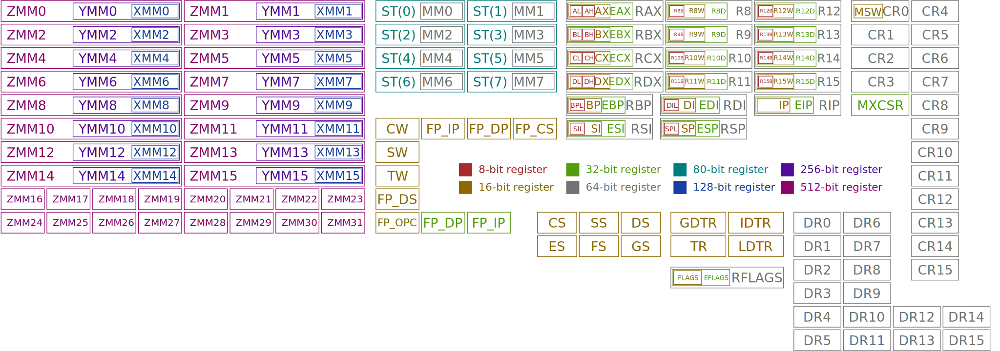

# 어셈블리
[어셈블리](https://ko.wikipedia.org/wiki/어셈블리어)(Assembly)는 프로그래밍 언어의 명령 코드가 [아키텍처](https://ko.wikipedia.org/wiki/컴퓨터_구조)(예를 들어 [x86](https://ko.wikipedia.org/wiki/X86), [x64](https://ko.wikipedia.org/wiki/X86-64), [ARM64](https://ko.wikipedia.org/wiki/ARM_아키텍처) 등)의 [기계어](https://ko.wikipedia.org/wiki/기계어) [명령](https://ko.wikipedia.org/wiki/명령어_집합)과 매우 잘 부합하는 저급 프로그래밍 언어를 일컫는다. 비록 [C++](ko.Cpp.md), [C#](ko.Csharp.md), [파이썬](ko.Python.md) 등의 고급 프로그래밍 언어에 비해 코딩 속도가 느리지만, 기계어를 직접 프로그래밍 하기 때문에 실행 속도는 [C](ko.C.md) 언어보다 빠르다. 그러므로 운영체제 중에서 빠른 처리 속도가 요구되는 일부 기능은 어셈블리 언어로 제작된다.

어셈블리 언어는 다음 컴퓨터 과학 및 구조에 대한 상당한 이해가 전제되어야 한다:

* [프로세서](ko.Processor.md)
* [메모리](ko.Memory.md)
* [이진법](https://ko.wikipedia.org/wiki/이진법) 및 [십육진법](https://ko.wikipedia.org/wiki/십육진법)
* [논리 연산](https://ko.wikipedia.org/wiki/논리_연산)

필수 요소는 아니지만, 아래에 대한 충분한 이해가 있으면 본문의 내용을 이해하는 데 수월하다:

* C 프로그래밍 언어
* 비주얼 스튜디오
* [WinDbg](ko.WinDbg.md)

## 어셈블러
[어셈블러](https://ko.wikipedia.org/wiki/어셈블리어#어셈블러)(assembler)는 어셈블리 언어를 기계어로 변환하는 프로그램이다. 얼핏 [컴파일러](ko.Compiler.md)와 유사하지만, 어셈블러는 프로그래밍 언어를 변환하는 게 아니라 단순히 어셈블리 코드를 대응하는 기계어로 변환한다. 대표적인 어셈블러로 인텔의 [NASM](https://ko.wikipedia.org/wiki/넷와이드_어셈블러)<sub>([공식 홈페이지](https://www.nasm.us/))</sub>, 마이크로소프트의 [MASM](https://learn.microsoft.com/en-us/cpp/assembler/masm/microsoft-macro-assembler-reference)<sub>([공식 홈페이지](http://www.masm32.com/))</sub> 등이 존재한다.

어셈블러를 통해 어셈블리 언어에서 기계어로 변환되면 부산물로 [오브젝트 파일](https://ko.wikipedia.org/wiki/목적_파일)(object file)이 생성된다. 오브젝트 파일은 파편적인 코드이므로, 다른 코드와 연동시키기 위해서는 [링커](https://ko.wikipedia.org/wiki/링커_(컴퓨팅))(linker)의 작업을 필요하다. 이를 통해 정적 및 동적 [라이브러리](ko.C.md#라이브러리)의 함수나 구조체를 가져올 수 있게 된다.

# 구문
[구문](https://ko.wikipedia.org/wiki/구문_(프로그래밍_언어))(syntax)은 프로그래밍 언어에서 문자 및 기호들의 조합이 올바른 문장 또는 표현식을 구성하였는지 정의하는 규칙이다. 어셈블리 코드를 작성하지 않더라도, 구문을 알고 있으면 디버깅 등의 트러블슈팅 목적으로도 유용하게 활용될 수 있다. 허나, 운영체제 및 [어셈블러](#어셈블러)에 따라 구문에 차이가 있음을 명시하도록 한다.

> 본문은 [윈도우](ko.Windows.md) 운영체제에서 [NASM](https://ko.wikipedia.org/wiki/넷와이드_어셈블러) 어셈블러를 위주로 설명한다.

어셈블리의 소스 코드는 [메모리 세그먼트](https://ko.wikipedia.org/wiki/X86_메모리_분할)<sub>([참고](https://en.wikipedia.org/wiki/File:Program_memory_layout.pdf))</sub> 중 다음 세 가지를 지원하며 (즉, [스택](https://ko.wikipedia.org/wiki/스택) 및 [힙](https://ko.wikipedia.org/wiki/동적_메모리_할당) 영역 제외), 이들은 `section` 키워드와 함께 명시하여 구분된다:

<table style="width: 60%; margin: auto;">
<caption style="caption-side: top;">어셈블리 언어의 프로그래밍 영역</caption>
<colgroup><col style="width: 15%;"/><col style="width: 85%;"/></colgroup>
<thead><tr><th style="text-align: center;">세그먼트</th><th style="text-align: center;">설명</th></tr></thead>
<tbody><tr><td style="text-align: center;"><a href="https://en.wikipedia.org/wiki/Code_segment"><code>.text</code></a></td><td>프로세서가 실행할 코드가 기입된다; MASM의 경우 <a href="https://en.wikipedia.org/wiki/Code_segment"><code>.code</code></a> 사용을 권장한다.</td></tr><tr><td style="text-align: center;"><a href="https://en.wikipedia.org/wiki/Data_segment"><code>.data</code></a></td><td>초기화된 변수 및 상수를 선언하며, 런타임에 변경이 불가하다.</td></tr><tr><td style="text-align: center;"><a href="https://ko.wikipedia.org/wiki/.bss"><code>.bss</code></a></td><td>초기화되지 않거나 영값을 가진 변수를 선언하며, 흔히 버퍼로 사용된다.</td></tr></tbody>
</table>

```nasm
global _main     ; 전역으로 선언된 _main 함수
extern _printf   ; extern으로 선언된 _printf 함수

; .text (혹은 .code) 영역
section .text
_main:
    push message
    call _printf
    add  esp, 4
    ret

; .data 영역
section .data
    message db "Hello World", 10, 0    ; ASCII 10 (new line '\n') and 0 (null terminator '\0')
```

위의 예시 코드에서 세미콜론 `;`은 주석(comment)을 나타내며 프로그램의 소스 코드로 취급하지 않아 실행되지 않는다.

### 진입점
[진입점](https://ko.wikipedia.org/wiki/엔트리_포인트)(entry point)은 프로그램이 시작되는 지점이다. C 런타임 라이브러리는 `_main` 함수를 기본 진입점으로 지정하였지만, [링커](https://ko.wikipedia.org/wiki/링커_(컴퓨팅))에게 진입점을 명시한다면 어떠한 이름을 지정해도 상관없다. 그리고 프로그램을 실행할 수 있도록 진입점은 외부에서도 접근이 가능한 [전역 함수](ko.C.md#함수)(global function)로 선언되어야 한다.

> `_main`에서의 밑줄은 사용자가 정의한 심볼과 네이밍 충돌을 방지하기 위한 관습으로, GCC 컴파일러는 C 언어 심볼에 해당 관습을 기본으로 적용한다.

## 문장
[문장](https://ko.wikipedia.org/wiki/문_(프로그래밍))(statement)은 실질적으로 무언가를 실행하는 구문적 존재를 가리킨다. 어셈블리 언어는 스크립트 줄마다 한 개의 문장만 기입될 수 있다.

```nasm
MNEMONIC    OPERAND     ; 명령어 집합을 표현하는 기초적인 문장 구성
```
위의 문장은 하나의 [명령어 집합](#명령어)을 나타내며, 이를 구성하는 요소들은 다음 역할을 지닌다:

* [니모닉](https://ko.wikipedia.org/wiki/기억술#치환법(변환법))(mnemonic): 기계어 연산자(일명 opcode)를 프로그래머가 쉽게 알아볼 수 있도록 영문으로 명시된 심볼적 명칭이다(`ADD`, `MOV`, 등).
* [피연산자](https://ko.wikipedia.org/wiki/피연산자#컴퓨터_과학)(operand): 니모닉으로부터 연산될 데이터들이며, `RET`와 같이 일부 경우에는 피연산자가 요구되지 않는다.

### 레이블
[레이블](https://ko.wikipedia.org/wiki/레이블_(컴퓨터_과학))(label)은 [메모리 주소](ko.C.md#포인터)를 명칭으로 호출할 수 있도록 하며, [C](ko.C.md)/[C++](ko.Cpp.md) 언어의 `goto` 이동문에 사용되는 [레이블](ko.C.md#goto-이동문)과 동일하다. 다시 말해, 레이블은 `.data` 혹은 `.bss` 영역에서 다루어지는 [변수](ko.C.md#변수)가 절대 아니다. 본 장의 예시에서 `_main`은 진입점을 가리키는 레이블에 해당한다.

# 레지스터
[레지스터](https://ko.wikipedia.org/wiki/프로세서_레지스터)(register)는 [프로세서](ko.Processor.md)가 연산을 위해 필요한 데이터, 또는 연산을 마치고 반환될 데이터를 임시로 저장할 수 있는 [워드](https://ko.wikipedia.org/wiki/워드_(컴퓨팅))([x86](https://ko.wikipedia.org/wiki/X86) 및 [x64](https://ko.wikipedia.org/wiki/X86-64)는 각각 32비트 그리고 64비트) 크기의 메모리이다. 여기서 워드(word)란, 시스템 아키텍처가 처리하는 데 가장 자연스러운 데이터 크기를 가리킨다. 시스템 아키텍처의 워드를 정의하는 요소 중 하나가 바로 프로세서의 레지스터 크기이다.

> 레지스터는 프로세서에만 종속되지 않고 [물리 디스크](https://ko.wikipedia.org/wiki/하드_디스크_드라이브) 또는 [그래픽 카드](https://ko.wikipedia.org/wiki/그래픽_카드) 등 다양한 하드웨어에서도 활용되지만, 본문은 프로세서를 위주로 설명한다.

비록 RAM도 매우 빠른 속도의 데이터 접근성을 자랑하지만, 레지스터는 아예 CPU 내부에 탑재되어 있어 접근 속도가 순식간이다. 그러한 만큼 어셈블리 언어는 레지스터를 활발히 사용하기 때문에 각 레지스터의 역할이 무엇인지 인지해야 한다.



위의 그림에서 볼 수 있듯이 x86-64(일명 x64) 아키텍처에 여러 레지스터가 존재하는 걸 확인할 수 있다. 그 중에서 `RAX` 안에 `EAX`가 들어있는 등의 구조를 여럿 찾아볼 수 있는데, 우선 이들이 무엇을 의미하는지 파악해야 한다. 가장 기초적인 범용 레지스터(general purpose register) A, B, C, 그리고 D를 위주로 살펴본다.

<table style="width: 80%; margin: auto;">
<caption style="caption-side: top;">x86-64 프로세서의 범용 레지스터 구조</caption>
<colgroup><col style="width: 50%;"/><col style="width: 25%;"/><col style="width: 12.5%;"/><col style="width: 12.5%;"/></colgroup>
<thead><tr><th style="text-align: center;">64</th><th style="text-align: center;">32</th><th style="text-align: center;">16</th><th style="text-align: center;">8</th></tr></thead>
<tbody style="text-align: center;">
<tr><td colspan="4"><code>R?(X)</code></td></tr>
<tr><td>-</td><td colspan="3"><code>E?(X)</code></td></tr>
<tr><td colspan="2">-</td><td colspan="2"><code>?(X)</code></td></tr>
<tr><td colspan="2">-</td><td><code>?H</code></td><td><code>?L</code></td></tr>
</tbody>
</table>

* **16비트 아키텍처**

    레지스터에 따라 구체적인 구조와 명칭하는 방법이 다소 상이할 수 있다:

    * *범용 레지스터 A, B, C, D*

        비록 16비트 워드이지만, 편의상 8비트 단위로 관리되어야 하는 경우가 존재한다. 상위(High) 및 하위(Low) 8비트 명칭을 접미사 `H`와 `L`로 분류하며, 이 둘을 종합한 레지스터는 16비트로 "확장되었다(e**X**tended)"고 하여 접미사 `X`가 붙는다.

    * *64비트 전용 범용 레지스터 `R8` ~ `R15`*

        본래 64비트 아키텍처를 대상으로 설계된 레지스터이므로, 8비트와 16비트 구성을 각각 바이트(byte)와 워드(word)의 앞글자를 따와 `R8B` (~ `R15B`) 그리고 `R8W` (~ `R15W`)라고 칭한다.

    * *그 외 레지스터*

        나머지 레지스터는 일반적으로 (워드와 동일한 크기의) 메모리 주소를 다루는 경향이 많아, 16비트 전체가 의미있는 데이터를 나타내는 경우가 대다수이다. 그러므로 16비트 레지스터는 `IP`, `SP`, `BP`처럼 접미사나 접두사가 붙지 않으며, 일부는 하위 8비트에 대해서만 접미사 `L`을 붙여 호출할 수 있다.

* **32비트 아키텍처**

    레지스터에 따라 구체적인 구조와 명칭하는 방법이 다소 상이할 수 있다:

    * *32비트 범용 레지스터 및 그 외 레지스터*

        16비트로 레지스터에서 32비트로 "확장되었다(**E**xtended)"는 의미로 접두사 `E`가 붙는다.

    * *64비트 전용 범용 레지스터 `R8` ~ `R15`*

        본래 64비트 아키텍처를 대상으로 설계된 레지스터이므로, 32비트 구성을 `DWORD`(doubleword) 자료형의 앞글자를 따와 `R8D` (~ `R15D`)라고 칭한다.

* **64비트 아키텍처**

    레지스터(**R**egister)를 의미하는 접두사 `R`이 모든 레지스터 이름 앞에 붙는다.

# 명령어
> *참고: [Intel x86 Assembler Instruction Set Opcode Table](http://sparksandflames.com/files/x86InstructionChart.html)*
