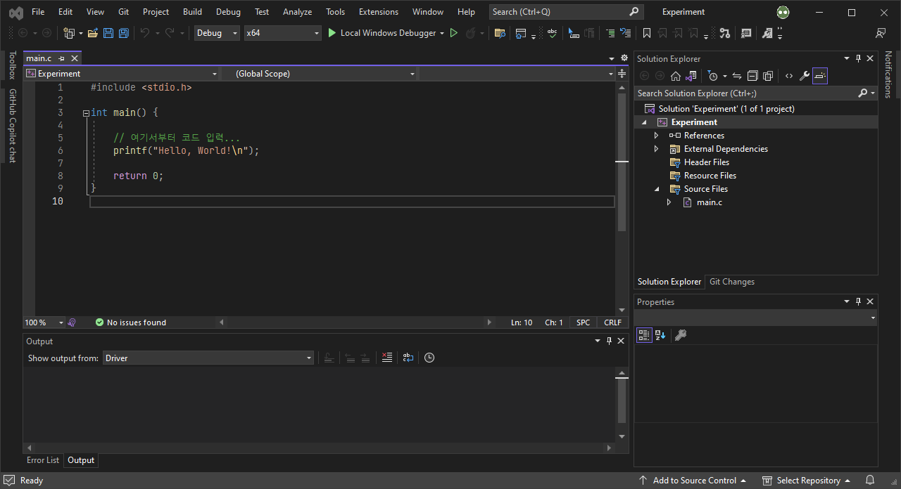
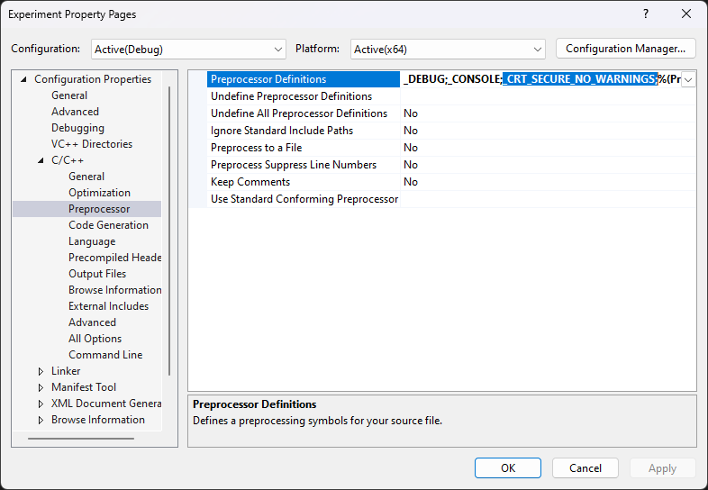

# C
[C 언어](https://learn.microsoft.com/en-us/cpp/c-language/)는 [유닉스](https://ko.wikipedia.org/wiki/유닉스)(UNIX) 컴퓨터를 위한 소프트웨어 제작을 위해 개발된 [B 언어](https://ko.wikipedia.org/wiki/B_(프로그래밍_언어))의 후속작이다. 현재 C 언어는 가장 널리 사용되고 있는 프로그래밍 언어로 [C++](ko.Cpp.md), [C#](ko.Csharp.md), [파이썬](ko.Python.md), 자바 등 여러 프로그래밍 언어에 영향을 주었다. C 언어는 다른 프로그래밍 언어에 비해 매우 빠른 처리 속도와 훌륭한 호환성을 가지고 있어 소프트웨어 및 펌웨어 개발에 여전히 사용되고 있다.

C 언어에 필요한 컴파일러는 흔히 소스 코드 편집, 프로그램 빌드, 그리고 디버깅 기능을 제공하는 [통합 개발 환경](https://ko.wikipedia.org/wiki/통합_개발_환경)(integrated development environment; IDE)을 설치하면 대체로 권장되는 [컴파일러](#컴파일러)가 함께 설치된다.

> [비주얼 스튜디오 코드](https://code.visualstudio.com/)(Visual Studio Code; VS Code)는 엄연히 말해 "텍스트 편집기"이며, 아래의 IDE를 사용할 것을 권장한다.

* [비주얼 스튜디오](https://visualstudio.microsoft.com/) <sub>(윈도우, macOS)</sub>
* [엑스코드](https://developer.apple.com/xcode/) <sub>(macOS)</sub>
* [CLion](https://www.jetbrains.com/clion/) <sub>(윈도우, macOS, 리눅스)</sub>

## 컴파일러
C 언어는 [컴파일 언어](ko.Compiler.md)(compiled language)이다. C 컴파일러는 [국제 표준화 기구](https://www.iso.org/home.html)(International Organization for Standardization; ISO)에서 표준을 발표한 년도에 따라 버전이 나뉘어진다. 가장 널리 사용되고 있는 버전으로는 ANSI C(일명 C89)와 C99가 있다. 본 문서는 <span style="color: red;">*ANSI C 컴파일러 기준*</span>으로 C 언어를 설명한다.

컴파일러는 개발사와 목적에 따라 다양한 종류가 존재하지만, 전부 동일한 ISO 표준에 따라 동작하므로 일반적인 경우에는 어떤 컴파일러를 사용하던 무관하다. 아래는 대표적인 C 언어 컴파일러들을 나열한다.

* [Microsoft Visual C++](https://ko.wikipedia.org/wiki/마이크로소프트_비주얼_C%2B%2B) (일명 MSVC): 마이크로소프트
* [GNU C Compiler](https://ko.wikipedia.org/wiki/GNU_C_컴파일러) (일명 GCC): GNU 프로젝트
* [Clang](https://ko.wikipedia.org/wiki/클랭): LLVM Developer Group, 애플

## 프로젝트
다음은 비주얼 스튜디오 2022을 위주로 C 언어 프로젝트 구축에 대하여 설명한다.



엑스코드와 달리, 비주얼 스튜디오는 C 언어를 위한 별도 프로젝트 생성 옵션이 존재하지 않는다. 대안으로 [C++](ko.Cpp.md)에서 빈 프로젝트(Empty Project)를 생성한 다음, 소스 코드를 `.C` 확장자로 직접 추가할 수 있다. MSVC 컴파일러는 C++를 주요 대상으로 설계된 컴파일러이지만, C 언어도 함께 지원하기 때문이다.

아래는 C 언어를 실행하는 가장 기초적인 코드와 함께 코드에 대한 설명이다.

<table style="width: 95%; margin: auto;">
<caption style="caption-side: top;">간단한 C 언어 코드 및 설명</caption>
<colgroup><col style="width: 50%;"/><col styl="width: 50%;"/></colgroup>
<thead><tr><th style="text-align: center;">코드</th><th style="text-align: center;">설명</th></tr></thead>
<tbody>
<tr>
<td>

```c
#include <stdio.h>

int main() {

    // 여기서부터 코드 입력...
    printf("Hello, World!\n");

    return 0;
}
```
</td><td>
<ul><li><code>#include &lt;stdio.h&gt;</code><br/>Stdio.h <a href="#헤더-파일">헤더 파일</a>로부터 C 표준 입출력 라이브러리를 불러오며, 터미널에 텍스트를 출력하는 <a href="#파일-입출력"><code>printf()</code></a> <a href="#함수">함수</a> 등을 제공한다.</li><li><code>int main() { ... }</code><br/>C 언어가 시작되는 함수, 일명 <a href="#진입점">진입점</a>이다.</li><li><code>return 0;</code><br/>함수를 종료하며 0 값을 반환하는 데, 이는 <code>EXIT_SUCCESS</code>에 대응하며 성공적으로 프로그램이 종료되었음을 의미한다.</li></ul>
</td></tr></tbody>
</table>

### C 런타임 라이브러리
> *출처: [Security Features in the CRT | Microsoft Learn](https://learn.microsoft.com/en-us/cpp/c-runtime-library/security-features-in-the-crt)*

C [런타임 라이브러리](https://ko.wikipedia.org/wiki/런타임_라이브러리), 일명 CRT는 C/C++ 프로그램이 [런타임 환경](https://ko.wikipedia.org/wiki/런타임_시스템)에서 동작하기 위해 필요한 함수들의 집합체이다. 대표적으로 메모리 할당 및 해제, 파일 입출력, 문자열 조작, 예외 처리 등이 해당한다. 매우 기초적이지만 필연적인 기능이므로, 일부 핵심 CRT(예를 들어 `malloc`, `printf`, `strcpy` 등)는 운영체제가 설치될 때 함께 내장되기도 한다. 런타임 라이브러리는 개발자나 서드 파티의 (정적 혹은 동적) [라이브러리](#라이브러리)와 전혀 다른 개념이므로 혼돈되어서는 안된다.

비주얼 스튜디오 2015 이후부터 `_s` 접미사가 붙은 안정성이 강화된 새로운 CRT 함수들이 소개되며(예를 들어 [`printf_s`](https://learn.microsoft.com/en-us/cpp/c-runtime-library/reference/printf-s-printf-s-l-wprintf-s-wprintf-s-l), [`strcpy_s`](https://learn.microsoft.com/en-us/cpp/c-runtime-library/reference/strcpy-s-wcscpy-s-mbscpy-s) 등), 기존의 옛 CRT 함수들을 사용하려 할 시 [C4996](https://learn.microsoft.com/en-us/cpp/error-messages/compiler-warnings/compiler-warning-level-3-c4996) 컴파일러 경고가 나타난다. 하지만 옛 CRT의 활용이 권장되지 않을 뿐, 사라진 게 아니므로 경고를 무시하려면 아래와 같이 매크로를 소스 코드 또는 프로젝트에 정의한다.

```c
#define _CRT_SECURE_NO_WARNINGS
```



## 헤더 파일
[헤더 파일](https://ko.wikipedia.org/wiki/헤더_파일)(header file)은 데이터 및 기능의 존재를 알리는 역할을 하는 `.H` 확장자 파일이다. 통상적으로 헤더 파일은 동일한 이름의 소스 파일과 짝을 이루며, 소스 파일에서 작성된 데이터와 코드를 헤더 파일로 통해 다른 소스 파일에서도 사용할 수 있도록 한다. 헤더 파일을 불러오는 방식은 두 가지가 존재한다:

```c
#include <stdio.h>
#include "header.h"
```

이 둘은 [전처리기](#전처리기)가 헤더 파일을 어느 위치에서 찾을 것인지 차이점을 가진다.

* **`#include <header.h>`**
    
    컴파일러 혹은 IDE에서 지정한 경로를 위주로 헤더 파일을 찾으며, 일반적으로 시스템 헤더 파일에 사용된다.

* **`#include "header.h"`**
    
    현재 소스 파일이 위치한 경로를 위주로 헤더 파일을 찾는다. 만일 찾지 못하였을 시, `#include <header.h>`와 같이 지정된 경로에서 헤더 파일을 재탐색한다. 일반적으로 사용자 정의 헤더 파일에 사용된다.


아래는 프로그래밍 언어에서 흔히 사용되는 데이터와 기능들은 바로 사용할 수 있도록 미리 컴파일된 [표준 라이브러리](https://ko.wikipedia.org/wiki/C_표준_라이브러리)를 불러오는 헤더 파일 일부를 나열한다.

<table style="width: 80%; margin: auto;">
<caption style="caption-side: top;">C 표준 라이브러리의 헤더 파일</caption>
<colgroup><col style="width: 18%;"/><col style="width: 12%;"/><col style="70%;"/></colgroup>
<thead><tr><th style="text-align: center;">유형</th><th style="text-align: center;">헤더 파일</th><th style="text-align: center;">설명</th></tr></thead>
<tbody><tr><td style="text-align: center;"><a href="https://ko.wikipedia.org/wiki/C_파일_입출력">표준 입출력</a></td><td style="text-align: center;"><code>stdio</code></td><td>파일 입출력 함수를 제공한다: <code>printf()</code>, <code>scanf()</code> 등</td></tr><tr><td style="text-align: center;">표준 라이브러리</td><td style="text-align: center;"><code>stdlib</code></td><td>메모리 할당, 예외처리를 포함한 범목적 기능들을 제공한다: <code>malloc()</code>, <code>free()</code> 등</td></tr><tr><td style="text-align: center;"><a href="https://ko.wikipedia.org/wiki/C_날짜와_시간_함수">날짜 및 시간</a></td><td style="text-align: center;"><code>time</code></td><td>날짜 및 시간과 관련된 함수를 제공한다: <code>time()</code>, <code>clock()</code> 등</td></tr><tr><td style="text-align: center;"><a href="https://ko.wikipedia.org/wiki/C_수식_함수">수식</a></td><td style="text-align: center;"><code>math</code></td><td>수학적 함수를 제공한다: <code>exp()</code>, <code>cos()</code> 등</td></tr></tbody>
</table>

### 컴파일된 헤더
[컴파일된 헤더](https://en.wikipedia.org/wiki/Precompiled_header)(precompiled header)는 컴파일러에서 더 빠른 속도로 처리할 수 있도록 중간체 형태로 컴파일된 헤더 파일이다. 컴파일 시간을 줄일 수 있는 장점을 가져 수많은 헤더 파일을 가진 프로젝트 혹은 큰 용량을 가진 헤더 파일에 효율적이다. 허나 컴파일된 헤더를 사용하면 컴파일 작업 자체에는 시간이 다소 걸리는 단점이 있어, 용량이 작은 프로젝트나 자주 수정을 해야 하는 헤더 파일이 있다면 컴파일된 헤더 파일은 오히려 비효율적이다.

> MSVC 컴파일러의 경우 `pch.h`(비주얼 스튜디오 2017 이전에는 `stdafx.h`)가 해당한다.

# 구문
[구문](https://ko.wikipedia.org/wiki/구문_(프로그래밍_언어))(syntax)은 프로그래밍 언어에서 문자 및 기호들의 조합이 올바른 문장 또는 표현식을 구성하였는지 정의하는 규칙이다. 각 프로그래밍 언어마다 규정하는 구문이 다르며, 이를 준수하지 않을 시 해당 프로그램은 빌드되지 않거나, 실행이 되어도 오류 및 의도치 않은 동작을 수행한다.

다음은 C 언어에서 구문에 관여하는 요소들을 소개한다:

* **[표현식](https://ko.wikipedia.org/wiki/식_(프로그래밍))(expression)**
    
    값을 반환하는 구문적 존재를 가리킨다. 표현식에 대한 결과를 도출하는 것을 평가(evaluate)라고 부른다.
    
    ```c
    2 + 3           // 숫자 5를 반환
    2 < 3           // 논리 참을 반환
    ```

* **[토큰](https://learn.microsoft.com/en-us/cpp/c-language/c-tokens)(token)**

    표현식을 구성하는 가장 기본적인 요소이며, 대표적으로 [키워드](https://learn.microsoft.com/en-us/cpp/c-language/c-keywords)(keyword), [식별자](#식별자)(identifier), [상수](https://learn.microsoft.com/en-us/cpp/c-language/c-constants)(constant), [문자열 리터럴](https://learn.microsoft.com/en-us/cpp/c-language/c-string-literals)(string literal) 등이 있다.

    ```c
    variable        // 식별자
    2               // 상수
    ```

* **[문장](https://ko.wikipedia.org/wiki/문_(프로그래밍))(statement)**
    
    실질적으로 무언가를 실행하는 구문적 존재를 가리킨다: 흔히 하나 이상의 표현식으로 구성되지만, [`break`](#break-문) 및 [`continue`](#continue-문)와 같이 독립적으로 사용되는 문장도 있다. 러스트 프로그래밍 언어는 [세미콜론](https://ko.wikipedia.org/wiki/새줄_문자)(semicolon) `;`을 기준으로 문장을 분별한다. 

    ```c
    int variable = 2 + 3;      // 숫자 5를 "variable" 변수에 초기화
    if (2 < 3) statement;      // 논리가 참이면 "statement" 문장 실행
    ```

* **[블록](블록_(프로그래밍))(block)**

    한 개 이상의 문장들을 한꺼번에 관리할 수 있도록 묶어놓은 소스 코드상 그룹이다. 블록 안에 또 다른 블록이 상주할 수 있으며, 이를 네스티드 블록(nested block)이라고 부른다. C 언어에서는 한 쌍의 중괄호 `{ }`로 표시된다.

    ```c
    {
        int variable = 2 + 3;
        if (2 < 3) statement;
    }
    ```

### 식별자
[식별자](https://learn.microsoft.com/en-us/cpp/c-language/c-identifiers)(identifier)는 프로그램을 구성하는 데이터들을 구별하기 위해 사용되는 명칭이다. 즉, 식별자는 개발자가 데이터에 직접 붙여준 이름이다. C 프로그래밍 언어에서 식별자를 선정하는데 아래의 규칙을 지켜야 한다.

1. 알파벳, 숫자, 밑줄 `_`만 허용 (그 외 특수문자 및 공백 사용 불가)
2. 식별자의 첫 문자는 숫자가 될 수 없음
3. 대소문자 구분 필수
4. [예약어](https://ko.wikipedia.org/wiki/예약어) 금지

### 주석
[주석](https://doc.rust-lang.org/reference/comments.html)(comment)은 프로그램의 소스 코드로 취급하지 않아 실행되지 않는 영역이다. 흔히 코드에 대한 간단한 정보를 기입하기 위해 사용되는 데, C 언어에는 한줄 주석 그리고 블록 주석이 존재한다.

<table style="table-layout: fixed; width: 80%; margin: auto;">
<caption style="caption-side: top;">C 언어 주석 종류</caption>
<colgroup><col style="width: 50%;"/><col style="width: 50%;"/></colgroup>
<thead><tr><th style="text-align: center;">한줄 주석</th><th style="text-align: center;">블록 주석</th></tr></thead>
<tbody>
<tr><td colspan="2">주석은 컴파일 직전에 <a href="#전처리기">전처리기</a>에 의해 소스 코드에 제거된다. 즉, 실행 파일 안에는 주석의 어떠한 정보도 저장되지 않는다.</td></tr>
<tr style="vertical-align: top; overflow-wrap: break-word;"><td>

```c
// 한줄 주석: 코드 한 줄을 차지하는 주석이다.
```
</td><td>

```c
/*
블록 주석:
코드 여러 줄을 차지하는 주석이다.
*/
```
</td></tr>
</tbody>
</table>

## 자료형
[자료형](https://ko.wikipedia.org/wiki/자료형)(data type)은 데이터를 어떻게 표현할 지 결정하는 요소이며, C 언어에서는 다음과 같이 존재한다. 단, 본 문서는 ANSI C 언어를 기준으로 소개하므로, 이후 C99부터 소개된 일부 자료형(`bool`, `long long` 등)은 목록에 제외되었다.

<table style="width: 80%; margin: auto;">
<caption style="caption-side: top;"><a href="https://learn.microsoft.com/en-us/cpp/c-language/storage-of-basic-types">C 언어 자료형</a> (ANSI C 기준)</caption>
<colgroup><col style="width: 15%;"/><col style="width: 15%;"/><col style="width: 15%;"/><col/></colgroup>
<thead><tr><th style="text-align: center;">키워드</th><th style="text-align: center;">자료형</th><th style="text-align: center;">크기 (바이트)</th><th style="text-align: center;">설명</th></tr></thead>
<tbody><tr><td style="text-align: center;"><code>char</code></td><td style="text-align: center;">문자</td><td style="text-align: center;">1</td><td>단일 ANSI 문자</td></tr><tr><td style="text-align: center;"><code>short</code></td><td style="text-align: center;">정수</td><td style="text-align: center;">2</td><td>가장 작은 정수 자료형</td></tr><tr><td style="text-align: center;"><code>int</code></td><td style="text-align: center;">정수</td><td style="text-align: center;">2 <sub>(최소)</sub></td><td>워드 크기의 기본 정수 자료형; <code>short</code>보다 작아서는 안되며, 32비트 시스템 이후로는 4바이트가 일반화되었다.</td></tr><tr><td style="text-align: center;"><code>long</code></td><td style="text-align: center;">정수</td><td style="text-align: center;">4 <sub>(최소)</td><td>정수 자료형 <code>int</code>보다 작아서는 안되며, 4바이트와 8바이트 중 어느 크기를 채택하였는지 컴파일러마다 다르다.</td></tr><tr><td style="text-align: center;"><code>float</code></td><td style="text-align: center;">부동소수점</td><td style="text-align: center;">4</td><td>32비트 단정밀도 실수</td></tr><tr><td style="text-align: center;"><code>double</code></td><td style="text-align: center;">부동소수점</td><td style="text-align: center;">8</td><td>64비트 배정밀도 실수</td></tr><tr><td style="text-align: center;"><code>void</code></td><td style="text-align: center;">보이드</td><td style="text-align: center;">1</td><td>불특정 자료형</td></tr></tbody/>
</table>

> [바이트](https://ko.wikipedia.org/wiki/바이트)(byte)란, 컴퓨터에서 메모리에 저장하는 가장 기본적인 단위이다. 자료형마다 크기가 정해진 이유는 효율적인 메모리 관리 차원도 있으나 CPU 연산과도 깊은 연관성을 갖는다. 한 바이트는 여덟 개의 [비트](https://ko.wikipedia.org/wiki/비트_(단위))(bit)로 구성된다.

`unsigned` 키워드는 자료형 중에서 [최상위 비트](https://ko.wikipedia.org/wiki/최상위_비트)를 정수의 [부호](https://ko.wikipedia.org/wiki/Signed와_unsigned)를 결정하는 요소로 사용하지 않도록 한다. 아래의 16비트 정수형인 `short`는 원래 최상위 비트를 제외한 나머지 15개의 비트로 정수를 표현한다. `unsigned` 키워드를 사용하면 음의 정수를 나타낼 수 없지만, 16개의 비트로 양의 정수를 더 많이 표현할 수 있다.

```c
short             // 표현 가능 범위: -32768 ~ +32767
unsigned short    // 표현 가능 범위:     +0 ~ +65535
``` 

### 자료형 변환
자료형 변환(type casting)은 데이터를 다른 자료형으로 바꾸는 작업이며, 불가피하게 데이터가 손실될 수 있으므로 유의하도록 한다.

* **암묵적 자료형 변환(implicit type casting)**

    코드에서 별도로 자료형을 명시하지 않아도 컴파일러에 의해 데이터가 자동적으로 적합한 자료형으로 변환되는 경우이다.

    ```c
    float num1 = 314.159;
    short num2 = num1;                   // num2 저장값: 314
    ```

* **명시적 자료형 변환(explicit type casting)**

    코드에서 소괄호 `()` 안에 자료형을 직접 기입하여 원하는 자료형으로 변환되는 경우이다.

    ```c
    float num1 = 314.159;
    short num2 = (unsigned char)num1;    // num2 저장값: 58
    ```

### `sizeof` 연산자
[`sizeof`](https://en.cppreference.com/w/c/language/sizeof) 연산자는 데이터나 자료형의 메모리에 할당된 바이트 크기를 반환한다.

```c
sizeof(int);      // 크기: 4바이트
sizeof(char);     // 크기: 1바이트
```

## 변수
변수(variable)는 데이터를 지정된 [자료형](#자료형)으로 저장하는 저장공간이다. 아래 예시는 `variable`이란 [식별자](#식별자)를 갖는 정수형 변수에 숫자 3을 할당한다. 시스템 관점에서 바라보면 `variable` 정수형 변수의 존재가 컴파일러에 각인되고 메모리가 할당되어 3이란 값이 저장되는 것으로, 이를 변수의 "정의(definition)"라고 부른다.

```c
// 변수 "variable"의 정의
int variable = 3;
```

정수 자료형 변수인 `variable`을 생성한 동시에 값 3을 할당하였는데, 변수로의 최초 할당을 "초기화(initialization)"라고 부른다.

아래는 변수를 정의하는 과정에서 초기화를 나중에 하는 예시 코드이다. 한 번 정의된 변수는 컴파일러 측에서 이미 존재를 알고 있으므로, 이후 변수에 다른 데이터를 저장하거나 호출할 때 자료형을 함께 언급하지 않는다. 초기화되지 않은 변수를 호출하는 것은 변수에 연동된 메모리가 가공되지 않은 상태로 잠재적 위험을 초래할 수 있기 때문에, 일반적으로 C 언어 컴파일러는 이를 오류로 치부한다.

```c
// 변수 "variable"의 정의
int variable;
variable = 3;
```

동일한 자료형의 변수 여러 개를 한꺼번에 정의하려면, 식별자마다 쉼표 `,`로 구분지을 수 있다.

```c
// 다수의 정수 자료형 변수 정의
int variable1 = 3, variable2 = 4, variable3;
```

변수의 "선언(declaration)"은 메모리 할당 여부와 관계없이 컴파일러에게 해당 변수의 존재성을 알리는 행위이다. 그러나 이미 변수를 정의하는 과정에서 컴파일러에게 변수의 존재를 알렸는데, 이 또한 변수를 선언한 것이다. 다음은 변수에 특수한 성질을 부여하는 선언 키워드를 소개한다.

<table style="width: 80%; margin: auto;">
<caption style="caption-side: top;">변수 선언 키워드 및 특징</caption>
<colgroup><col style="width: 20%;"/><col style="width: 80%;"/></colgroup>
<thead><tr><th style="text-align: center;">키워드</th><th style="text-align: center;">특징</th></tr></thead>
<tbody><tr><td style="text-align: center;"><a href="https://en.cppreference.com/w/cpp/language/constant_expression"><code>const</code></a></td><td>초기화된 이후로 변경이 불가한 상수(constant)로 지정한다.</td></tr><tr><td style="text-align: center;"><a href="https://en.cppreference.com/w/cpp/language/storage_duration#Static_local_variables"><code>static</code></a></td><td><a href="#함수">함수</a>를 탈출하여도 데이터가 소멸되지 않는 특수한 <a href="#지역-변수">지역 변수</a>, 일명 <a href="#정적-변수">정적 변수</a>이다.</td></tr><tr><td style="text-align: center;"><a href="https://en.cppreference.com/w/c/language/extern"><code>extern</code></a></td><td>아직 정의되지 않은 변수 혹은 함수를 미리 호출할 수 있도록 선언만 하는 <a href="#외부-변수">외부 변수</a>이다.</td></tr></tbody>
</table>

> 위에서 소개한 키워드, 특히 `static` 및 `extern`은 차후 함수와 [라이브러리](#라이브러리)를 소개하면서 다시 설명할 예정이다.

C/C++ 언어 [ISO 표준](https://github.com/cplusplus/draft)의 § 6.2 Declarations and definitions 부문에 의하면 일반적인 변수의 선언은 정의와 동일하다고 간주한다. 단, 다음은 변수가 선언되었으나 정의되지 않은 예외를 나열한다:

* 함수 전방선언
* 함수 매개변수 선언
* `extern` 키워드 선언
* `typedef` 선언

변수가 소스 코드 중에서 어디에 정의되었는지에 따라 지역 변수와 전역 변수로 구분된다. 

<table style="width: 95%; margin: auto;">
<caption>C 언어의 지역 및 전역 변수</caption>
<colgroup><col style="width: 50%;"/></col style="width: 50%;"/></colgroup>
<thead><tr><th style="text-align: center;">지역 변수</th><th style="text-align: center;">전역 변수</th></tr></thead>
<tbody><tr><td>

```c
int main () {

    // 지역 변수
    int variable;

    return 0;
}
```
</td><td>

```c
// 전역 변수
int variable;

int main() {

    return 0;
}
```
</td></tr>
<tr><td>블록 내부에서 정의된 변수이다. 지역 변수에 저장된 데이터는 블록 밖에서는 소멸되므로 외부에서 사용할 수 없다.</td><td>어떠한 블록에도 속하지 않은 외부에 정의된 변수이다. 전역 변수는 어느 블록에서라도 호출하여 지역 변수와 함께 사용할 수 있다.</td></tr>
</tbody>
</table>

변수는 지정된 자료형 외의 데이터를 할당받을 수 있다. 아래 예시 코드는 문자 자료형 변수에 값 75로 초기화할 시, ASCII 코드에 의하여 대문자 'K'로 저장된다.

```c
char variable = 75;    // ASCII에 의해 문자 'K'가 저장
```

거의 모든 프로그래밍 언어는 할당 기호를 기준으로 왼쪽에는 피할당자(변수), 오른쪽에는 할당자(데이터 혹은 변수)가 위치한다. 반대로 놓여질 경우, 오류가 발생하거나 원치 않는 결과가 도출될 수 있다.

## 연산자
연산자(operator)는 피연산 데이터를 조작할 수 있는 가장 간단한 형태의 연산 요소이다. 연산자는 피연산자의 접두부, 접미부, 혹은 두 데이터 사이에 위치시켜 사용한다. 가독성을 위해 데이터와 연산자 사이에 공백을 넣어도 연산에는 아무런 영향을 주지 않는다. 다음은 C 언어의 연산자들을 간략히 소개한다.

* **[산술 연산자](https://en.cppreference.com/w/cpp/language/operator_arithmetic)(arithmetic operators)**
    
    정수나 부동소수점 자료형 산술 연산에 사용된다: 가장 기본적인 `+`, `-`, `*`, `/` 사칙 연산자부터 나눗셈의 나머지 `%`를 구할 수 있다.

    * **증감 연산자**

        [증가 연산자](https://en.cppreference.com/w/cpp/language/operator_incdec)(increment operator) `++` 및 [감소 연산자](https://en.cppreference.com/w/cpp/language/operator_incdec)(decrement operator) `--`는 데이터를 1만큼 증가 혹은 감소하는데 간략하게 한 줄로 표현한다.

        <table style="width: 95%; margin: auto;"><caption style="caption-side: top;">증감 연산자의 위치에 따른 비교</caption><colgroup><col style="width: 50%;"/><col style="width: 50%;"/></colgroup><thead><tr><th style="text-align: center;">접두부</th><th style="text-align: center;">접미부</th></tr></thead><tbody><tr><td>해당 변수를 1만큼 증가/감소시킨 다음에 표현식을 평가한다.</td><td>표현식을 평가한 다음에 해당 변수를 1만큼 증가/감소시킨다.</td></tr><tr><td>

        ```c
        x = ++y;    // 동일: { y = y + 1; x = y; }
        x = --y;    // 동일: { y = y - 1; x = y; }
        ```
        </td><td>

        ```c
        x = y++;    // 동일: { x = y; y = y + 1; }
        x = y--;    // 동일: { x = y; y = y - 1; }
        ```
        </td></tr></tbody></table>

* **[비트 연산자](https://en.wikipedia.org/wiki/Bitwise_operations_in_C)(bitwise operators)**

* **[비교 연산자](https://en.cppreference.com/w/cpp/language/operator_comparison)(relational operators)**

    초과 `>`와 미만 `<`, 이상 `>=`과 이하 `<=`, 그리고 동일 `==`와 다름 `!=` 관계 부합 여부에 따라 논리적 참 혹은 거짓이 반환된다.

* **[논리 연산자](https://en.cppreference.com/w/cpp/language/operator_logical)(logical operators)**

    논리 자료형의 조합이 논리적으로 참인지 거짓인지 판별한다.

    <table style="width: 75%; margin: auto;"><caption style="caption-side: top;">논리 연산자 목록</caption><colgroup><col style="width: 10%;"/><col style="width: 15%;"/><col style="width: 75%;"/></colgroup><thead><tr><th style="text-align: center;">연산자</th><th style="text-align: center;">논리</th><th style="text-align: center;">설명</th></tr></thead><tbody><tr><td style="text-align: center;"><code>&&</code></td><td style="text-align: center;">논리곱</td><td>모든 데이터가 참이면 1을 반환하고, 그렇지 않으면 0을 반환한다.</td></tr><tr><td style="text-align: center;"><code>||</code></td><td style="text-align: center;">논리합</td><td>하나 이상의 데이터가 참이면 1을 반환하고, 그렇지 않으면 0을 반환한다.</td></tr><tr><td style="text-align: center;"><code>!</code></td><td style="text-align: center;">보수</td><td>참을 거짓으로, 또는 거짓을 참으로 변환한다.</td></tr></tbody></table>

* **[할당 연산자](https://en.cppreference.com/w/cpp/language/operator_assignment)(assignment operators)**

    할당 기호와 조합하여 산술 및 비트 연산 코드를 더욱 간결하게 작성할 수 있도록 한다. 아래는 다양한 할당 연산자 중에서 일부를 선보인다.

    <table style="width: 40%; margin: auto;"><caption style="caption-side: top;">할당 연산자 예시</caption><colgroup><col style=""/><col style=""/></colgroup><thead><tr><th style="text-align: center;">연산자</th><th style="text-align: center;">설명</th></tr></thead><tbody><tr><td style="text-align: center;"><code>=</code></td><td>변수로 할당된 값이 반환된다.</td></tr><tr><td style="text-align: center;"><code>+=</code></td><td>

    ```c
    x += y;    // 동일: x = x + y;
    ```
    </td></tr><tr><td style="text-align: center;"><code>*=</code></td><td>

    ```c
    x *= y;    // 동일: x = x * y;
    ```
    </td></tr><tr><td style="text-align: center;"><code>&=</code></td><td>

    ```c
    x &= y;    // 동일: x = x & y;
    ```
    </td></tr><tr><td style="text-align: center;"><code><<=</code></td><td>

    ```c
    x <<= y;    // 동일: x = x << y;
    ```
    </td></tr></tbody></table>

## 탈출 문자
[탈출 문자](https://ko.wikipedia.org/wiki/이스케이프_문자)(escape character)는 백슬래시 기호 `\`를 사용하며, [문자열](#문자열)로부터 탈출하여 텍스트 데이터 내에서 특정 연산을 수행하도록 한다. 예시에서 `\n` 탈출 문자를 사용하여 문자열 줄바꿈을 구현한 것을 보여주었다.

```c
printf("Hello,\nWorld!");
```
```
Hello,
World!
```

# 제어문
제어문(control statement)는 코드 실행을 제어하는 문장을 가리키며, C 언어에서는 대표적으로 조건문, 반복문, 그리고 이동문이 존재한다.

## 조건문
조건문(conditional statement)은 프로그래밍에 주어진 조건의 논리에 따라서 코드 실행 여부를 결정하는 제어문이다.

### `if` 조건문
[`if`](https://en.cppreference.com/w/c/language/if) 조건문은 조건 혹은 논리가 참일 경우 코드를 실행하며, 거짓일 경우에는 코드를 실행하지 않는다.

```c
if (condition) {
    statements;
}

// 간략화된 문장
if (condition) statement;
```

* **`else` 조건문**

    단독으로 사용될 수 없으며 반드시 `if` 조건문 이후에 사용되어야 한다. 조건부가 거짓으로 판정되면 실행할 코드를 포함한다.

    ```c
    if (condition) {
        statements;
    }
    else {
        statements; 
    }
    ```

* **`else if` 조건문**

    `else`와 `if` 조건문의 조합으로 이전 조건이 거짓일 때 새로운 조건을 제시한다.

    ```c
    if (condition) {
        statements;
    }
    else if (condition) {
        statements;
    }
    else {
        statements;
    }
    ```

### 조건 연산자
[조건 연산자](https://en.cppreference.com/w/c/language/operator_other#Conditional_operator)(ternary operator) `?:`는 세 가지 인수만을 사용하여 조건문을 아래와 같이 간략하게 표현한다. 조건 연산자는 가독성을 감소시키므로 과용해서는 안되지만 변수 할당에 유용하다.

```c
condition ? true_return : false_return;
```

### `switch` 조건문
[`switch`](https://en.cppreference.com/w/c/language/switch) 조건문은 전달받은 인자를 `case`의 상수와 동일한지 비교하여 논리가 참일 경우 해당 지점부터 코드를 실행하며, 거짓일 경우에는 다음 `case`로 넘어간다. 선택사항으로 `default` 키워드를 통해 어떠한 `case` 조건에도 부합하지 않으면 실행될 지점을 지정한다.

```c
switch (argument) {
case value1:
    statements;
    break;

case value2:
    statements;
    break;

case value3:
    statements;
    break;

default:
    statements;
}
```

`switch` 조건문이 어느 `case` 코드를 실행할지 결정하는 것이라고 쉽사리 착각할 수 있으나, 이는 사실상 [`break`](#break-문) 탈출문 덕분이다. 탈출문이 없었더라면 아래 예시 코드처럼 해당 조건의 `case` 코드 실행을 마쳤어도 다음 `case` 코드로 계속 진행하는 걸 확인할 수 있다. 즉, `case` 키워드는 코드 실행 영역을 분별하는 것이 아니라 진입 포인트 역할을 한다.

```c
int variable = 2;

// switch 조건문의 동작 예시
switch (variable) {
case 1:
    printf("Statement 1\n");

case 2:
    printf("Statement 2\n");

case 3:
    printf("Statement 3\n");
 
default:
    printf("Statement 4\n");
}
```
```
Statement 2
Statement 3
Statement 4
```

## 반복문
반복문(loop statement)은 프로그래밍에 주어진 조건의 논리에 따라서 코드를 얼마나 반복적으로 실행할 것인지 결정하는 제어문이다.

### `while` 반복문
[`while`](https://en.cppreference.com/w/c/language/while) 반복문은 조건 혹은 논리가 참일 동안 코드를 반복적으로 실행하며, 거짓일 경우에는 반복문을 종료한다.

```c
while (condition) {
    statements;
}

// 간략화된 문장
while (condition) statement;
```

* **[`do`](https://en.cppreference.com/w/c/language/do) 반복문**

    코드를 우선 실행하고 조건 혹은 논리가 참일 경우 코드를 반복하며, 거짓일 경우에는 반복문을 종료한다.

    ```c
    do {
        statements;
    } while (condition);
    ```

### `for` 반복문
[`for`](https://en.cppreference.com/w/c/language/for) 반복문은 조건 혹은 논리가 참일 동안 코드를 반복적으로 실행하며, 거짓일 경우에는 반복문을 종료한다. `for` 반복문은 조건 평가 외에도 지역 변수를 초기화 및 증감할 수 있는 인자가 있다.

```c
for (initialize; condition; increment) {
    statements;
}

// 간략화된 문장
for (initialize; condition; increment) statement;
```

`for` 반복문의 우선 `initialize`에서 반복문 지역 변수를 정의하거나 외부 변수를 불러와 반복문을 위한 초기값을 할당한 다음 `condition`에서 조건을 평가한다. 논리가 참이면 코드를 반복적으로 실행하며, 거짓일 경우에는 반복문을 종료한다. 블록 내의 코드가 마무리되었거나 `continue` 문을 마주하면 `increment`에서 변수를 증감하고, `condition`으로 돌아가 절차를 반복한다.

## 이동문
이동문(jump statement)은 코드 실행 지점을 이동시키는 무조건 제어문이다.

### `break` 탈출문
[`break`](https://en.cppreference.com/w/cpp/language/break) 탈출문은 (1) 반복문을 조기 종료시키거나, (2) `switch` 조건문에서 경우에 따라 실행되어야 할 코드를 구분짓기 위해 사용된다.

### `continue` 연속문
[`continue`](https://en.cppreference.com/w/cpp/language/continue) 연속문은 반복문을 종료하지 않은 채 나머지 실행 코드를 전부 무시하고 반복문의 조건부로 되돌아간다.

### `goto` 이동문
[`goto`](https://en.cppreference.com/w/c/language/goto) 이동문은 다른 문장으로써는 절대로 접근이 불가한 코드에 도달할 수 있도록 한다 (일명 제어 전달; control transfer). `goto` 키워드에 명시된 [레이블](https://en.cppreference.com/w/cpp/language/statements#Labels)로 제어를 전달하나, 이 둘은 반드시 동일한 [함수](#함수) 내에 위치해야 한다. 레이블은 `goto` 문 이전이나 이후에 위치하여도 무관하다.

```c
int main() {
    
    // 제어 전달: "label"로 이동
    goto label;    

    // "label" 레이블
label:
    statements;

}
```

단, `goto` 이동문을 사용할 때에는 매우 조심해야 하며 무리한 남용은 [스파게티 코드](https://ko.wikipedia.org/wiki/스파게티_코드)의 원인이 된다.

### `return` 반환문
[`return`](https://en.cppreference.com/w/cpp/language/return) 반환문은 [함수](#함수)를 종료하면서 지정된 자료형으로 데이터를 반환한다. 하단에 코드가 남아 있음에도 불구하고 반환문이 실행되면 함수는 즉시 종료된다.

```c
// return 반환문이 있는 사용자 정의 함수
int function() {
    printf("Hello World!\n");
    return 1 + 2;
}
    
printf("%d\n", function());
```
```
Hello World!
3
```
