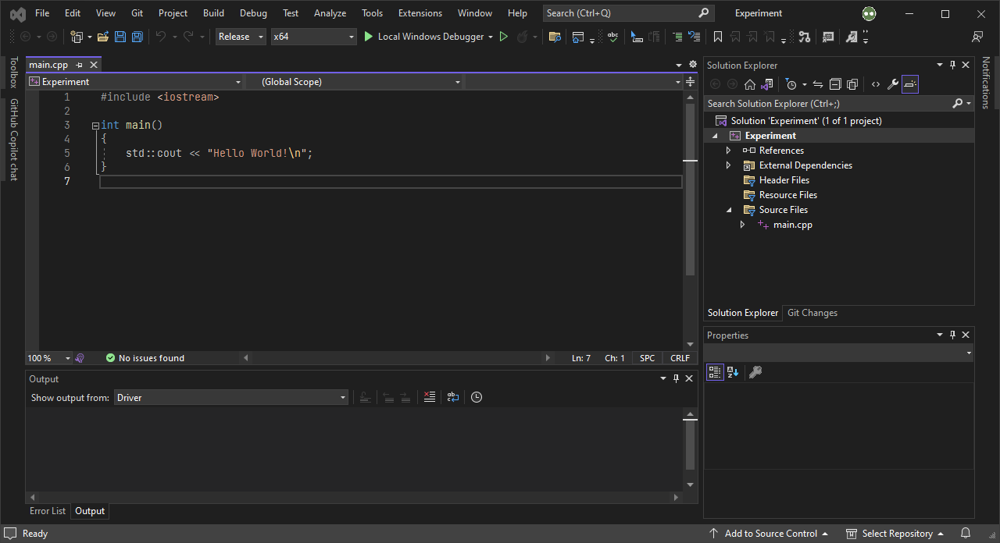
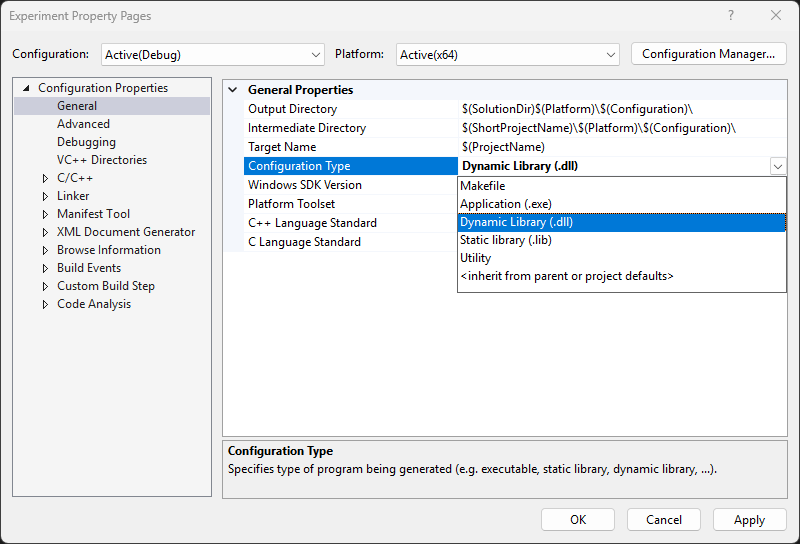

# C++
[C++](https://learn.microsoft.com/en-us/cpp/cpp/)는 본래 [클래스](#클래스)를 지원하는 [C 언어](ko.C.md)의 확장판으로 시작된 고급 범용 프로그래밍 언어로, 현재는 그 외에도 [함수](#함수)를 더 유연하게 사용할 수 있거나 [템플릿](#템플릿) 등 다양한 기능을 지원한다. 이러한 유래로 C++는 C 언어와 상당한 [호환성](https://en.wikipedia.org/wiki/Compatibility_of_C_and_C%2B%2B)을 자랑하지만, 오랜 역사를 거쳐온 탓에 엄연히 서로 다른 언어이다. C++는 현재 [데스크탑](https://ko.wikipedia.org/wiki/응용_소프트웨어)이나 [서버](https://ko.wikipedia.org/wiki/서버), 또는 [운영체제](ko.Windows.md)와 같은 [임베디드](https://en.wikipedia.org/wiki/Embedded_software) 분야에서도 활약하고 있다.

C++ 언어에 필요한 컴파일러는 흔히 소스 코드 편집, 프로그램 빌드, 그리고 디버깅 기능을 제공하는 [통합 개발 환경](https://ko.wikipedia.org/wiki/통합_개발_환경)(integrated development environment; IDE)을 설치하면 대체로 권장되는 [컴파일러](#컴파일러)가 함께 설치된다.

> [비주얼 스튜디오 코드](https://code.visualstudio.com/)(Visual Studio Code; VS Code)는 엄연히 말해 "텍스트 편집기"이며, 아래의 IDE를 사용할 것을 권장한다.

* [비주얼 스튜디오](https://visualstudio.microsoft.com/) <sub>(윈도우, macOS)</sub>
* [엑스코드](https://developer.apple.com/xcode/) <sub>(macOS)</sub>
* [CLion](https://www.jetbrains.com/clion/) <sub>(윈도우, macOS, 리눅스)</sub>

## 컴파일러
C++ 언어는 [컴파일 언어](ko.Compiler.md)(compiled language)이다. C++ 컴파일러는 [국제 표준화 기구](https://www.iso.org/home.html)(International Organization for Standardization; ISO)에서 표준을 발표한 년도에 따라 버전이 나뉘어진다. 본격적으로 표준화된 버전은 C++98이지만, 본 문서는 다양한 기능들이 추가된 <span style="color: red;">*C++11 표준*</span>을 위주로 설명한다.

컴파일러는 개발사와 목적에 따라 다양한 종류가 존재하지만, 전부 동일한 ISO 표준에 따라 동작하므로 일반적인 경우에는 어떤 컴파일러를 사용하던 무관하다. 아래는 대표적인 C++ 언어 컴파일러들을 나열한다.

* [Microsoft Visual C++](https://ko.wikipedia.org/wiki/마이크로소프트_비주얼_C++) (일명 MSVC): 마이크로소프트
* [GNU C Compiler](https://ko.wikipedia.org/wiki/GNU_C_컴파일러) (일명 GCC): GNU 프로젝트
* [Clang](https://ko.wikipedia.org/wiki/클랭): LLVM Developer Group, 애플

## 프로젝트
다음은 비주얼 스튜디오 2022을 위주로 C++ 프로젝트 구축에 대하여 설명한다.



아래는 C++를 실행하는 가장 기초적인 코드와 함께 코드에 대한 설명이다.

<table style="width: 95%; margin: auto;">
<caption style="caption-side: top;">간단한 C++ 코드 및 설명</caption>
<colgroup><col style="width: 50%;"/><col styl="width: 50%;"/></colgroup>
<thead><tr><th style="text-align: center;">코드</th><th style="text-align: center;">설명</th></tr></thead>
<tbody>
<tr>
<td>

```cpp
#include <iostream>

int main()
{
    std::cout << "Hello World!\n";
}
```
</td><td>
<ul><li><code>#include &lt;iostream&gt;</code><br/>Iostream <a href="#헤더-파일">헤더 파일</a>로부터 C++ 표준 입출력 라이브러리를 <a href="#포함-지시문">불러오며</a>, 터미널에 텍스트를 출력하는 <a href="#파일-입출력"><code>std::cout</code></a> 등을 제공한다.</li><li><code>int main() { ... }</code><br/>C++가 시작되는 함수, 일명 <a href="#진입점">진입점</a>이다.</li></ul>
</td></tr></tbody>
</table>

# 구문
[구문](https://ko.wikipedia.org/wiki/구문_(프로그래밍_언어))(syntax)은 프로그래밍 언어에서 문자 및 기호들의 조합이 올바른 문장 또는 표현식을 구성하였는지 정의하는 규칙이다. 각 프로그래밍 언어마다 규정하는 구문이 다르며, 이를 준수하지 않을 시 해당 프로그램은 빌드되지 않거나, 실행이 되어도 오류 및 의도치 않은 동작을 수행한다.

다음은 C++ 언어에서 구문에 관여하는 요소들을 소개한다:

* **[표현식](https://ko.wikipedia.org/wiki/식_(프로그래밍))(expression)**
    
    값을 반환하는 구문적 존재를 가리킨다. 표현식에 대한 결과를 도출하는 것을 평가(evaluate)라고 부른다.
    
    ```cpp
    2 + 3           // 숫자 5를 반환
    2 < 3           // 논리 참을 반환
    ```

* **[토큰](https://learn.microsoft.com/en-us/cpp/cpp/character-sets)(token)**

    표현식을 구성하는 가장 기본적인 요소이며, 대표적으로 [키워드](https://learn.microsoft.com/en-us/cpp/cpp/keywords-cpp)(keyword), [식별자](#식별자)(identifier), [숫자](https://learn.microsoft.com/en-us/cpp/cpp/numeric-boolean-and-pointer-literals-cpp) 및 [문자열 리터럴](https://learn.microsoft.com/en-us/cpp/cpp/string-and-character-literals-cpp)(literal) 등이 있다.

    ```cpp
    variable        // 식별자
    2               // 정수 리터럴
    ```

* **[문장](https://ko.wikipedia.org/wiki/문_(프로그래밍))(statement)**
    
    실질적으로 무언가를 실행하는 구문적 존재를 가리킨다: 흔히 하나 이상의 표현식으로 구성되지만, [`break`](#break-문) 및 [`continue`](#continue-문)와 같이 독립적으로 사용되는 문장도 있다. 러스트 프로그래밍 언어는 [세미콜론](https://ko.wikipedia.org/wiki/새줄_문자)(semicolon) `;`을 기준으로 문장을 분별한다. 

    ```cpp
    int variable = 2 + 3;      // 숫자 5를 "variable" 변수에 초기화
    if (2 < 3) statement;      // 논리가 참이면 "statement" 문장 실행
    ```

* **[블록](https://ko.wikipedia.org/wiki/블록_(프로그래밍))(block)**

    한 개 이상의 문장들을 한꺼번에 관리할 수 있도록 묶어놓은 소스 코드상 그룹이다. 블록 안에 또 다른 블록이 상주할 수 있으며, 이를 네스티드 블록(nested block)이라고 부른다. C++에서는 한 쌍의 중괄호 `{}`로 표시된다.

    ```cpp
    {
        int variable = 2 + 3;
        if (2 < 3) statement;
    }
    ```

### 식별자
[식별자](https://learn.microsoft.com/en-us/cpp/cpp/identifiers-cpp)(identifier)는 프로그램을 구성하는 데이터들을 구별하기 위해 사용되는 명칭이다. 즉, 식별자는 개발자가 데이터에 직접 붙여준 이름이다. C++에서 식별자를 선정하는데 아래의 규칙을 지켜야 한다.

1. 알파벳, 숫자, 밑줄 `_`만 허용 (그 외 특수문자 및 공백 사용 불가)
2. 식별자의 첫 문자는 숫자가 될 수 없음
3. 대소문자 구분 필수
4. [예약어](https://ko.wikipedia.org/wiki/예약어) 금지

### 주석
[주석](https://learn.microsoft.com/en-us/cpp/cpp/comments-cpp)(comment)은 프로그램의 소스 코드로 취급하지 않아 실행되지 않는 영역이다. 흔히 코드에 대한 간단한 정보를 기입하기 위해 사용되는 데, C++에는 한줄 주석 그리고 블록 주석이 존재한다.

<table style="table-layout: fixed; width: 80%; margin: auto;">
<caption style="caption-side: top;">C++ 주석 종류</caption>
<colgroup><col style="width: 50%;"/><col style="width: 50%;"/></colgroup>
<thead><tr><th style="text-align: center;">한줄 주석</th><th style="text-align: center;">블록 주석</th></tr></thead>
<tbody>
<tr><td colspan="2">주석은 컴파일 직전에 <a href="#전처리기">전처리기</a>에 의해 소스 코드에 제거된다. 즉, 실행 파일 안에는 주석의 어떠한 정보도 저장되지 않는다.</td></tr>
<tr style="vertical-align: top; overflow-wrap: break-word;"><td>

```cpp
// 한줄 주석: 코드 한 줄을 차지하는 주석이다.
```
</td><td>

```cpp
/*
블록 주석:
코드 여러 줄을 차지하는 주석이다.
*/
```
</td></tr>
</tbody>
</table>

## 자료형
[자료형](https://ko.wikipedia.org/wiki/자료형)(data type)은 데이터를 어떻게 표현할 지 결정하는 요소이며, C++에서는 다음과 같이 존재한다.

<table style="width: 80%; margin: auto;">
<caption style="caption-side: top;"><a href="https://learn.microsoft.com/en-us/cpp/cpp/fundamental-types-cpp">C++ 자료형</a></caption>
<colgroup><col style="width: 15%;"/><col style="width: 15%;"/><col style="width: 15%;"/><col/></colgroup>
<thead><tr><th style="text-align: center;">키워드</th><th style="text-align: center;">자료형</th><th style="text-align: center;">크기 (바이트)</th><th style="text-align: center;">설명</th></tr></thead>
<tbody><tr><td style="text-align: center;"><code>char</code></td><td style="text-align: center;">문자</td><td style="text-align: center;">1</td><td>단일 ANSI 문자</td></tr><tr><td style="text-align: center;"><code>short</code></td><td style="text-align: center;">정수</td><td style="text-align: center;">2</td><td>가장 작은 정수 자료형</td></tr><tr><td style="text-align: center;"><code>int</code></td><td style="text-align: center;">정수</td><td style="text-align: center;">2 <sub>(최소)</sub></td><td>워드 크기의 기본 정수 자료형; <code>short</code>보다 작아서는 안되며, 32비트 시스템 이후로는 4바이트가 일반화되었다.</td></tr><tr><td style="text-align: center;"><code>long</code></td><td style="text-align: center;">정수</td><td style="text-align: center;">4 <sub>(최소)</td><td>정수 자료형 <code>int</code>보다 작아서는 안되며, 4바이트와 8바이트 중 어느 크기를 채택하였는지 컴파일러마다 다르다.</td></tr><tr><td style="text-align: center;"><code>float</code></td><td style="text-align: center;">부동소수점</td><td style="text-align: center;">4</td><td>32비트 단정밀도 실수</td></tr><tr><td style="text-align: center;"><code>double</code></td><td style="text-align: center;">부동소수점</td><td style="text-align: center;">8</td><td>64비트 배정밀도 실수</td></tr><tr><td style="text-align: center;"><code>bool</code></td><td style="text-align: center;">논리형</td><td style="text-align: center;">1</td><td>참(<code>true</code>)과 거짓(<code>false</code>); 각각 영 혹은 그 외의 정수로도 구분된다.</td></tr><tr><td style="text-align: center;"><code>void</code></td><td style="text-align: center;">보이드</td><td style="text-align: center;">1</td><td>불특정 자료형</td></tr><tr><td style="text-align: center;"><code>auto</code></td><td style="text-align: center;">자동</td><td style="text-align: center;">N/A</td><td>컴파일러에 의해 적절한 자료형으로 자동 선택된다. 복잡한 자료형을 간략히 정의하는데 매우 유용하다.</td></tr></tbody/>
</table>

> [바이트](https://ko.wikipedia.org/wiki/바이트)(byte)란, 컴퓨터에서 메모리에 저장하는 가장 기본적인 단위이다. 자료형마다 크기가 정해진 이유는 효율적인 메모리 관리 차원도 있으나 CPU 연산과도 깊은 연관성을 갖는다. 한 바이트는 여덟 개의 [비트](https://ko.wikipedia.org/wiki/비트_(단위))(bit)로 구성된다.

`unsigned` 키워드는 자료형 중에서 [최상위 비트](https://ko.wikipedia.org/wiki/최상위_비트)를 정수의 [부호](https://ko.wikipedia.org/wiki/Signed와_unsigned)를 결정하는 요소로 사용하지 않도록 한다. 아래의 16비트 정수형인 `short`는 원래 최상위 비트를 제외한 나머지 15개의 비트로 정수를 표현한다. `unsigned` 키워드를 사용하면 음의 정수를 나타낼 수 없지만, 16개의 비트로 양의 정수를 더 많이 표현할 수 있다.

```cpp
short             // 표현 가능 범위: -32768 ~ +32767
unsigned short    // 표현 가능 범위:     +0 ~ +65535
```

### 자료형 변환
자료형 변환(type casting)은 데이터를 다른 자료형으로 바꾸는 작업이며, 불가피하게 데이터가 손실될 수 있으므로 유의하도록 한다.

* **암묵적 자료형 변환(implicit type casting)**

    코드에서 별도로 자료형을 명시하지 않아도 컴파일러에 의해 데이터가 자동적으로 적합한 자료형으로 변환되는 경우이다.

    ```cpp
    float num1 = 314.159;
    short num2 = num1;                   // num2 저장값: 314
    ```

* **명시적 자료형 변환(explicit type casting)**

    코드에서 소괄호 `()` 안에 자료형을 직접 기입하여 원하는 자료형으로 변환되는 경우이다.

    ```cpp
    float num1 = 314.159;
    short num2 = (unsigned char)num1;    // num2 저장값: 58
    ```

    C 형식의 자료형 변환이 가지던 결함을 보완하기 위해 C++11부터 네 가지의 새로운 캐스팅 연산자가 소개되었다. C++에서는 다음 네 개의 연산자를 사용한 자료형 캐스팅을 권장한다.

    <table style="width: 80%; margin: auto;"><caption style="caption-side: top;">C++ 캐스팅 연산자</caption><colgroup><col style="width: 20%;"/><col style="width: 80%;"/></colgroup><thead><tr><th style="text-align: center;">연산자</th><th style="text-align: center;">설명 및 예시</th></tr></thead><tbody><tr><td rowspan="2" style="text-align: center;"><a href="https://en.cppreference.com/w/cpp/language/static_cast"><code>static_cast</code></a></td><td>명시적 그리고 암묵적 변환에 사용되는 가장 일반적인 자료형 캐스팅 연산자이다.</td></tr><tr><td>
    
    ```cpp
    int variable = 3;
    static_cast<double>(variable);
    ```
    </td></tr><tr><td rowspan="2" style="text-align: center;"><a href="https://en.cppreference.com/w/cpp/language/const_cast"><code>const_cast</code></a></td><td>상수 전용 자료형 캐스팅 연산자이며, 이 과정에서 상수의 값을 <a href="#참조">참조</a>를 통해 변경할 수 있다.</td></tr><tr><td>
    
    ```cpp
    const int A = 3;                 // 변환 이전: A = 3
    int *B = const_cast<int *>(&A);
    *B = 1;                          // 변환 이후: A = 1
    ```
    </td></tr><tr><td rowspan="2" style="text-align: center;"><a href="https://en.cppreference.com/w/cpp/language/dynamic_cast"><code>dynamic_cast</code></a></td><td><a href="#클래스">클래스</a> 혹은 <a href="#클래스">객체</a>의 <a href="#다형성">다형성</a>을 처리하는데 사용되는 자료형 캐스팅 연산자이다.</td></tr><tr><td>
    
    ```cpp
    derivedClass *A = new derivedClass;
    baseClass *B = dynamic_cast<baseClass *>(A);
    ```
    </td></tr><tr><td rowspan="2" style="text-align: center;"><a href="https://en.cppreference.com/w/cpp/language/reinterpret_cast"><code>reinterpret_cast</code></a></td><td><a href="#포인터">포인터</a>를 다른 자료형의 포인터로 변환하는데 사용되는 자료형 캐스팅 연산자이다. 데이터 손상 위험이 가장 높은 캐스팅 연산자로써 매우 신중히 사용되어야 한다.</td></tr><tr><td>
    
    ```cpp
    int *variable = 3
    reinterpret_cast<double *>(variable)
    ```
    </td></tr></tbody></table>

### `sizeof` 연산자
[`sizeof`](https://en.cppreference.com/w/cpp/language/sizeof) 연산자는 데이터나 자료형의 메모리에 할당된 바이트 크기를 반환한다.

```cpp
sizeof(int);      // 크기: 4바이트
sizeof(char);     // 크기: 1바이트
```

## 변수
변수(variable)는 데이터를 지정된 [자료형](#자료형)으로 저장하는 저장공간이다. 아래 예시는 `variable`이란 [식별자](#식별자)를 갖는 정수형 변수에 숫자 3을 할당한다. 시스템 관점에서 바라보면 `variable` 정수형 변수의 존재가 컴파일러에 각인되고 메모리가 할당되어 3이란 값이 저장되는 것으로, 이를 변수의 "정의(definition)"라고 부른다.

```cpp
// 변수 "variable"의 정의
int variable = 3;
```

정수 자료형 변수인 `variable`을 생성한 동시에 값 3을 할당하였는데, 변수로의 최초 할당을 "초기화(initialization)"라고 부른다.

아래는 변수를 정의하는 과정에서 초기화를 나중에 하는 예시 코드이다. 한 번 정의된 변수는 컴파일러 측에서 이미 존재를 알고 있으므로, 이후 변수에 다른 데이터를 저장하거나 호출할 때 자료형을 함께 언급하지 않는다. 초기화되지 않은 변수를 호출하는 것은 변수에 연동된 메모리가 가공되지 않은 상태로 잠재적 위험을 초래할 수 있기 때문에, 일반적으로 C 언어 컴파일러는 이를 오류로 치부한다.

```cpp
// 변수 "variable"의 정의
int variable;
variable = 3;
```

동일한 자료형의 변수 여러 개를 한꺼번에 정의하려면, 식별자마다 쉼표 `,`로 구분지을 수 있다.

```cpp
// 다수의 정수 자료형 변수 정의
int variable1 = 3, variable2 = 4, variable3;
```

변수의 "선언(declaration)"은 메모리 할당 여부와 관계없이 컴파일러에게 해당 변수의 존재성을 알리는 행위이다. 그러나 이미 변수를 정의하는 과정에서 컴파일러에게 변수의 존재를 알렸는데, 이 또한 변수를 선언한 것이다. 다음은 변수에 특수한 성질을 부여하는 선언 키워드를 소개한다.

<table style="width: 80%; margin: auto;">
<caption style="caption-side: top;">변수 선언 키워드 및 특징</caption>
<colgroup><col style="width: 20%;"/><col style="width: 80%;"/></colgroup>
<thead><tr><th style="text-align: center;">키워드</th><th style="text-align: center;">특징</th></tr></thead>
<tbody><tr><td style="text-align: center;"><a href="https://en.cppreference.com/w/cpp/language/constant_expression"><code>const</code></a></td><td>초기화된 이후로 변경이 불가한 상수(constant)로 지정한다.</td></tr><tr><td style="text-align: center;"><a href="https://en.cppreference.com/w/cpp/language/storage_duration#Static_local_variables"><code>static</code></a></td><td><a href="#함수">함수</a>를 탈출하여도 데이터가 소멸되지 않는 특수한 <a href="#지역-변수">지역 변수</a>, 일명 <a href="https://en.cppreference.com/w/cpp/language/storage_duration#Static_local_variables">정적 변수</a>이다.</td></tr><tr><td style="text-align: center;"><a href="https://en.cppreference.com/w/c/language/extern"><code>extern</code></a></td><td>아직 정의되지 않은 변수 혹은 함수를 미리 호출할 수 있도록 선언만 하는 <a href="#외부-변수">외부 변수</a>이다.</td></tr></tbody>
</table>

> 위에서 소개한 키워드, 특히 `static` 및 `extern`은 차후 함수와 [라이브러리](#라이브러리)를 소개하면서 다시 설명할 예정이다.

C/C++ 언어 [ISO 표준](https://github.com/cplusplus/draft)의 § 6.2 Declarations and definitions 부문에 의하면 일반적인 변수의 선언은 정의와 동일하다고 간주한다. 단, 다음은 변수가 선언되었으나 정의되지 않은 예외를 나열한다:

* 함수 전방선언
* 함수 매개변수 선언
* `using` 선언 및 지시문
* `alias` 선언
* `extern` 키워드 선언
* `typedef` 선언

변수가 소스 코드 중에서 어디에 정의되었는지에 따라 지역 변수와 전역 변수로 구분된다. 

<table style="width: 95%; margin: auto;">
<caption>C 언어의 지역 및 전역 변수</caption>
<colgroup><col style="width: 50%;"/></col style="width: 50%;"/></colgroup>
<thead><tr><th style="text-align: center;">지역 변수</th><th style="text-align: center;">전역 변수</th></tr></thead>
<tbody><tr><td>

```cpp
int main () {

    // 지역 변수
    int variable;

    return 0;
}
```
</td><td>

```cpp
// 전역 변수
int variable;

int main() {

    return 0;
}
```
</td></tr>
<tr><td>블록 내부에서 정의된 변수이다. 지역 변수에 저장된 데이터는 블록 밖에서는 소멸되므로 외부에서 사용할 수 없다.</td><td>어떠한 블록에도 속하지 않은 외부에 정의된 변수이다. 전역 변수는 어느 블록에서라도 호출하여 지역 변수와 함께 사용할 수 있다.</td></tr>
</tbody>
</table>

변수는 지정된 자료형 외의 데이터를 할당받을 수 있다. 아래 예시 코드는 문자 자료형 변수에 값 75로 초기화할 시, ASCII 코드에 의하여 대문자 'K'로 저장된다.

```cpp
char variable = 75;    // ASCII에 의해 문자 'K'가 저장
```

거의 모든 프로그래밍 언어는 할당 기호를 기준으로 왼쪽에는 피할당자(변수), 오른쪽에는 피할당자로 전달하려는 표현식(값 혹은 데이터)이 위치한다. 반대로 놓여질 경우, 오류가 발생하거나 원치 않는 결과가 도출될 수 있다.

## 네임스페이스
[네임스페이스](https://ko.wikipedia.org/wiki/이름공간)(namespace)는 식별자의 유일성을 보장하기 위한 [영역범위](https://learn.microsoft.com/en-us/cpp/cpp/scope-visual-cpp)(scope)를 설정하여 데이터를 분류 공간이다. `namespace` 키워드를 통해 네임스페이스를 지정하고 블록 안에 변수, 함수, 클래스 등의 데이터들이 선언될 수 있다. 네임스페이스 안에 선언된 데이터들은 범위지정 연산자(scope resolution operator) `::`를 통해 호출이 가능하다.

```cpp
// 네임스페이스 및 변수 선언
namespace namespace1
{
    int variable;
}

// 네임스페이스 내의 변수 호출
namespace1::variable = 3;
```

> 이후 [*파일 입출력*](#파일-입출력) 장에서 소개될 `std`는 [C++ 표준 라이브러리](https://en.cppreference.com/w/cpp/standard_library)에 정의된 데이터를 관리하는 표준 네임스페이스(standard namespace)이다.

네임스페이스 안에 또 다른 네임스페이스가 선언되는 "네스티드 네임스페이스(nested namespace)"가 가능하다. 그러나 네임스페이스 또한 유일한 식별자를 가져야 하기 때문에 동일한 영역범위에 놓여진 네임스페이스는 이름이 중복되어서는 안된다.

* 전역 네임스페이스(global namespace)는 어느 네임스페이스에도 속하지 않는 최외각 영역범위이다. 범위지정 연산자 `::`를 식별자의 접두부에 기입하여 전역 네임스페이스로부터 호출하였음을 명시할 수 있다. 위의 예시 코드에 전역 네임스페이스를 명시하면 다음과 같이 표현된다.

    ```cpp
    ::namespace1::variable;
    ```

### `using` 키워드
`using` 키워드는 네임스페이스 내의 데이터를 간편하게 접근할 수 있도록 한다. 즉, 네임스페이스를 별도로 명시하지 않아도 데이터 호출이 가능하게 한다. 하지만 무분별한 남용은 컴파일러가 어느 네임스페이스의 데이터를 호출하는 것인지 구별하지 못하게 하여 오류가 발생할 위험이 높다.

<table style="width: 95%; margin: auto;">
<caption>네임스페이스의 <code>using</code> 키워드 활용</caption>
<colgroup><col style="width: 50%;"/></col style="width: 50%;"/></colgroup>
<thead><tr><th style="text-align: center;"><a href="https://en.cppreference.com/w/cpp/language/namespace#Using-directives"><code>using</code> 지시문</a> (using-directive)</th><th style="text-align: center;"><a href="hhttps://en.cppreference.com/w/cpp/language/namespace#Using-declarations"><code>using</code> 선언</a> (using-declaration)</th></tr></thead>
<tbody><tr><td>스크립트 파일에서 해당 네임스페이스 전체를 생략한다.</td><td>네임스페이스 내의 개별 데이터를 선택적으로 간략화시킨다.</td></tr><tr><td>

```cpp
using namespace std;
cout << "Hello World!" << endl;
```
</td><td>

```cpp
using std::endl;
std::cout << "Hello World!" << endl;
```
</td></tr>
</tbody>
</table>

## 연산자
[연산자](https://ko.wikipedia.org/wiki/연산자_(프로그래밍))(operator)는 피연산 데이터를 조작할 수 있는 가장 간단한 형태의 연산 요소이다. 연산자는 피연산자의 접두부, 접미부, 혹은 두 데이터 사이에 위치시켜 사용한다. 가독성을 위해 데이터와 연산자 사이에 공백을 넣어도 연산에는 아무런 영향을 주지 않는다. 다음은 [C/C++ 연산자](https://ko.wikipedia.org/wiki/C와_C++의_연산자)들을 간략히 소개한다.

### 산술 연산자
<table style="width: 85%; margin: auto;">
<caption style="caption-side: top;"><a href="https://en.cppreference.com/w/cpp/language/operator_arithmetic">산술 연산자</a>(arithmetic operators)</caption>
<colgroup><col style="width: 10%;"/><col style="width: 15%;"/><col style="width: 75%;"/></colgroup>
<thead><tr><th style="text-align: center;">연산자</th><th style="text-align: center;">산술</th><th style="text-align: center;">설명</th></tr></thead>
<tbody>
<tr><td style="text-align: center;"><code>+</code></td><td style="text-align: center;">덧셈</td><td>좌측과 우측 피연산자의 값을 더하여 반환한다.</td></tr><tr><td style="text-align: center;"><code>-</code></td><td style="text-align: center;">뺄셈</td><td>좌측 피연산자에서 우측 피연산자를 뺀 값을 반환한다.</td></tr><tr><td style="text-align: center;"><code>*</code></td><td style="text-align: center;">덧셈</td><td>좌측 피연산자를 우측 피연산자의 값만큼 곱하여, 즉 반복 덧셈하여 반환한다.</td></tr><tr><td style="text-align: center;"><code>/</code></td><td style="text-align: center;">나눗셈</td><td>좌측 피연산자에서 우측 피연산자를 나눈 <a href="https://ko.wikipedia.org/wiki/몫">몫</a>을 반환한다.</td></tr><tr><td style="text-align: center;"><code>%</code></td><td style="text-align: center;"><a href="https://ko.wikipedia.org/wiki/모듈러_산술">모듈러</a></td><td>좌측 피연산자에서 우측 피연산자를 나눈 <a href="https://ko.wikipedia.org/wiki/나머지">나머지</a>를 반환한다.</td></tr>
</tbody>
</table>

### 증감 연산자
[증가 연산자](https://en.cppreference.com/w/cpp/language/operator_incdec)(increment operator) `++` 및 [감소 연산자](https://en.cppreference.com/w/cpp/language/operator_incdec)(decrement operator) `--`는 데이터를 1만큼 증가 혹은 감소하는데 간략하게 한 줄로 표현한다.

<table style="width: 85%; margin: auto;"><caption style="caption-side: top;">증감 연산자의 위치에 따른 비교</caption><colgroup><col style="width: 50%;"/><col style="width: 50%;"/></colgroup><thead><tr><th style="text-align: center;">접두부</th><th style="text-align: center;">접미부</th></tr></thead><tbody><tr><td>피연산자를 1만큼 증가/감소시킨 다음에 표현식을 평가한다.</td><td>표현식을 평가한 다음에 피연산자를 1만큼 증가/감소시킨다.</td></tr><tr><td>

```cpp
x = ++y;  // 동일: { y = y + 1; x = y; }
x = --y;  // 동일: { y = y - 1; x = y; }
```
</td><td>

```cpp
x = y++;  // 동일: { x = y; y = y + 1; }
x = y--;  // 동일: { x = y; y = y - 1; }
```
</td></tr></tbody></table>

### 비트 연산자
<table style="width: 85%; margin: auto;">
<caption style="caption-side: top;"><a href="https://en.wikipedia.org/wiki/Bitwise_operations_in_C">비트 연산자</a>(bitwise operators)</caption>
<colgroup><col style="width: 10%;"/><col style="width: 15%;"/><col style="width: 75%;"/></colgroup>
<thead><tr><th style="text-align: center;">연산자</th><th style="text-align: center;">비트연산</th><th style="text-align: center;">설명</th></tr></thead>
<tbody>
<tr><td style="text-align: center;"><code>&</code></td><td style="text-align: center;"><a href="https://ko.wikipedia.org/wiki/비트_연산#AND">AND</a></td><td>두 피연산자의 각 비트를 비교하여 모두 1이면 1을, 아니면 0을 계산하여 반환한다.</td></tr><tr><td style="text-align: center;"><code>|</code></td><td style="text-align: center;"><a href="https://ko.wikipedia.org/wiki/비트_연산#OR">OR</a></td><td>두 피연산자의 각 비트를 비교하여 하나라도 1이 있으면 1을, 아니면 0을 계산하여 반환한다.</td></tr><tr><td style="text-align: center;"><code>^</code></td><td style="text-align: center;"><a href="https://ko.wikipedia.org/wiki/비트_연산#XOR">XOR</a></td><td>두 피연산자의 각 비트를 비교하여 값이 같으면 0을, 다르면 1을 계산하여 반환한다.</td></tr><tr><td style="text-align: center;"><code>~</code></td><td style="text-align: center;"><a href="https://ko.wikipedia.org/wiki/비트_연산#NOT">NOT</a></td><td>피연산자의 각 비트마다 반전시킨 값을 반환한다.</td></tr><tr><td style="text-align: center;"><code>&lt;&lt;</code></td><td style="text-align: center;"><a href="https://en.wikipedia.org/wiki/Bitwise_operations_in_C#Left_shift_%3C%3C">좌향 시프트</a></td><td>피연산자(左)의 비트를 전반적으로 일정 값(右)만큼 왼쪽으로 이동시킨다.</td></tr><tr><td style="text-align: center;"><code>&gt;&gt;</code></td><td style="text-align: center;"><a href="https://en.wikipedia.org/wiki/Bitwise_operations_in_C#Right_shift_%3E%3E">우향 시프트</a></td><td>피연산자(左)의 비트를 전반적으로 일정 값(右)만큼 오른쪽으로 이동시킨다.</td></tr>
</tbody>
</table>

### 할당 연산자
단순 할당 연산자를 산술 및 비트 연산자와 조합하여 코드를 더욱 간결하게 작성할 수 있으며, 아래는 다양한 할당 연산자 중 일부만 보여준다.

<table style="width: 85%; margin: auto;">
<caption style="caption-side: top;"><a href="https://en.cppreference.com/w/cpp/language/operator_assignment">할당 연산자</a>(assignment operators)</caption>
<colgroup><col style="width: 10%;"/><col style="width: 15%;"/><col style="width: 75%;"/></colgroup>
<thead><tr><th style="text-align: center;">연산자</th><th style="text-align: center;">할당</th><th style="text-align: center;">설명</th></tr></thead>
<tbody>
<tr><td style="text-align: center;"><code>=</code></td><td style="text-align: center;">단순 할당</td><td>피연산자(右)가 <a href="#변수">변수</a>와 같은 피할당자(左)로 할당된 값을 반환한다.</td></tr><tr><td style="text-align: center;"><code>+=</code></td><td style="text-align: center;">덧셈 대입</td><td>

```cpp
x += y;  // 동일: x = x + y;
```
</td></tr><tr><td style="text-align: center;"><code>*=</code></td><td style="text-align: center;">곱셈 대입</td><td>

```cpp
x *= y;  // 동일: x = x * y;
```
</td></tr><tr><td style="text-align: center;"><code>&=</code></td><td style="text-align: center;">AND 대입</td><td>

```cpp
x &= y;  // 동일: x = x & y;
```
</td></tr><tr><td style="text-align: center;"><code>&lt;&lt;=</code></td><td style="text-align: center;">좌향 시프트 대입</td><td>

```cpp
x <<= y;  // 동일: x = x << y;
```
</td></tr>
</tbody>
</table>

### 비교 연산자
아래 비교 연산자의 설명은 참을 반환할 조건을 소개하며, 그 외에는 모두 `false`를 반환한다.

<table style="width: 85%; margin: auto;">
<caption style="caption-side: top;"><a href="https://en.cppreference.com/w/cpp/language/operator_comparison">비교 연산자</a>(relational operators)</caption>
<colgroup><col style="width: 10%;"/><col style="width: 15%;"/><col style="width: 75%;"/></colgroup>
<thead><tr><th style="text-align: center;">연산자</th><th style="text-align: center;">관계</th><th style="text-align: center;">설명</th></tr></thead>
<tbody>
<tr><td style="text-align: center;"><code>&gt;</code></td><td style="text-align: center;">초과</td><td>좌측 피연산자가 우측 피연산자보다 크면 <code>true</code>를 반환한다.</td></tr><tr><td style="text-align: center;"><code>&lt;</code></td><td style="text-align: center;">미만</td><td>좌측 피연산자가 우측 피연산자보다 작으면 <code>true</code>를 반환한다.</td></tr><tr><td style="text-align: center;"><code>&gt;=</code></td><td style="text-align: center;">이상</td><td>좌측 피연산자가 우측 피연산자보다 크거나 같으면 <code>true</code>를 반환한다.</td></tr><tr><td style="text-align: center;"><code>&lt;=</code></td><td style="text-align: center;">이하</td><td>좌측 피연산자가 우측 피연산자보다 작거나 같으면 <code>true</code>를 반환한다.</td></tr><tr><td style="text-align: center;"><code>==</code></td><td style="text-align: center;">동일</td><td>두 피연산자의 값이 같으면 <code>true</code>를 반환한다.</td></tr><tr><td style="text-align: center;"><code>!=</code></td><td style="text-align: center;">상이</td><td>두 피연산자의 값이 같지 않으면 <code>true</code>를 반환한다.</td></tr>
</tbody>
</table>

### 논리 연산자
(논리 부정을 제외한) 아래 논리 연산자의 설명은 참을 반환할 조건을 소개하며, 그 외에는 모두 `false`를 반환한다.

<table style="width: 85%; margin: auto;">
<caption style="caption-side: top;"><a href="https://en.cppreference.com/w/cpp/language/operator_logical">논리 연산자</a>(logical operators)</caption>
<colgroup><col style="width: 10%;"/><col style="width: 15%;"/><col style="width: 75%;"/><col style="width: "/></colgroup>
<thead><tr><th style="text-align: center;">연산자</th><th style="text-align: center;">논리</th><th style="text-align: center;">설명 </th></tr></thead>
<tbody>
<tr><td style="text-align: center;"><code>&&</code></td><td style="text-align: center;"><a href="https://ko.wikipedia.org/wiki/논리곱">논리곱</a></td><td>좌측 그리고 우측 <a href="https://ko.wikipedia.org/wiki/명제">명제</a>(피연산자)가 모두 참이면 <code>true</code>를 반환한다.</td></tr><tr><td style="text-align: center;"><code>||</code></td><td style="text-align: center;"><a href="https://ko.wikipedia.org/wiki/논리합">논리합</a></td><td>좌측 또는 우측 명제(피연산자)가 하나라도 참이면 <code>true</code>를 반환한다.</td></tr><tr><td style="text-align: center;"><code>!</code></td><td style="text-align: center;"><a href="https://ko.wikipedia.org/wiki/부정_(논리학)">부정</a></td><td>명제(피연산자)가 참이면 거짓으로, 혹은 그 반대로 반전된 값을 반환한다.</td></tr>
</tbody>
</table>

## 탈출 문자
[탈출 문자](https://ko.wikipedia.org/wiki/이스케이프_문자)(escape character)는 백슬래시 기호 `\`를 사용하며, [문자열](#문자열)로부터 탈출하여 텍스트 데이터 내에서 특정 연산을 수행하도록 한다. 예시에서 `\n` 탈출 문자를 사용하여 문자열 줄바꿈을 구현한 것을 보여주었다.

> 한편, C++ 표준 라이브러리는 [줄바꿈 조작자](https://en.cppreference.com/w/cpp/io/manip/endl)(new-line manipulator) `std::endl`를 통해 자체적으로 텍스트 [줄바꿈](https://ko.wikipedia.org/wiki/새줄_문자)을 지원한다.

<table style="table-layout: fixed; width: 90%; margin: auto;">
<caption style="caption-side: top;">C++ 텍스트 줄바꿈 구현 방법</caption>
<colgroup><col style="width: 50%;"/><col style="width: 50%;"/></colgroup>
<thead><tr><th style="text-align: center;">탈출 문자</th><th style="text-align: center;">줄바꿈 조작자</th></tr></thead>
<tbody>
<tr style="vertical-align: top; overflow-wrap: break-word;"><td>

```cpp
std::cout << "Hello,\nWorld!";
```
</td><td>

```cpp
std::cout << "Hello" << std::endl << "World!"; 
```
</td></tr>
<tr><td colspan="2">

```terminal
Hello,
World!
```
</td></tr>
</tbody>
</table>

# 파일 입출력
C++ 언어의 파일 입출력(일명 I/O)은 [`iostream`](https://en.cppreference.com/w/cpp/header/iostream) 헤더로부터 관련 함수들을 호출할 수 있으며, 단순 파일뿐만 아니라 터미널로부터 텍스트를 입력받거나 출력할 때에도 관여한다. [C](ko.C.md) 언어의 [파일 입출력](ko.C.md#파일-입출력)에서 소개한 [`stdio.h`](https://en.cppreference.com/w/cpp/header/cstdio) 헤더를 활용할 수 있지만, 본 장은 C++에 최적화된 입출력을 위주로 다룬다.

<table style="width: 80%; margin: auto;">
<caption style="caption-side: top;">C++ 파일 입출력 연산자</caption>
<colgroup><col style="width: 50%;"/><col style="width: 50%;"/></colgroup>
<thead><tr><th style="text-align: center;">추출 연산자(extraction operator) <code>&gt;&gt;</code></th><th style="text-align: center;">삽입 연산자(insertion operator) <code>&lt;&lt;</code></th></tr></thead>
<tbody>
<tr><td>입력 받은 데이터를 빈 공간(띄어쓰기, 줄바꿈 등)마다 추출하여 순서대로 변수에 할당한다.</td><td>데이터를 자료형에 맞게 순서대로 파일 또는 터미널에 삽입, 즉 작성한다.</td></tr><tr><td>

```cpp
int variable;
std::cin >> variable;
```
</td><td>

```cpp
int variable = 51;
std::cout << static_cast<char>(variable);
```
</td></tr>
</tbody>
</table>

여기서 `std::cin` 및 `std::cout`은 각각 터미널 대상의 입출력 전역 스트림이며, 파일 스트림 객체로 지정하였다면 해당 파일로 입출력이 처리된다.

> [스트림](https://ko.wikipedia.org/wiki/스트림_(컴퓨팅))(stream)이란 사전적 의미로 "물이 흐르는 개울"을 의미한다. 즉, 컴퓨터 통신 용어에서 스트림은 데이터가 흐르는 길을 의미한다.

## 파일 관리
C++ 언어는 파일 입출력 스트림을 제공하는 [`fstream`](https://en.cppreference.com/w/cpp/header/fstream) 헤더에서 제공하는 [클래스](#클래스)를 통해 파일을 열고 닫을 수 있다.

<table style="width: 95%; margin: auto;">
<caption style="caption-side: top;">파일 입출력 및 모드 옵션</caption>
<colgroup><col style="width: 50%;"/><col style="width: 10%;"/><col style="width: 40%;"/></colgroup>
<thead><tr><th style="text-align: center;">파일 관리 코드</th><th colspan="2" style="text-align: center;">파일 열기 옵션: <a href="https://en.cppreference.com/w/cpp/io/ios_base/openmode"><code>openmode</code></a></th></tr></thead>
<tbody>
<tr><td rowspan="6">

```cpp
#include <fstream>

std::fstream FILE;
FILE.open("filename.txt");
// std::fstream FILE("filename.txt");

    ...

FILE.close();
```

<td><code>std::ios::binary</code></td><td><a href="https://en.cppreference.com/w/cpp/io/c/FILE#Binary_and_text_modes">이진파일 모드</a></td><tr><td><code>std::ios::in</code></td><td>읽기 전용 모드 <sub>(대안 클래스: <a href="https://en.cppreference.com/w/cpp/io/basic_ifstream"><code>ifstream</code></a>)</sub></td></tr><tr><td><code>std::ios::out</code></td><td>쓰기 전용 모드 <sub>(대안 클래스: <a href="https://en.cppreference.com/w/cpp/io/basic_ofstream"><code>ofstream</code></a>)</sub></td></tr></td><td><code>std::ios::app</code></td><td>매 입력마다 스트림 끝으로 이동하여 덧붙여 쓰기</td></tr><tr><td><code>std::ios::ate</code></td><td>파일을 열었을 때 곧바로 스트림 끝으로 이동</td></tr><tr><td><code>std::ios::trunc</code></td><td>파일을 열기 직전에 내용을 전부 삭제</td></tr></tbody>
</table>

C++ 언어의 파일 스트림은 입출력 양방향을 지원하지만, 열었을 당시 입력 혹은 출력 중 하나만 선택할 수 있다. 만일 `fstream`에 모드가 별도로 명시되지 않았을 시, 최초 파일 작업이 입력인지 출력인지에 따라 모드가 자동으로 결정된다. 혹은 `ifstream` 및 `ofstream`을 대신 사용할 수 있다.

더 이상 사용하지 않는 파일은 스트림 객체의 [`close()`](https://en.cppreference.com/w/cpp/io/basic_ofstream/close) 메소드로 닫아 리소스 낭비를 줄이는데 기여할 수 있다. [예외](#예외-처리)가 발생하여도 정상적으로 파일을 닫을 수 있도록 예외 처리문이나 `EOF`(End-of-File) 또는 [`is_open()`](https://en.cppreference.com/w/cpp/io/basic_ofstream/is_open) 메소드를 활용한 조건문을 사용할 것을 권장한다.

> [EOF](https://ko.wikipedia.org/wiki/파일_끝)란, End-of-File의 약자로 파일의 끝에 도달하였으면 트리거되는 데이터이다.

# 제어문
제어문(control statement)은 코드 실행을 제어하는 문장을 가리키며, 프로그래밍에 있어 기초적이면서 가장 흔히 사용되는 코드 유형 중 하나이다. 제어문을 크게 세 분류로 나누면 [조건문](#조건문), [반복문](#반복문), 그리고 [이동문](#이동문)이 존재한다.

## 조건문
조건문(conditional statement)은 주어진 조건의 논리에 따라서 코드 실행 여부를 결정하는 제어문이다:

### `if` 조건문
[`if`](https://en.cppreference.com/w/cpp/language/if) 조건문은 조건 혹은 논리가 참일 경우 코드를 실행하며, 거짓일 경우에는 코드를 실행하지 않는다.

```cpp
if (condition) {
    statements;
}

// 간략화된 문장
if (condition) statement;
```

* **`else` 조건문**

    단독으로 사용될 수 없으며 반드시 `if` 조건문 이후에 사용되어야 한다. 조건부가 거짓으로 판정되면 실행할 코드를 포함한다.

    ```cpp
    if (condition) {
        statements;
    }
    else {
        statements; 
    }
    ```

* **`else if` 조건문**

    `else`와 `if` 조건문의 조합으로 이전 조건이 거짓일 때 새로운 조건을 제시한다.

    ```cpp
    if (condition) {
        statements;
    }
    else if (condition) {
        statements;
    }
    else {
        statements;
    }
    ```

### 조건 연산자
[조건 연산자](https://en.cppreference.com/w/c/language/operator_other#Conditional_operator)(ternary operator) `?:`는 세 가지 인수만을 사용하여 조건문을 아래와 같이 간략하게 표현한다. 조건 연산자는 가독성을 감소시키므로 과용해서는 안되지만 변수 할당에 유용하다.

```cpp
condition ? true_return : false_return;
```

### `switch` 조건문
[`switch`](https://en.cppreference.com/w/cpp/language/switch) 조건문은 전달받은 인자를 `case`의 상수와 동일한지 비교하여 논리가 참일 경우 해당 지점부터 코드를 실행하며, 거짓일 경우에는 다음 `case`로 넘어간다. 선택사항으로 `default` 키워드를 통해 어떠한 `case` 조건에도 부합하지 않으면 실행될 지점을 지정한다.

```cpp
switch (argument) {
case value1:
    statements;
    break;

case value2:
    statements;
    break;

case value3:
    statements;
    break;

default:
    statements;
}
```

`switch` 조건문이 어느 `case` 코드를 실행할지 결정하는 것이라고 쉽사리 착각할 수 있으나, 이는 사실상 [`break`](#break-문) 탈출문 덕분이다. 탈출문이 없었더라면 아래 예시 코드처럼 해당 조건의 `case` 코드 실행을 마쳤어도 다음 `case` 코드로 계속 진행하는 걸 확인할 수 있다. 즉, `case` 키워드는 코드 실행 영역을 분별하는 것이 아니라 진입 포인트 역할을 한다.

```cpp
int variable = 2;

// switch 조건문의 동작 예시
switch (variable) {
case 1:
    std::cout << "Statement 1" << std::endl;

case 2:
    std::cout << "Statement 2" << std::endl;

case 3:
    std::cout << "Statement 3" << std::endl;
 
default:
    std::cout << "Statement 4" << std::endl;
}
```
```terminal
Statement 2
Statement 3
Statement 4
```

## 반복문
반복문(loop statement)은 주어진 조건의 논리에 따라서 코드를 얼마나 반복적으로 실행할 지 결정하는 제어문이다:

### `while` 반복문
[`while`](https://en.cppreference.com/w/cpp/language/while) 반복문은 조건 혹은 논리가 참일 동안 코드를 반복적으로 실행하며, 거짓일 경우에는 반복문을 종료한다.

```cpp
while (condition) {
    statements;
}

// 간략화된 문장
while (condition) statement;
```

* **[`do`](https://en.cppreference.com/w/cpp/language/do) 반복문**

    코드를 우선 실행하고 조건 혹은 논리가 참일 경우 코드를 반복하며, 거짓일 경우에는 반복문을 종료한다.

    ```cpp
    do {
        statements;
    } while (condition);
    ```

### `for` 반복문
[`for`](https://en.cppreference.com/w/cpp/language/for) 반복문은 조건 혹은 논리가 참일 동안 코드를 반복적으로 실행하며, 거짓일 경우에는 반복문을 종료한다. `for` 반복문은 조건 평가 외에도 지역 변수를 초기화 및 증감할 수 있는 인자가 있다.

```cpp
for (initialize; condition; increment) {
    statements;
}

// 간략화된 문장
for (initialize; condition; increment) statement;
```

`for` 반복문의 우선 `initialize`에서 반복문 지역 변수를 정의하거나 외부 변수를 불러와 반복문을 위한 초기값을 할당한 다음 `condition`에서 조건을 평가한다. 논리가 참이면 코드를 반복적으로 실행하며, 거짓일 경우에는 반복문을 종료한다. 블록 내의 코드가 마무리되었거나 `continue` 문을 마주하면 `increment`에서 변수를 증감하고, `condition`으로 돌아가 절차를 반복한다.

* C++11부터 범위형 `for` 반복문이 새로 소개되었으며, 조건 만족 여부에 따라 반복하는 게 아니라 주어진 범위 내에서 반복한다. 일반적으로 데이터 요소를 하나씩 나열할 수 있는 [시퀀스 컨테이너](#컨테이너)가 범위로 사용된다.

    ```cpp
    for (element : container) {
    	statements;
    }
    
    // 간략화된 문장
    for (element : container) statement;
    ```

## 이동문
이동문(jump statement)은 아무런 조건이 필요없이 코드 실행 지점을 이동시키는 제어문이다:

### `break` 탈출문
[`break`](https://en.cppreference.com/w/cpp/language/break) 탈출문은 (1) 반복문을 조기 종료시키거나, (2) `switch` 조건문에서 경우에 따라 실행되어야 할 코드를 구분짓기 위해 사용된다.

### `continue` 연속문
[`continue`](https://en.cppreference.com/w/cpp/language/continue) 연속문은 반복문을 종료하지 않은 채 나머지 실행 코드를 전부 무시하고 반복문의 조건부로 되돌아간다.

### `goto` 이동문
[`goto`](hhttps://en.cppreference.com/w/cpp/language/goto) 이동문은 다른 문장으로써는 절대로 접근이 불가한 코드에 도달할 수 있도록 한다 (일명 제어 전달; control transfer). `goto` 키워드에 명시된 [레이블](https://en.cppreference.com/w/cpp/language/statements#Labels)로 제어를 전달하나, 이 둘은 반드시 동일한 [함수](#함수) 내에 위치해야 한다. 레이블은 `goto` 문 이전이나 이후에 위치하여도 무관하다.

```cpp
int main() {
    
    // 제어 전달: "label"로 이동
    goto label;    

    // "label" 레이블
label:
    statements;

}
```

단, `goto` 이동문을 사용할 때에는 매우 조심해야 하며 무리한 남용은 [스파게티 코드](https://ko.wikipedia.org/wiki/스파게티_코드)의 원인이 된다.

### `return` 반환문
[`return`](https://en.cppreference.com/w/cpp/language/return) 반환문은 [함수](#함수)를 종료하면서 지정된 자료형으로 데이터를 반환한다. 하단에 코드가 남아 있음에도 불구하고 반환문이 실행되면 함수는 즉시 종료된다.

```cpp
// return 반환문이 있는 사용자 정의 함수
int function() {
    std::cout << "Hello World!" << std::endl;
    return 1 + 2;
}

std::cout << function();    
```
```terminal
Hello World!
3
```

# 컨테이너
C++ 언어는 여러 데이터를 하나의 변수로 저장하는 공간인 [컨테이너](https://en.cppreference.com/w/cpp/container)(container)를 기본적으로 [표준 라이브러리](https://ko.wikipedia.org/wiki/C++_표준_라이브러리)로부터 제공한다. 아래는 C++ 컨테이너 유형에 대하여 간략하게 소개한다.

<table style="width: 80%; margin: auto;">
<caption style="caption-side: top;">C++ 컨테이너 유형</caption>
<colgroup><col style="width: 25%;"/><col style="width: 75%;"/></colgroup>
<thead><tr><th style="text-align: center;">유형</th><th style="text-align: center;">설명</th></tr></thead>
<tbody><tr><td style="text-align: center;"><a href="https://en.wikipedia.org/wiki/Sequence_container_(C++)">시퀀스 컨테이너</a><br/>(sequence)</td><td>저장된 다수의 데이터, 일명 요소가 순번을 가져 순차적인 호출이 가능하다.</td></tr><tr><td style="text-align: center;"><a href="https://en.wikipedia.org/wiki/Associative_containers">연관 컨테이너</a><br/>(associative)</td><td>키(key)와 값(value)이 하나씩 서로 연관 및 정돈된 자료구조로 탐색에 적합하다.</td></tr><tr><td style="text-align: center;"><a href="https://en.wikipedia.org/wiki/Unordered_associative_containers_(C++))(unordered associative containers">비정돈 연관 컨테이너</a><br/>(unordered associative)</td><td>키와 값이 하나씩 서로 연관되었으나 정돈되지 않은, 즉 <a href="https://ko.wikipedia.org/wiki/해시_테이블">해시</a> 자료구조의 컨테이너이다.</td></tr></tbody>
</table>

## 배열
[배열](https://en.cppreference.com/w/cpp/language/array)(array)은 동일한 자료형의 데이터를 일련의 순서로 담는 [시퀀스 컨테이너](https://en.wikipedia.org/wiki/Sequence_container_(C++))이다. 전통적인 C 형식의 배열은 식별자 뒤에 대괄호 `[]`가 위치하여 배열이 담을 수 있는 데이터 용량 크기를 [정수 리터럴](https://en.cppreference.com/w/cpp/language/integer_literal)이나 [상수](#변수)로 지정한다. 배열의 데이터 초기화는 중괄호 `{}` 내에 항목을 순서대로 쉼표로 나누어 나열한다. 만일 배열 용량을 지정하지 않으면 데이터 개수만큼 크기가 정해지며, 아래는 배열을 정의하는 두 방식을 보여준다.

<table style="width: 95%; margin: auto;">
<caption style="caption-side: top;">배열 크기를 지정하는 여부에 따른 C 형식의 배열 정의 방식</caption>
<colgroup><col style="width: 50%;"/><col style="width: 50%;"/></colgroup>
<thead><tr><th style="text-align: center;">명시적 배열 크기</th><th style="text-align: center;">암묵적 배열 크기</th></tr></thead>
<tbody>
<tr><td>

```cpp
int arr[size] = {value1, value2, ... };
```
</td><td>

```cpp
int arr[] = {value1, value2, ... };
```
</td></tr>
</tbody>
</table>

한 번 정의된 배열의 크기는 변경이 불가하다. 초기 데이터 개수는 배열 용량을 초과해서는 안되지만, 반면에 데이터 개수가 용량을 미치지 못하면 나머지는 `0` 혹은 `NULL`로 초기화된다.

배열의 각 요소에 할당된 데이터는 대괄호 `[]`를 사용해 0번부터 시작하는 인덱스 위치를 호출할 수 있다. 그러나 배열 자체를 호출하면 컴퓨터 메모리에 배열이 저장된 주소가 반환된다. 배열의 메모리 주소는 첫 번째 요소(즉, 인덱스 0번)의 주소와 일치하는데, 그 다음 주소에는 다음 인덱스 요소가 연쇄적으로 할당되어 있다. 자세한 내용은 [포인터](#포인터)를 다룰 때 소개한다.

```cpp
int arr[3] = {value1, value2, value3};

printf("%p\n", arr);        // 출력: 00D2FBA8
printf("%p\n", &arr[0]);    // 출력: 00D2FBA8
printf("%p\n", &arr[1]);    // 출력: 00D2FBAC (= 00D2FBA8 + 정수형 4바이트)
```

이러한 배열의 특징으로 인해 배열은 정의 외에 한꺼번에 할당이 불가능하다. 그렇지만 개별 요소를 재할당하여 데이터를 변경할 수 있다.

```cpp
int arr[3];

// 배열의 개별 요소 할당
arr[0] = value1;
arr[1] = value2;
arr[2] = value3;
```

### 다차원 배열
배열은 또 다른 배열을 요소로 가질 수 있으나, 자료형이 동일해야 하며 요소로 작용하는 배열들의 크기는 모두 같아야 하는 제약을 갖는다. 다차원 배열도 첫 번째 차원의 크기를 별도로 명시하지 않아도 되지만, 나머지 차원의 크기는 반드시 지정해야 한다.

<table style="width: 95%; margin: auto;">
<caption style="caption-side: top;">다차원 배열의 1차원 크기를 지정하는 여부에 따른 정의 방식</caption>
<colgroup><col style="width: 50%;"/><col style="width: 50%;"/></colgroup>
<thead><tr><th style="text-align: center;">명시적 배열 크기</th><th style="text-align: center;">암묵적 배열 크기</th></tr></thead>
<tbody>
<tr><td>

```cpp
int arr[size1][size2] = {
    { value11, value12, ... },
    { value11, value12, ... },
    ...
};
```
</td><td>

```cpp
int arr[][size2] = {
    { value11, value12, ... },
    { value11, value12, ... },
    ...
};
```
</td></tr>
</tbody>
</table>

### 배열의 크기
[`sizeof`](#sizeof-연산자) 연산자가 배열에 사용되면 배열의 크기가 아닌, 배열이 차지하는 총 바이트 수를 반환한다. 배열의 각 요소마다 자료형만큼 메모리를 차지하므로 배열의 크기를 구하기 위해서는 다음과 같은 표현식을 사용한다. 자료형의 요소들로 구성된 배열을 해당 자료형으로 나누면 요소의 개수가 계산된다.

```cpp
int arr[3];
std::cout << sizeof(arr)/sizeof(int);    // 출력: 3 (= 배열의 크기)
```

## 배열 클래스
[배열 클래스](https://en.cppreference.com/w/cpp/container/array)(vector class)는 [`array`](https://en.cppreference.com/w/cpp/header/array) 헤더로부터 C++ 형식의 [배열](#배열)을 생성할 수 있도록 지원한다. 원칙적으로 C 형식의 배열과 다르지 않지만, [클래스](#클래스)의 특성상 부가적인 정보 및 기능을 제공하여 프로그래밍 차원에서 보조한다.

```cpp
#include <array>

// 배열 정의: C++ 배열 클래스
std::array<int> arr;
```

## 벡터 클래스
[배열 클래스](https://en.cppreference.com/w/cpp/container/vector)(vector class)는 [`vector`](https://en.cppreference.com/w/cpp/header/vector) 헤더로부터 제공하는 크기를 가변할 수 있는 [시퀀스 컨테이너](https://en.wikipedia.org/wiki/Sequence_container_(C++))이다. 비록 유연하다는 장점이 있으나, 배열에 비해 상대적으로 처리 속도가 느리다는 단점을 지닌다.

> 배열의 데이터는 스택 영역에 저장되는 반면, 벡터는 힙 영역에 저장하기 때문에 크기 변경이 가능하다. 이에 대한 내용은 [동적 할당](#동적-할당)에서 설명한다.

```cpp
#include <vector>

// 벡터 정의: C++ 벡터 클래스
std::vector<int> vec;
```

## 문자열
C 언어는 일련의 문자들, 일명 [문자열](https://en.cppreference.com/w/cpp/string/byte)(string)을 한 개 이상의 `char` 문자들과 널 문자 `\0`로 구성된 배열로 문자열을 표현한다. 이러한 전통적인 방식을 C++ 언어에서는 "C 형식 문자열(C-style string)"이라고 부른다.

```cpp
// C 형식 문자열
char arr[] = "Hello";    // 즉, arr[] = {'H', 'e', 'l', 'l', 'o', '\0'};
char* ptr = "World!";    // 포인터를 활용한 문자열 표현 방법
```

[`cstring`](https://en.cppreference.com/w/cpp/header/cstring) 헤더 파일은 아래와 같이 C 표준 라이브러리로부터 제공하는 문자열 관련 함수들을 제공한다.

<table style="width: 80%; margin: auto;">
<caption style="caption-side: top;">C 언어의 문자열 함수</caption>
<colgroup><col style="width: 20%;"/><col style="width: 80%;"/></colgroup>
<thead><tr><th style="text-align: center;">함수</th><th style="text-align: center;">설명</th></tr></thead>
<tbody><tr><td style="text-align: center;"><a href="https://en.cppreference.com/w/c/string/byte/strcat"><code>strcat</code></a></td><td>배열의 문자열에 다른 배열의 문자열을 덧붙인다.</td></tr><tr><td style="text-align: center;"><a href="https://en.cppreference.com/w/c/string/byte/strcpy"><code>strcpy</code></a></td><td>배열의 문자열을 다른 배열로 복사한다.</td></tr><tr><td style="text-align: center;"><a href="https://en.cppreference.com/w/cpp/string/byte/strlen"><code>strlen</code></a></td><td>널 문자를 제외한 문자열 길이를 반환한다.</td></tr></tbody>
</table>

### 문자열 자료형
C++ 표준 라이브러리는 [`iostream`](#파일-입출력) (구체적으로 [`string`](https://en.cppreference.com/w/cpp/header/string)) 헤더로부터 자체적으로 문자열 자료형 [`std::string`](https://en.cppreference.com/w/cpp/string/basic_string)을 제공한다. 문자열 자료형은 매우 편리하지만, [윈도우 API](ko.WinAPI.md) 또는 [POSIX](https://ko.wikipedia.org/wiki/POSIX) 등에서는 불가피하게 C 형식 문자열을 사용해야 할 경우가 흔히 발생한다.

> 문자열 자료형은 흔히 문자열 [객체](#클래스)(string object)라고도 부른다.

```cpp
// C++ 문자열 자료형
std::string variable = "Hello World!";
```

# 함수
함수(function)는 독립적인 코드 블록으로써 데이터를 처리하며, 재사용이 가능하고 호출 시 처리된 데이터를 보여주어 유동적인 프로그램 코딩을 가능하게 한다. 함수는 이름 뒤에 소괄호가 있는 `function()` 형식으로 구별된다.

```cpp
float variable = 3.14159
std::cout << std::round(variable);
// 실수의 소수점을 반올림하는 "std::round()" 함수
```
```
3
```

함수를 정의하기 위해서 (1) 여러 문장의 코드들을 하나로 묶는 [블록](#구문)과 (2) [`return`](#return-반환문) 키워드에 의해 반환될 데이터 유형을 결정하는 [자료형](#자료형)이 반드시 필요하다. 함수 안에 새로운 함수를 정의하는 건 허용되지 않는다. 정의된 함수를 호출하여 사용하는 데, 함수명 뒤에 소괄호 `()` 기입 여부에 따라 의미하는 바가 다르다:

<table style="width: 95%; margin: auto;">
<caption style="caption-side: top;">함수 식별자의 호출 방식에 따른 차이</caption>
<colgroup><col style="width: 50%;"/><col style="width: 50%;"/></colgroup>
<thead><tr><th style="text-align: center;"><code>function()</code> 호출</th><th style="text-align: center;"><code>function</code> 호출</th></tr></thead>
<tbody><tr><td>함수에 정의된 코드를 실행한다.</td><td>함수의 <a href="#포인터">메모리 주소</a>를 가리키며, 정의된 코드를 실행하지 않는다.</td></tr><tr style="vertical-align: top;"><td>

```cpp
int function() {
    std::cout << 1 + 2 << std::endl;
    return 7;
}

int variable = function();
printf("반환: %p", variable);
```
</td><td>

```cpp
int function() {
    std::cout << 1 + 2 << std::endl;
    return 7;
}

int variable = function;
printf("반환: %p", variable);
```
</td></tr><tr style="vertical-align: top;"><td>

```terminal
3
반환: 0000000000000007
```
</td><td>

```terminal
반환: 00000000249513ED
```
</td></tr>
</tbody>
</table>

함수가 정의하기도 전에 호출되면 순차적으로 실행되는 C++ 언어 특성상 존재하지 않는 함수를 호출하는 것으로 간주되어 오류가 발생한다. 함수 [프로토타입](https://en.cppreference.com/w/c/language/function_declaration)(prototype), 일명 전방선언(forward declaration)은 컴파일러에게 미리 함수의 존재를 알려주어 정의되기 전에 호출할 수 있다. 프로토타입은 선택사항이며, 우선적으로 선언될 수 있게 스크립트 상단부에 기입하는 게 일반적이다.

```cpp
// 함수 프로토타입
void function();

// 함수 호출
function();

// 함수 정의
void function() {
    std::cout << 1 + 2;
}
```

다음은 함수에 대해 논의할 때 중요하게 언급되는 매개변수와 전달인자의 차이에 대하여 설명한다.

* **전달인자 (argument)**: 간략하게 "인자"라고도 부르며, 함수로 전달되는 데이터이다.
* **매개변수 (parameter)**: 전달인자를 할당받는 함수 내의 지역 변수이다. 그러므로 매개변수는 함수 외부에서 호출이 불가능하다. 매개변수 선언은 함수의 소괄호 `()` 내에서 이루어진다.

> 매개변수와 전달인자는 개념적으로 다른 존재이지만, 동일한 데이터를 가지고 있는 관계로 흔히 두 용어는 혼용되어 사용하는 경우가 많다.

C++ 언어는 매개변수에 할당 연산자를 사용하여 인자가 없을 시 전달할 [기본값](https://en.cppreference.com/w/cpp/language/default_arguments)을 함수 선언부에 미리 지정할 수 있다. 

```cpp
void function(std::string arg = "Hello World!");

function();       // 반환: "Hello World!"
function("C++");  // 반환: "C++"

void function(std::string arg) {
    std::cout << arg << std::endl;
}
```

배열은 위와 동일한 구문으로 인자를 매개변수로 건네줄 수 없으며, 아래의 두 가지 방법이 존재한다:

<table style="width: 95%; margin: auto;">
<caption style="caption-side: top;">배열을 매개변수로 전달하는 방법</caption>
<colgroup><col style="width: 50%;"/><col style="width: 50%;"/></colgroup>
<thead><tr><th style="text-align: center;"><a href="#배열">배열</a>로 선언</th><th style="text-align: center;"><a href="#포인터">포인터</a>로 선언</th></tr></thead>
<tbody><tr style="vertical-align: top;"><td>

```cpp
void function(int arg[]);

int arr[3] = {value1, value2, value3};
function(arr);

// 넘겨받은 인자를 배열 그대로 받아들인다.
void function(int arg[]) {
    statements;
    return;
}
```
</td><td>

```cpp
void function(int *arg);

int arr[3] = {value1, value2, value3};
function(arr);

// 넘겨받은 인자를 배열이 아닌 포인터로 받아들인다.
void function(int *arg) {
    statements;
    return;
}
```
</td></tr>
</tbody>
</table>

배열 자체를 호출하면 배열의 첫 번째 요소의 메모리 주소를 가져오기 때문에 가능하다. 특히 배열의 각 요소가 할당된 메모리 주소는 연쇄적이므로, 바로 옆 (`int` 정수형이면 +4) 메모리 주소에는 배열의 다음 요소가 저장된 메모리 공간이다.

### 함수 오버로딩
[함수 오버로딩](https://ko.wikipedia.org/wiki/함수_오버로드)(function overloading)은 동일한 식별자 및 반환 자료형을 갖는 함수를 전달받은 인자의 자료형 및 개수에 따라 달리 동작할 수 있도록 지원한다. 원하는 자료형 및 개수의 매개변수 조합을 가진 함수를 추가 정의하여 오버로딩을 구현할 수 있다.

```cpp
// 오버로딩된 함수의 프로토타입
float function(int arg1, float arg2);
float function(float arg1, float arg2);

function(1, 3.0);      // 반환: 4.0
function(1.0, 3.0);    // 반환: -2.0

// 오버로딩된 함수의 정의 1
float function(int arg1, float arg2) {
    return arg1 + arg2;
}

// 오버로딩된 함수의 정의
float function(float arg1, float arg2) {
    return arg1 - arg2;
}
```

## 진입점
[진입점](https://ko.wikipedia.org/wiki/엔트리_포인트)(entry point)는 프로그램이 시작되는 부분을 의미하며, C++ 언어의 경우 [`main()`](https://en.cppreference.com/w/cpp/language/main_function) 함수에서부터 코드가 실행된다. 진입점은 프로토타입이 존재하지 않으며, 유일해야 하므로 복수의 `main()` 함수가 존재하거나 찾지 못하면 요류가 발생하여 컴파일이 불가하다.

```cpp
// C++ 언어 진입점: main()
int main(int argc, char **argv) {

    return 0;
}
```

> 본 문서의 대부분 예시에는 `main()` 함수가 직접 언급되지 않았으나, 전역 변수와 함수 등을 제외한 코드들은 `main()` 함수 내에서 작성되어야만 실행된다.

C/C++ 언어 표준에 의하면 `main()` 함수는 반드시 `int` 정수형을 반환해야 하며, `EXIT_SUCCESS`(혹은 정수 `0`) 그리고 `EXIT_FAILURE`이 있다. 만일 반환문이 없을 시, 컴파일러는 자동적으로 `return 0;` 문장을 `main()` 함수의 말단에 삽입한다.

`main()` 진입점은 아래와 같은 매개변수를 함축적으로 가진다.

* **`argc`**: 전달인자 개수(argument count).
* **`argv`**: 전달인자 데이터 배열(argument vector); 매개변수 정의는 `char *argv[]`로 대체 가능하다.

## 콜백 함수
[콜백 함수](https://ko.wikipedia.org/wiki/콜백)(callback function)는 인자로 전달되는 함수이다. 여기서 콜백이란, 전달인자로 전달된 함수가 다른 함수에서 언젠가 다시 호출(call back)되어 실행된다는 의미에서 붙여진 용어이다. 콜백 함수를 전달받는 함수, 일명 호출 함수(calling function)는 블록 내에서 매개변수 호출을 통해 콜백 함수를 실행한다.

아래는 콜백 함수의 예시이며, 이에 대한 자세한 원리는 차후 [함수 포인터](#함수-포인터)에서 설명한다.

```cpp
// 호출 함수
float calling(float (*function)(int, float), int arg) {
    // 콜백 함수의 호출
    return function(arg, 3.14159);
}

// 콜백 함수
float callback(int arg1, float arg2) {
    return (float)arg1 + arg2;
}

std::cout << calling(callback, 1);
```
```
4.141590
```

## 람다 표현식
[람다 표현식](https://en.cppreference.com/w/cpp/language/lambda)(lambda expression), 일명 [람다 함수](https://learn.microsoft.com/en-us/cpp/cpp/lambda-expressions-in-cpp)(lambda function) 혹은 익명 함수(anonymous function)는 이름이 없는, 즉 익명 함수로써 흔히 일회용으로 사용된다. 비록 식별자가 필요없는 함수일지라도, 람다 표현식은 재호출을 위해 일반 함수처럼 식별자를 가질 수 있다.

```cpp
// 람다 표현식 정의
[ capture ]( params ) -> ret
{
    statements;
}
```

> 여기서 `ret`은 람다 표현식의 반환 자료형을 의미하며, 명시되지 않을 경우에는 `auto`로 간주한다.

[캡처 조항](https://en.cppreference.com/w/cpp/language/lambda#Lambda_capture)(capture clause)은 매개변수 이외에 유효범위 내에 선언된 변수를 람다 표현식으로 전달할 수 있는 수단을 제공한다. 유효범위 내의 변수를 캡처 조항에 명시하지 않고 람다 표현식에 호출하면 [MSVC](https://ko.wikipedia.org/wiki/마이크로소프트_비주얼_C++)의 경우에 [C3493](https://learn.microsoft.com/en-us/cpp/error-messages/compiler-errors-2/compiler-error-c3493) 오류가 발생한다. 다음은 캡처 조항을 활용하는 예시와 함께 코드에 대하여 설명한다.

<table style="width: 100%; margin: auto;">
<caption>C++ 람다 표현식의 캡처 조항 예시</caption>
<colgroup><col style="width: 50%;"/><col style="width: 50%;"/></colgroup>
<thead><tr><th style="text-align: center;">명시적 캡처</th><th style="text-align: center;">암시적 캡처</th></tr></thead>
<tbody><tr>
<td>캡쳐 조항에 유효범위 내에 위치한 변수를 선택적으로 기입할 때, 변수 앞에 <code>&</code> 기호 여부에 따라 "값에 의한" 혹은 "<a href="#참조">참조</a>에 의한" 캡처가 구분된다.</td><td>유효범위의 변수를 기본적으로 "값에 의한" <code>[=]</code> 혹은 "참조에 의한" <code>[&]</code> 캡처하여, 개별적으로 변수를 명시하여 별도 캡처 조항을 지정할 수 있다.</td></tr><tr style="vertical-align: top;"><td>

```cpp
int  number = 3;
char letter = 'A';

auto lambda = [number, &letter]
{
    std::cout << number;
    std::cout << letter;
};

number = 7;
letter = 'C';

lambda();
```
</td><td>

```cpp
int  number = 3;
char letter = 'A';

auto lambda = [=, &letter]
{
    std::cout << number;
    std::cout << letter;
};

/* 대안:
    auto lambda = [&, number] {
        std::cout << number;
        std::cout << letter;
    };
*/

number = 7;
letter = 'C';

lambda();
```
</td></tr>
<tr style="vertical-align: top;"><td colspan="2">

```terminal
3C
```
</td></tr></tbody>
</table>

## 인라인 함수
[인라인 함수](https://en.cppreference.com/w/cpp/language/inline)(inline function)는 인라인 확장에 사용될 `inline` 키워드로 지정된 함수이다.

> [인라인 확장](https://ko.wikipedia.org/wiki/인라인_확장)(inline expansion)은 컴파일 과정에서 함수 [호출지](https://en.wikipedia.org/wiki/Call_site)(call site)를 함수 코드로 치환하는 최적화 기법이다. 

프로그램 실행 (즉, 런타임) 도중에 함수를 호출하는데 소모되는 시간이 없으므로 속도가 소폭 향상되는 효과가 있으나, 과도한 사용은 프로그램 크기가 커지고 RAM 메모리를 더 많이 사용하는 단점으로 작용한다. 그러므로 인라인은 코드가 작지만 자주 사용되는 함수에 가장 적합하다.

<table style="width: 95%; margin: auto;">
<caption style="caption-side: top;">인라인 함수를 활용한 코드 비교</caption>
<colgroup><col style="width: 50%;"/><col style="width: 50%;"/></colgroup>
<thead><tr><th style="text-align: center;">인라인 함수가 적용된 코드</th><th style="text-align: center;">동일 코드</th></tr></thead>
<tbody><tr style="vertical-align: top;"><td>

```cpp
// 인라인 함수
inline void function(char* arg) {
    std::cout << arg;
}

int main() {
    function("Hello World!");
    return 0;
}
```
</td><td>

```cpp
int main() {
    std::cout << "Hello World!";
    return 0;
}
```
</td></tr>
</tbody>
</table>

## 재귀 함수
[재귀 함수](https://ko.wikipedia.org/wiki/재귀_(컴퓨터_과학))(recursive function)는 스스로를 호출하는 함수이다. 재귀 함수는 반드시 스스로를 호출하는 반복으로부터 탈출하는 기저 조건(base case)이 필요하다. 기저 조건이 없으면 무한 재귀가 발생하는데 프로그램 실행에 기여하는 [메모리](#스택-영역)가 부족하여 충돌이 발생한다.

```cpp
// 예제: 펙토리얼 "!"
int factorial(int arg) {
    // 기저 조건: 재귀로부터 탈출하는 조건
    if (arg == 1)
        return 1;
    else
        return arg * factorial(arg - 1);
}
```

# 포인터
[포인터](https://en.cppreference.com/w/cpp/language/pointer)(pointer)는 정의된 데이터나 코드가 할당받은 [메모리](ko.Memory.md)를 가리키는(가리키다; point) [변수](#변수) 혹은 주소(address)이다. 포인터가 가리키는 메모리 주소 안에는 해당 데이터나 코드가 저장되어 있는데, 이러한 메모리 주소를 통해 접근이 가능한 특징이 C 언어의 핵심이자 많은 코딩 입문자들을 기피하게 만든다. 포인터에 대한 이해를 위해 컴퓨터 구조, 특히 메모리와 관련된 개념이 함께 설명될 필요가 있다.

포인터를 선언할 때에는 변수와 마찬가지로 [자료형](#자료형)이 명시되어야 하지만, 자료형과 식별자 사이에 별표 `*`(영문: [asterisk](https://en.wikipedia.org/wiki/Asterisk))를 기입하여 포인터임을 알린다.

```cpp
// int 자료형의 포인터 정의
int *ptr = &variable;
```

위의 예시는 [참조 연산자](https://en.cppreference.com/w/cpp/language/operator_member_access#Built-in_address-of_operator) `&`(영문: [ampersand](https://en.wikipedia.org/wiki/Ampersand))를 통해 변수 `variable`가 저장된 메모리 주소를 정수형 자료형의 포인터 `ptr`에 알려주는 문장이다. 단, 포인터가 가리킬 수 있는 메모리 주소는 lvalue에 속하는 값 유형에만 해당한다.

* **[lvalue](https://learn.microsoft.com/en-us/cpp/c-language/l-value-and-r-value-expressions)**: 접근 가능한 메모리 주소를 할당받은 데이터로 변수, [함수](#함수) 등이 해당한다.
* **[rvalue](https://learn.microsoft.com/en-us/cpp/cpp/lvalues-and-rvalues-visual-cpp)**
    * *prvalue*: 접근 가능한 메모리 주소를 할당받지 아니한 데이터로 정수 및 문자열 [리터럴](https://ko.wikipedia.org/wiki/리터럴) 등이 해당한다.
    * *xrvalue*: 메모리 주소를 할당받았지만 더 이상 접근이 불가한 데이터이다.

> lvalue와 rvalue는 각각 할당 기호 `=`의 좌측(left)과 우측(right)에 위치한, 즉 데이터를 저장하는 피할당자와 값을 전달하는 표현식 관계이다.

32비트와 64비트 프로그램은 메모리 주소를 각각 4바이트(8자리의 십육진수)와 8바이트(16자리의 십육진수)로 표현한다. 그렇지만 메모리 주소는 개발자가 직접 수기로 작성하면 절대 안되며, 이는 오히려 [NTSTATUS](https://learn.microsoft.com/en-us/openspecs/windows_protocols/ms-erref/596a1078-e883-4972-9bbc-49e60bebca55) [0xC0000005](https://learn.microsoft.com/en-us/shows/inside/c0000005) STATUS_ACCESS_VIOLATION이란 유효하지 않은 메모리 주소 접근 오류를 유발한다.

메모리 주소에는 오로지 한 바이트의 데이터만 저장할 수 있다. 예를 들어, `int` 정수를 표현하려면 4바이트가 필요하므로 이웃하는 네 개의 메모리 주소가 하나의 데이터를 저장하는데 관여한다. 포인터의 자료형은 이러한 특성을 고려하여 가리키고 있는 메모리 주소로부터 어디까지 참조해야 완전한 데이터를 표현할 수 있는지 알려주는 역할을 한다. 그러므로 포인터에 [역참조 연산자](https://en.cppreference.com/w/cpp/language/operator_member_access#Built-in_indirection_operator) `*`를 사용하면 자료형을 반영한 메모리 주소에 저장된 값을 반환한다.

<table style="width: 95%; margin: auto;">
<caption style="caption-side: top;">포인터와 자료형의 관계</caption>
<colgroup><col style="width: 50%;"/><col style="width: 50%;"/></colgroup>
<thead><tr><th style="text-align: center;">동일한 자료형</th><th style="text-align: center;">상이한 자료형</th></tr></thead>
<tbody><tr style="vertical-align: top;"><td>

```cpp
int variable = 365;
int *ptr = &variable;

printf("%p\n%d\n", ptr, *ptr);
```
</td><td>

```cpp
int variable = 365;
char *ptr = &variable;

printf("%p\n%d\n", ptr, *ptr);
```
</td></tr><tr style="vertical-align: top;"><td>

```terminal
000000526132F5E4 (주소)
365              (값)
```
</td><td>

```terminal
000000526132F5E4 (주소)
109              (값)
```
</td></tr>
</tbody>
</table>

여기서 역참조 연산자의 `*`와 포인터 선언에 사용된 별표는 기호만 동일한 뿐, 연관성이 없는 전혀 다른 존재이다. 만일 `variable` 변수의 값이 변하면 해당 메모리 주소를 참조하는 `ptr` 포인터의 역참조로도 관측이 가능하다. "참조에 의한 호출(call by reference)"은 이러한 매커니즘을 기반하며, 이미 함수에서 [배열](#배열)을 매개변수로 전달하는 방법을 소개할 때 선보였다.

* **널 포인터(null pointer)**

    아무런 메모리를 가리키지 않는 포인터이다. C 언어에서 포인터가 더 이상 사용되지 않는 메모리 주소를 계속 가리키고 있으면, 이는 자칫 NTSTATUS 0xC0000005 메모리 접근 오류를 유발할 수 있다. 안전한 포인터 사용을 위해 해당 포인터에 [`NULL`](https://en.cppreference.com/w/cpp/types/NULL) 또는 [`nullptr`](https://en.cppreference.com/w/cpp/language/nullptr)을 할당한다.

    ```cpp
    int *ptr = nullptr;
    std::cout << ptr;
    ```
    ```
    0000000000000000
    ```

* **보이드 포인터(void pointer)**

    지정된 자료형이 없는, 즉 `void` 자료형의 포인터이다. 이는 자료형과 무관하게 단순히 가리키고자 하는 메모리 주소만을 저장하기 위한 방법으로 사용된다.

    ```cpp
    int variable = 356;
    
    void *ptr = &variable;
    printf("%d", *(int*)ptr);
    ```
    ```
    365
    ```

### 함수 포인터
함수 포인터(function pointer)는 함수 자체를 가리키는 보이드 포인터이다. 배열 자체가 첫 번째 요소 메모리 주소를 가리키는 것과 동일한 맥락이다. 함수 포인터를 활용한 대표적인 예시로 [콜백 함수](#콜백-함수)가 있다. 함수 포인터의 선언은 아래와 같아야 하며, 이를 만족하지 않을 시 컴파일 오류가 발생한다.

1. 포인터의 자료형은 함수의 자료형과 일치해야 한다. 
1. 함수가 갖는 매개변수의 자료형과 개수가 동일해야 한다.

```cpp
int function(int arg1, float arg2) {
    statements;
    return 0;
}

int main() {

    // 함수 포인터 선언 및 호출
    int (*ptr)(int, float) = function;
    ptr(1, 3.14);

    return 0;
}
```

## 참조
[참조](https://en.cppreference.com/w/cpp/language/reference)(reference)는 메모리 주소를 저장하지만, 초기화 이루 메모리 주소 변동이 불가한 상수 포인터에 대응한다. 참조는 단순히 [네임 바인딩](https://ko.wikipedia.org/wiki/네임_바인딩)(name binding)된 변수이다: 자체적으로 할당된 메모리를 갖지 않는 대신에 참조하는 데이터가 할당된 메모리를 그대로 사용하며, 종속된 블록 영역범위를 벗어나면 참조만이 자연스레 사라진다. 이러한 특징에 의해 참조는 보다 안전한 포인터 하위호환으로 사용된다.

C++ 언어는 [lvalue](#포인터)와 [rvalue](#포인터)에 따른 두 가지 유형의 참조를 지원한다:

<table style="width: 95%; margin: auto;">
<caption style="caption-side: top;">C++의 lvalue 및 rvalue 참조</caption>
<colgroup><col style="width: 50%;"/><col style="width: 50%;"/></colgroup>
<thead><tr><th style="text-align: center;"><a href="https://learn.microsoft.com/en-us/cpp/cpp/lvalue-reference-declarator-amp">lvalue 참조</a> <code>&</code></th><th style="text-align: center;"><a href="https://learn.microsoft.com/en-us/cpp/cpp/rvalue-reference-declarator-amp-amp">rvalue 참조</a> <code>&&</code></th></tr></thead>
<tbody>
<tr><td>이미 정의된 변수에 별칭을 선언하는 것과 같다. 특히 함수의 매개변수의 참조에 의한 호출을 포인터보다 안전하게 구현하는데 활용된다.</td><td>(표현식으로부터 평가된 값과 같은) 임시 데이터를 곧바로 참조하여 불필요한 변수 정의를 배제할 수 있다.</td></tr><tr><td>

```cpp
int variable = 3;
int &ref = variable;

std::cout << ref;

variable++;
std::cout << ref;
```
</td><td>

```cpp
int variable = 3;
int &&ref = variable + 4;

std::cout << ref;

ref++;
std::cout << ref;
```
</td></tr><tr><td>

```terminal
3
4
```
</td><td>

```terminal
7
8
```
</td></tr>
</tbody>
</table>

## 엔디언
[엔디언](https://ko.wikipedia.org/wiki/엔디언)(endianess)이란 컴퓨터가 메모리로부터 데이터를 표현하기 위해 바이트 단위의 정보를 어떻게 정렬할 것인지를 가리킨다. 특히 포인터가 메모리 주소를 접근 및 호출하기 때문에 엔디언의 기본적인 개념 이해는 필요하다고 본다.

엔디언이 C++ 언어 프로그래밍에 어떠한 영향을 주는지 설명하기 위해, 아래 예시는 십진수 정수를 십육진수로 변환 및 메모리 주소를 출력하였다.

> 본 예시는 이해를 돕기 위해 32비트 어플리케이션으로 빌드한 것이며, 64비트 어플리케이션은 메모리 주소 길이가 배로 늘어날 뿐 동일한 결과를 보여준다.

```cpp
int variable = 123456789;

std::cout << "십육진수: 0x" << std::hex << std::setfill('0') << std::setw(8) << variable << std::endl;
std::cout << "포인터: 0x" << &variable << std::endl;
```
```terminal
십육진수: 0x075bcd15
포인터: 0x00CFF790
```

위의 바이트 네 개, `0x07`, `0x5b`, `0xcd`, 그리고 `0x15`는 각각 `int` 정수 자료형을 정의하면 할당되는 인접한 네 개의 메모리 주소에 저장된다. 그리고 포인터를 호출하면 전체 메모리 중에서 첫 번째 주소만 호출한다고 설명하였다. 그렇다면 한 바이트만 저장할 수 있는 첫 번째 메모리 주소에는 실제로 어떤 값이 들어있는가: `0x07` 아니면 `0x15`인가?

아래는 두 유형의 엔디언에 대하여 간략하게 소개한다.

* **빅 엔디언(big-endian; BE)**: 최상위 바이트가 첫 주소에 할당된다.

    ```terminal
    +---------------------------------------------------+
    | 0x00CFF790 | 0x00CFF791 | 0x00CFF792 | 0x00CFF793 |
    |------------+------------+------------+------------|
    |    0x07    |    0x5b    |    0xcd    |    0x15    |
    +---------------------------------------------------+
    ```

* **리틀 엔디언(little-endian; LE)**: 최하위 바이트가 첫 주소에 할당된다.

    ```terminal
    +---------------------------------------------------+
    | 0x00CFF790 | 0x00CFF791 | 0x00CFF792 | 0x00CFF793 |
    |------------+------------+------------+------------|
    |    0x15    |    0xcd    |    0x5b    |    0x07    |
    +---------------------------------------------------+
    ```

십육진수 `0x075bcd15`와 `0x15cd5b07`는 각각 십진수로 변환하면 123456789 그리고 365779719가 나온다. 그러나 결론적으로 프로그램의 각 메모리 주소를 확인해 보면 *리틀 엔디언*으로 데이터가 저장되고 있음을 확인할 수 있다.

```cpp
#include <iomanip>

int variable = 123456789;
unsigned char* ptr = reinterpret_cast<unsigned char*>(&variable);

for (int index = 0; index < sizeof(variable); index++) {
    std::cout << "0x" << static_cast<void*>(ptr + index) << " : 0x" 
        << std::hex << std::setfill('0') << std::setw(2) << static_cast<int>(*(ptr + index)) << std::endl;
}
```
```terminal
0x00CFF790 : 0x15
0x00CFF791 : 0xcd
0x00CFF792 : 0x5b
0x00CFF793 : 0x07
```

비록 숫자를 읽을 때에는 빅 엔디언이 익숙하겠지만, 컴퓨터 메모리에서는 리틀 엔디언으로 데이터를 저장한다는 점을 명시하도록 한다.

# 동적 할당
소스 코드에서 정의된 [변수](#변수)와 [함수](#함수)들은 [메모리](ko.Memory.md)의 [스택](https://ko.wikipedia.org/wiki/%EC%8A%A4%ED%83%9D)(stack) 영역에서 [레지스터](ko.Processor.md)에 의한 푸쉬(push)와 팝(pop)이 빠른 속도로 이루어지면서 [프로세스](ko.Process.md)가 실행된다. 하지만 스택 구조의 특성상 메모리 데이터를 저장하기에 부적합하며, 특히 블록 내에 정의된 변수를 외부에서 사용할 수 없는 점도 스택에 의한 현상이다. 이러한 한계점을 극복하기 위한 기술이 바로 프로세스 [런타임](https://ko.wikipedia.org/wiki/런타임) 도중에 메모리를 확보하는 "[동적 할당](https://ko.wikipedia.org/wiki/C_동적_메모리_할당)(dynamic allocation)"이다. 만일 [배열](#배열)을 변수에 정의하였다면, 프로세스 실행 당시에 애초부터 이를 고려하여 스택상 메모리가 미리 확보된 점과 상반되는 동작이다.

동적 할당은 [힙](https://en.wikipedia.org/wiki/Memory_management#HEAP)(heap) 영역에 메모리를 할당하여, 스택의 영향을 전혀 받지 않은 채 데이터를 저장할 수 있다.

> 힙 영역은 [힙 자료구조](https://ko.wikipedia.org/wiki/힙_(자료_구조))와 전혀 상관이 없으며, 사전적으로 "(데이터) 더미"를 뜻하는 순수히 물리 메모리의 주소공간 영역을 지칭하는 용어이다.

개발자는 원하는 데이터를 저장할 힙 영역의 메모리를 할당받아 사용할 수 있지만, 반면 사용하지 않게 된다면 개발자가 직접 할당받은 메모리를 해제하여 시스템에 반환해야 한다. 이러한 작업이 충분히 이루어지지 않는다면 메모리 누수(memory leak)가 발생하여 리소스 고갈로 프로세스 충돌을 야기한다.

<table style="width: 80%; margin: auto;">
<caption style="caption-side: top;">C++ 언어의 동적 할당 표현식</caption>
<colgroup><col style="width: 20%;"/><col style="width: 80%;"/></colgroup>
<thead><tr><th style="text-align: center;">표현식</th><th style="text-align: center;">설명</th></tr></thead>
<tbody><tr><td style="text-align: center;"><a href="https://en.cppreference.com/w/cpp/language/new"><code>new</code></a></td><td>힙 영역의 메모리 공간에 데이터 크기만큼 동적 할당 및 저장한다.</td></tr><tr><td style="text-align: center;"><a href="https://en.cppreference.com/w/cpp/language/new#Placement_new"><code>new()</code></a></td><td>지정된 메모리 주소에 힙 영역의 메모리 공간에 데이터 크기만큼 동적 할당 및 저장한다.</td></tr><tr><td style="text-align: center;"><a href="https://en.cppreference.com/w/cpp/language/delete"><code>delete</code></a></td><td>동적 할당받은 메모리를 해제한다.</td></tr></tbody>
</table>

```cpp
// 동적 할당: 정수 3
int* ptr = new int(3);
delete ptr;

// 동적 할당: 문자형 배열
int* arr = new char[2] {1, 7};
delete[] arr;
```

위의 동적 할당은 [값 초기화](https://en.cppreference.com/w/cpp/language/value_initialization)(value initialization)가 진행되었으며, 할당받은 메모리에 저장한 데이터를 해당하는 값으로 초기화한다. 반면, 소괄호가 없이 [기본 초기화](https://en.cppreference.com/w/cpp/language/default_initialization)(default initialization)를 하면 자료형에 따라 동작이 다소 차이가 있다: (1) 기본 자료형은 초기화되지 않아 메모리에 잔여한 쓰레기 값을 가지며, (2) [클래스](#클래스) 및 [구조체](#구조체)의 경우 [기본 생성자](#생성자)가 실행된다.

C++ 언어는 여전히 전통적인 [C 형식 동적 메모리 할당](ko.C.md#동적-할당)이 가능하지만, 되도록 C++ 언어에 최적화된 `new` 및 `delete` 표현식을 사용할 것을 권장한다.

* **[메모리 누수](https://ko.wikipedia.org/wiki/메모리_누수)(memory leak)**

    더 이상 사용되지 않는 동적 할당된 메모리가 계속 잔여하여, 프로세스의 [가상 주소 공간](ko.Process.md#가상-주소-공간)에 할당할 수 있는 메모리 리소스가 점차 줄어드는 현상이다. 가상 주소 공간에 더 이상 할당받을 수 있는 메모리가 없으면 프로세스 충돌이 발생하여 종료된다.

* **[허상 포인터](https://ko.wikipedia.org/wiki/허상_포인터)(dangling pointer)**

    *[NTSTATUS](https://learn.microsoft.com/en-us/openspecs/windows_protocols/ms-erref/596a1078-e883-4972-9bbc-49e60bebca55) [0xC0000005](https://learn.microsoft.com/en-us/shows/inside/c0000005) STATUS_ACCESS_VIOLATION 참고*

# 클래스
객체(object 혹은 instance)는 데이터를 저장할 수 있는 [변수](#변수)와 처리할 수 있는 [함수](#함수)를 하나로 묶은 데이터이다. 객체의 변수와 함수는 각각 필드(field)와 메소드(method)라고 불리며, 이를 통틀어 맴버(member)라고 칭하고 다음과 같이 접근한다.

<table style="width: 95%; margin: auto;">
<caption style="caption-side: top;">객체의 맴버 유형별 호출 구문</caption>
<colgroup><col style="width: 50%;"/><col style="width: 50%;"/></colgroup>
<thead><tr><th style="text-align: center;">필드 (유사 변수)</th><th style="text-align: center;">메소드 (유사 함수)</th></tr></thead>
<tbody><tr style="vertical-align: top;"><td>

```cpp
instance.field
```
</td><td>

```cpp
instance.method()
```
</td></tr>
</tbody>
</table>

현재까지 다룬 내용 중에서 객체에 해당되는 데이터로는 [문자열 객체](#문자열-자료형)와 [시퀀스 객체](#배열-클래스)가 있다.

```cpp
std::array<int, 4> variable = {0, 3, 5, 9};
std::cout << variable.at(2);
// "variable" 배열 객체의 "at()" 메소드를 사용하여 2 번째 인덱스 요소의 값을 반환한다.
```

[클래스](https://en.cppreference.com/w/cpp/language/classes)(class)는 객체의 필드와 메소드를 정의하여, "객체화(instantiation)" 작업을 통해 해당 객체를 생성하는 코드이다. `class` 키워드로부터 정의되며, [`struct`](#구조체) 혹은 [`union`](#공용체) 키워드로도 정의될 수 있으나 [PDS](#사용자-정의-자료형)에서 성질 차이에 대하여 설명할 예정이다.

> 클래스 내에 정의된 메소드는 사실상 [인라인 함수](#인라인-함수)이며, 자세한 내용은 [맴버 선언](#맴버-선언)을 참고한다.

객체화에 의해 클래스에 정의된 맴버들은 [캡슐화](https://ko.wikipedia.org/wiki/캡슐화)(encapsulation)되어 다음 특징을 갖는다:

1. 변수와 함수가 하나의 객체로 결합된다.
1. 우연치 않은 수정을 방지하기 위해 변수 및 함수에 대한 직접적인 접근을 외부로부터 제한할 수 있다.

<table style="width: 95%; margin: auto;">
<caption style="caption-side: top;">유형별 클래스 정의 및 객체화</caption>
<colgroup><col style="width: 50%;"/><col style="width: 50%;"/></colgroup>
<thead><tr><th style="text-align: center;">명명된 클래스</th><th style="text-align: center;">익명 클래스</th></tr></thead>
<tbody><tr style="vertical-align: top;"><td>명명된 식별자를 통해 해당 클래스를 언제든지 객체화할 수 있다.</td><td>흔히 네스티드(nested) 구조에서 코드 일관성을 보여주기 위해 사용된다.</td></tr><tr style="vertical-align: top;"><td>

```cpp
class CLASS {
public:

    int   field1 = 2;
    float field2 = 3.14;
    
    int method() {
        return field1 * field2;
    }

    int method(int arg) {
        return field1 + field2 - arg;
    }
};

CLASS instance;
```
</td><td>

```cpp
class {
public:

    int   field1 = 2;
    float field2 = 3.14;
    
    int method() {
        return field1 * field2;
    }

    int method(int arg) {
        return field1 + field2 - arg;
    }
} instance;
```
</td></tr>
</tbody>
</table>

### 접근 지정자
[접근 지정자](https://en.cppreference.com/w/cpp/language/access)(access specifier)는 외부 코드 및 [상속](#상속)으로부터 맴버들을 접근할 수 있는 권한을 설정하며, 대표적인 세 가지 유형을 소개한다.

> `class`와 `struct` 키워드의 유일한 차이점은 기본 접근 지정자 뿐이다. 그러므로 클래스를 정의할 때 후자를 사용하는 경우도 흔히 찾아볼 수 있다.

* `public`: 클래스 외부 코드로부터 맴버 접근이 자유롭다 (`stuct` 및 `union` 키워드의 기본 접근 지정자이다).
* `private`: 클래스 내부에서만 맴버 접근이 가능하다 (`class` 키워드의 기본 접근 지정자이다).
* `protected`: 맴버 접근이 가능한 외부 코드가 해당 클래스로부터 상속된 파생 클래스로 제한된다.

### 클래스 포인터
클래스 포인터(class pointer)는 클래스를 자료형으로 갖는 [포인터](#포인터)이며, 클래스 뒤에 별표 `*`를 기입하여 포인터를 선언한다. 포인터로부터 맴버를 접근하는기 위해 [포인터 맴버 연산자](https://en.cppreference.com/w/cpp/language/operator_member_access#Built-in_member_access_operators) `->`를 사용해야 한다.

```cpp
// 클래스 포인터 정의
CLASS *ptr = &instance;

std::cout << ptr->field;
std::cout << ptr->method();
```

## 생성자
[생성자](https://en.cppreference.com/w/cpp/language/constructor)(constructor)는 객체화마다 자동으로 실행되는 특수한 보이드 메소드이다. 비록 생성자는 선택사항이지만, 정의한다면 반드시 클래스명과 동일해야 한다. 외부 코드로부터 객체화되기 때문에 생성자를 `public` 접근 지정자로 설정한다. 흔히 객체화 단계에서 맴버들을 초기화하는 용도로 사용된다.

<table style="width: 95%; margin: auto;">
<caption style="caption-side: top;">생성자의 맴버 초기화 방식</caption>
<colgroup><col style="width: 50%;"/><col style="width: 50%;"/></colgroup>
<thead><tr><th style="text-align: center;">직접 초기화(direct initialization)</th><th style="text-align: center;">목록 초기화(list initialization)</th></tr></thead>
<tbody><tr style="vertical-align: top;"><td>생성자의 블록 내에서 각 맴버를 할당 연산자(<code>=</code>)로 초기화하는 일반적인 방법이다.</td><td>직접 초기화가 불가능한 <a href="#상수">상수</a> 맴버의 초기화가 가능하다.</td></tr><tr style="vertical-align: top;"><td>

```cpp
class CLASS {
    int   field1;
    float field2; 

public:
    CLASS(int arg1, float arg2)
    {
        field1 = arg1; field2 = arg2;
        ...
    }
};

// 클래스 객체화
CLASS intance(2, 3.14);
```
</td><td>

```cpp
class CLASS {
    int   field1;
    float field2;

public:
    CLASS(int arg1, float arg2)
        : field1(arg1), field2(arg2)
    {
        ...
    }
};

// 클래스 객체화
CLASS intance(2, 3.14);
```
</td></tr>
</tbody>
</table>

생성자는 오버로딩될 수 있어 한 개 이상이 정의될 수 있다. 그 중에서 아무런 전달인자를 받지 않는 생성자를 기본 생성자(default constructor)라고 칭한다.

### 소멸자
[소멸자](https://en.cppreference.com/w/cpp/language/destructor)(destructor)는 객체가 메모리로부터 소멸되기 직전에 자동으로 실행되는 특수한 보이드 메소드이다. 비록 소멸자는 선택사항이지만, 정의한다면 접두부에는 물결표 `~`가 함께 반드시 클래스명과 동일해야 한다. 외부 코드로부터 소멸되기 때문에 소멸자를 `public` 접근 지정자로 설정한다.

```cpp
class CLASS {
public:
    ~CLASS()
    {
    	...
    }
};
```

소멸자는 매개변수를 가질 수 없으므로 오버로딩될 수 없다. 그러므로 클래스는 오로지 하나의 소멸자만 정의할 수 있다.

## 맴버 선언
맴버 함수(즉, 메소드)와 [정적 맴버](#정적-맴버)는 클래스 내에 정의되지 않고 선언에 국한된다. 다시 말해, 클래스는 이들 맴버의 존재를 인지하지만, 해당 맴버의 실질적인 데이터나 코드는 클래스 외부에 위치한다. 때문에 클래스에 [`sizeof`](#sizeof-연산자) 연산자를 사용하면 맴버 변수만 반영되어 크기가 결정되고, 선언된 맴버들은 클래스 자료형 크기에 어떠한 영향을 미치지 않는다.

> 클래스 내부에 맴버 함수의 정의가 가능한 것은 편의상 제공된 컴파일러 기능일 뿐, 결국 [인라인](#인라인-함수)에 의해 실제 코드는 클래스 외부로 옮겨진다.

아래는 메소드를 선언과 정의로 나누어 작성한 코드를 보여준다:

<table style="width: 95%; margin: auto;">
<caption style="caption-side: top;">맴버 함수의 선언과 정의</caption>
<colgroup><col style="width: 50%;"/><col style="width: 50%;"/></colgroup>
<thead><tr><th style="text-align: center;">선언과 정의 구분</th><th style="text-align: center;">동일 코드</th></tr></thead>
<tbody><tr style="vertical-align: top;"><td>

```cpp
struct CLASS {
    int method(int arg);
};

int CLASS::method(int arg) { ... }
```
</td><td>

```cpp
struct CLASS {

    int method(int arg) { ... }

};
```
</td></tr>
</tbody>
</table>

### 정적 맴버
[정적 맴버](https://en.cppreference.com/w/cpp/language/static)(static member)는 클래스로부터 생성된 객체의 개수와 무관하게 오로지 하나의 데이터만 존재하여 공유되는 `static` 키워드로 명시된 맴버이다. 해당 유형의 맴버는 객체화가 필요없이 클래스로부터 직접 호출이 가능하다.

> 파이썬 프로그래밍 언어와 비교하자면 [클래스 속성 및 메소드](/docs/ko.Python/#클래스-속성-및-메소드)에 대응한다.

일반 맴버와 달리, 정적 맴버는 클래스 내에서 선언만 되고 외부에서 별도로 정의되어야 한다:

<table style="width: 95%; margin: auto;">
<caption style="caption-side: top;">정적 맴버의 선언과 정의</caption>
<colgroup><col style="width: 50%;"/><col style="width: 50%;"/></colgroup>
<thead><tr><th style="text-align: center;">정적 필드</th><th style="text-align: center;">정적 메소드</th></tr></thead>
<tbody><tr style="vertical-align: top;"><td>

```cpp
using namespace std;

struct CLASS {
    // 정적 맴버 선언
    static int field;
} instance;

// 정적 맴버 정의
int CLASS::field = 7;

int main() {
    cout << ++CLASS::field << endl;
    cout << ++instance.field << endl;
}
```
</td><td>

```cpp
using namespace std;

struct CLASS {
    // 정적 맴버 선언
    static int method(int arg);
} instance;

// 정적 맴버 정의
void CLASS::method(int arg) { return 7 + arg; }

int main() {
    cout << CLASS::method(1) << endl;
    cout << instance.method(2) << endl;
}
```
</td></tr><tr style="vertical-align: top;"><td>

```terminal
8
9
```
</td><td>

```terminal
8
9
```
</td></tr>
</tbody>
</table>

### 상수 맴버 함수
[상수 맴버 함수](https://learn.microsoft.com/en-us/cpp/cpp/const-cpp#const-member-functions)(constant member function)는 객체를 변경하지 않는 "읽기 전용"이 보장된 메소드이며 매개변수 선언 이후에 `const` 키워드를 기입하여 선언한다. 클래스가 상수로 객체화된 경우에만 호출이 가능하며, 아래와 같은 성질을 지닌다:

1. [비정적](#변수)(non-static) 맴버 변수(즉, 필드)를 변경할 수 없다.
1. 상수가 아닌 맴버 함수를 호출할 수 없다.

```cpp
struct CLASS {
    int   field1 = 2;
    float field2 = 3.14;

    // 상수 맴버 함수
    int method(int arg) const {
        return field1 + field2 - arg;
    }    
};

// 클래스 상수 객체화
const CLASS instance;
```

### 프렌드 선언
[프렌드 선언](https://en.cppreference.com/w/cpp/language/friend)(friend declaration)는 외부에 정의된 함수나 메소드, 클래스 등을 `friend` 키워드로 클래스 내에 선언하여 캡슐화에 의한 맴버 접근할 권한을 제공한다. 프렌드 선언된 코드는 클래스의 맴버가 전혀 아니므로 단독적으로 사용할 수 있다. 캡슐화에 기반한 기술이므로 접근 지정자와 무관하다.

```cpp
class CLASS {
    int   field1 = 2;
    float field2 = 3.14;

    // 프렌드 선언
    friend int function(CLASS &obj, int arg);

};

int function(CLASS &obj, int arg) {
    return obj.field1 + obj.field2 - arg;
}
```

## `this` 포인터
[`this`](https://en.cppreference.com/w/cpp/language/this) 포인터는 (클래스가 아닌) 객체가 자신의 메모리 주소를 반환하는데 사용된다. 즉, 객체는 `this` 포인터를 통해 [비정적](#변수)(non-static) 맴버들을 명시적으로 호출할 수 있으며, 객체 내부적으로 사용되는 [클래스 포인터](#클래스-포인터)로 간주할 수 있다. 흔히 맴버를 매개변수나 지역변수와 구분짓는데 유용하게 활용된다.

```cpp
struct CLASS {
    int   field1 = 2;
    float field2 = 3.14;
    
    int method() {
        return this->field1 * this->field2;
    }

    int method(int arg) {
        return this->field1 + this->field2 - arg;
    }
};
```

## 상속
[상속](https://en.cppreference.com/w/cpp/language/derived_class)(inheritance)은 기반 클래스(base class)의 맴버 데이터 및 함수를 파생 클래스(derived class)에게 전달하는 행위이다. 파생 클래스가 상속 받을 기반 클래스의 맴버들은 [접근 지정자](#접근-지정자)로부터 접근 권한을 설정할 수 있다.

* `public`: 기반 클래스 맴버들의 접근 지정자가 파생 클래스에서도 유지된다 (`stuct` 및 `union` 키워드의 기본 접근 지정자이다).
* `private`: 기반 클래스 맴버들은 접근 지정자가 파생 클래스에서 `private`으로 전환된다 (`class` 키워드의 기본 접근 지정자이다).
* `protected`: 기반 클래스 맴버들은 접근 지정자가 파생 클래스에서 `protected`로 전환된다.

> 그러므로 기반 클래스의 `private` 맴버는 절대로 상속되지 않으며 접근이 불가하다.

파생 클래스는 기반 클래스에 이미 정의된 식별자의 맴버를 선언할 수 있으며, 이러한 경우 기반 클래스의 맴버 정의는 파생 클래스에 의해 묻힌다. 범위지정 연산자 `::`를 사용하여 파생 클래스에 묻힌 기반 클래스의 맴버를 접근할 수 있다. 파생 클래스는 여러 기반 클래스로부터 동시에 상속받을 수 있다.

<table style="width: 95%; margin: auto;">
<caption style="caption-side: top;">기반 및 파생 클래스의 상속 관계</caption>
<colgroup><col style="width: 50%;"/><col style="width: 50%;"/></colgroup>
<thead><tr><th style="text-align: center;">기반 클래스</th><th style="text-align: center;">파생 클래스</th></tr></thead>
<tbody><tr style="vertical-align: top;"><td>

```cpp
using namespace std;

class CLASS1 {
public:

    CLASS1()  { cout << "[기반 클래스] 생성자\n"; }
    ~CLASS1() { cout << "[기반 클래스] 소멸자\n"; }

    int    field1 = 3;
    string field2 = "C++";

    int method(int arg1, int arg2) {
        return arg1 + arg2;
    }
};
```
</td><td>

```cpp
using namespace std;

struct CLASS2
    : public CLASS1 {
    
    CLASS2()  { cout << "[파생 클래스] 생성자\n"; }
    ~CLASS2() { cout << "[파생 클래스] 소멸자\n"; }

    string field2 = "Hello World!";
    bool   field3 = true;

    int method(int arg1, int arg2) {
        return CLASS1::method(arg1, arg2) * 2;
    }
};
```
</td></tr><tr style="vertical-align: top;"><td colspan="2">

```cpp
int main() {
    // 파생 클래스 객체화
    CLASS2 instance;
    
    cout << instance.field1 << " " << instance.field2 << " " << instance.field3 << endl;
    cout << instance.method(2, 3) << endl;
}
```
</td></tr><tr style="vertical-align: top;"><td colspan="2">

```terminal
[기반 클래스] 생성자
[파생 클래스] 생성자
3 Hello World! 1
10
[파생 클래스] 소멸자
[기반 클래스] 소멸자
```
</td></tr>
</tbody>
</table>

## 다형성
[다형성](https://ko.wikipedia.org/wiki/다형성_(컴퓨터_과학))(polymorphism)은 "여러가지의 형태를 가진"이란 사전적 의미를 가지며, 프로그래밍 언어에서는 상황과 용도에 따라 달리 동작하는 것을 가리킨다.

<table style="width: 95%; margin: auto;">
<caption style="caption-side: top;">C++ 언어의 다형성 유형</caption>
<colgroup><col style="width: 50%;"/><col style="width: 50%;"/></colgroup>
<thead><tr><th style="text-align: center;">컴파일타임 다형성(compile-time polymorphism)</th><th style="text-align: center;">런타임 다형성(runtime polymorphism)</th></tr></thead>
<tbody><tr style="vertical-align: top; text-align: center;"><td>컴파일 시 이루어지는 다형성<br/>(일명 정적 다형성; static polymorphism)</td><td>프로그램 실행 시 이루어지는 다형성<br/>(일명 동적 다형성; dynamic polymorphism)</td></tr><tr style="vertical-align: top; text-align: center;"><td>예시: <a href="#연산자-오버로딩">연산자 오버로딩</a></td><td>예시: <a href="#함수-오버로딩">함수 오버로딩</a>, <a href="#함수-오버라이딩">함수 오버라이딩</a></td></tr>
</tbody>
</table>

### 연산자 오버로딩
[연산자 오버로딩](https://en.cppreference.com/w/cpp/language/operators)(operator overloading)은 연산자가 특정 클래스 및 해당 객체에서 어떻게 동작할 지 `operator` 키워드로 재정의하는 컴파일타임 다형성이다. 한 개의 연산자에 전달받은 인자의 자료형 및 개수에 따라 여러 정의가 가능하다.

```cpp
struct CLASS {

    CLASS(int arg) : field(arg) { }
    int field;
    
    // 연산자 오버로딩: + 정의
    CLASS operator + (const CLASS &arg) {
        return CLASS obj(field + arg.field);
    }

    // 연산자 오버로딩: [] 정의
    std::string operator [] (std::string arg) {
    	return std::string(std::to_string(field) + arg);
    }
};

int main() {
    CLASS obj1(2), obj2(3);

    // 연산자 사용: +
    CLASS instance(obj1 + obj2);

    // 연산자 사용: []
    std::cout << instance["!"] << std::endl;
}
```
```
5!
```

### 함수 오버라이딩
[함수 오버라이딩](https://en.cppreference.com/w/cpp/language/override)(function overriding)은 상속된 기반 클래스의 맴버 함수(일명 메소드)를 파생 클래스에서 재정의하는 런타임 다형성이다.

> 동일한 이름 하에 정의된 여러 함수 중에서 하나를 택하여 실행하는 [함수 오버로딩](#함수-오버로딩)과 전혀 다른 개념이다.

오버라이딩이 되는 기반 클래스의 메소드는 [`virtual`](https://en.cppreference.com/w/cpp/language/virtual) 지정자로 정의된 가상 함수(virtual function)이다. 정의된 가상 함수는 기반 클래스를 객체화하여 곧바로 사용할 수 있으며, 또는 파생 클래스에서 오버라이딩을 하지 않은 채 객체화하여 사용될 수 있다. [상속](#상속)에서 보여준 예시 코드는 절대 함수 오버라이딩이 아니며 단순히 파생 클래스에 묻힌 것일 뿐이다.

<table style="width: 95%; margin: auto;">
<caption style="caption-side: top;">가상 함수의 오버라이딩</caption>
<colgroup><col style="width: 50%;"/><col style="width: 50%;"/></colgroup>
<thead><tr><th style="text-align: center;">기반 클래스</th><th style="text-align: center;">파생 클래스</th></tr></thead>
<tbody><tr style="vertical-align: top;"><td>

```cpp
struct CLASS1 {
    
    // 가상 함수
    virtual void function() {
    	...
    }
};
```
</td><td>

```cpp
struct CLASS2 : public CLASS1 {

    // 함수 오버라이딩
    void function() {
    	...
    }
};
```
</td></tr>
</tbody>
</table>

기반 클래스의 가상 함수는 아무런 정의가 없이 `=0` 구문이 뒤에 붙는 [순수 가상 함수](https://en.cppreference.com/w/cpp/language/abstract_class)(pure virtual function)로 선언될 수 있다. 그리고 최소한 한 개 이상의 순수 가상 함수를 갖는 클래스를 추상 클래스(abstract class)라고 부른다.

```cpp
// 추상 클래스
class BASECLASS {
public:
    
    // 순수 가상 함수
    virtual void function() = 0;
};
```

순수 가상 함수는 아무런 정의가 없으므로 추상 클래스는 객체화가 불가하며, 오로지 상속 목적으로만 사용된다.

# 사용자 정의 자료형
C++ 언어는 `int`, `float`, 또는 `char` 등의 기존 [자료형](#자료형)을 활용하여 특정 목적을 위한 커스텀 자료형을 제작할 수 있으며, 이를 사용자 정의 자료형(user-defined data type)이라고 부른다. 새로운 자료형을 창조하는 게 아닌, 효율적인 데이터 관리를 위해 기존 자료형들을 활용한 혹은 취합한 자료형이다.

[클래스](#클래스)가 해당하지만, 본 장은 객체지향 기능들이 결여되고 필드 맴버만으로 구성된 [레코드](https://ko.wikipedia.org/wiki/레코드_(컴퓨터_과학))(record)를 지칭하는 [PDS](https://ko.wikipedia.org/wiki/POD_(데이터_구조))(passive data structure 혹은 plain old data, POD; 수동형 자료구조) 관점에서 소개한다.

> C++ 언어에서 PDS 클래스 자료형을 별도로 다루는 이유는 C 언어의 [사용자 정의 자료형](/docs/ko.C#사용자-정의-자료형)과 호환되기 때문이다.

* 사용자 정의 [소멸자](#소멸자)가 없다.
* 사용자 정의 [복사 할당 연산자](https://en.cppreference.com/w/cpp/language/copy_assignment) `operator=`가 없다.
* PDS가 아닌 클래스 자료형의 [비정적](#변수)(non-static) 필드 맴버를 갖지 않는다.
* [집합형](#집합형) 클래스이다.


### 집합형
집합형(aggregate)이란, [집합 초기화](https://en.cppreference.com/w/cpp/language/aggregate_initialization) `{}`를 통해 생성된 데이터이다. 대표적인 집합형으로 [배열](#배열)이 있으며 클래스(일반적으로 `struct` 및 `union`)도 아래의 특성을 모두 갖추면 집합형이다.

* 사용자 정의 [생성자](#생성자)가 없다.
* 비정적 `private` 그리고 `protected` 필드 맴버를 갖지 않는다.
* `private`, `protected` 그리고 가상 기반 클래스로부터 상속되지 않다.
* [가상 맴버 함수](#함수-오버라이딩)가 없다.

# 템플릿
[템플릿](https://en.cppreference.com/w/cpp/language/templates)(template)은 [함수](#함수)와 [클래스](#클래스)([구조체](#구조체) 및 [공용체](#공용체) 포함)의 매개변수나 맴버 등의 [자료형](#자료형)이 지정되지 않은 채 정의되어, 호출할 때 자료형을 지정하여 사용할 수 있는 코드이다. 유사한 코드를 실행하는 함수나 클래스는 반복적으로 정의할 필요 없이 템플릿으로 통합하여 작업 효율을 높이고 수월하게 관리할 수 있다. 템플릿을 사용하는 대표적인 예시로 [배열 클래스](#배열-클래스) 그리고 [벡터 클래스](#벡터-클래스)가 있다.

다음은 템플릿의 유형별 정의 그리고 홑화살괄호 `<>` 안에 자료형을 지정하여 객체화하는 예시 코드를 보여준다.

<table style="width: 95%; margin: auto;">
<caption style="caption-side: top;">템플릿 유형별 정의 및 호출</caption>
<colgroup><col style="width: 50%;"/><col style="width: 50%;"/></colgroup>
<thead><tr><th style="text-align: center;">함수 테블릿</th><th style="text-align: center;">클래스 템플릿</th></tr></thead>
<tbody><tr style="vertical-align: top;"><td>

```cpp
// 함수 템플릿 정의
template <class T, class U>
U FUNCTION(T arg1, U arg2) {
    ...
}
```
</td><td>

```cpp
// 클래스 템플릿 정의
template <class T, class U>
class CLASS {
public:
    CLASS(T arg1, U arg2)
        : field1(arg1), field2(arg2) { ... }
    ~CLASS() { ... }
    
    T member1;
    U member2(T arg) { ... }
};
```
</td></tr><tr style="vertical-align: top;"><td>

```cpp
// 함수 템플릿 객체화
FUNCTION<int, float>(1, 3.0)
```
</td><td>

```cpp
// 클래스 템플릿 객체화
CLASS<int, float> instance(1, 3.0);
```
</td></tr>
</tbody>
</table>

> 클래스 템플릿은 클래스가 아니다: 클래스처럼 [헤더 파일과 소스 파일로 나누어서 관리하는 것](#클래스-파일)은 C++ 프로그래밍 언어에서 지원하지 않는다.

### `typename` 키워드
[`typename`](https://learn.microsoft.com/en-us/cpp/cpp/typename) 키워드는 컴파일러에게 해당 데이터가 자료형임을 명시적으로 알리는 기능을 가진다. 그러나 템플릿 정의에 있어서 `typename` 키워드는 `class` 키워드 대안으로 사용되기도 한다.

```cpp
// 함수 템플릿 정의: typename 키워드 사용
template <typename T, typename U>
U FUNCTION(T arg1, U arg2) {
    ...
}
```

## 템플릿 특수화
[템플릿 특수화](https://en.cppreference.com/w/cpp/language/template_specialization)(template specialization)는 특정 자료형으로 객체화하였을 시 별도의 정의가 적용되도록 한다. 템플릿 정의와 동일한 구문을 사용하지만, 홑화살괄호 안에 `class` 키워드를 지정하지 않으며 자료형을 직접 명시하여 코드를 정의한다.

```cpp
// 함수 템플릿 특수화: 문자 자료형 전용
template <>
bool FUNCTION<char>(int arg1, float arg2) {
    ...
}
```

## 템플릿 별칭
템플릿 별칭(template alias)은 [자료형 별칭 선언](#자료형-별칭-선언)을 템플릿에 그대로 적용한, 즉 `using` 키워드로 기존 템플릿을 다른 별칭으로 호출하여 가독성을 높여준다.

```cpp
// 템플릿 별칭
template <class X>
    using aliasName = FUNCTION<X, X>;

// 함수 템플릿 객체화: 별칭 사용
aliasName<int>(1, 3)
```

# 예외 처리
[예외](https://ko.wikipedia.org/wiki/예외_처리)(exception)는 [런타임](https://ko.wikipedia.org/wiki/런타임) 도중에 잘못된 데이터 처리나 적절하지 않은 알고리즘 등에 의해 프로그램상 실행 불가한 코드 오류이다. C++ 언어의 구문적 문제가 아닌 관계로 정상적으로 빌드되지만, 예외를 마주하게 되면 [프로세스](ko.Process.md)는 충돌하여 즉시 종료된다. 그러므로 예외 처리(exception handling)란, 프로세스가 오류를 처음으로 마주한 순간인 [1차 시도 예외](ko.ProcDump.md#예외-처리)(1<sup>st</sup> chance exception)에서 유연하게 대처하여 종료되는 것을 방지하고 안정적으로 실행을 유지하는 게 주목표이다.

### 표준 오류 스트림
[파일 입출력](#파일-입출력) 장에서 `cin` 및 `cout` 객체와 함께 표준 입력과 출력 스트림을 소개하였다. C++ 언어는 오류 내용을 전달을 목적의 `cerr` "표준 오류(standard error)" 스트림 객체를 제공한다. 이렇게 나뉘어진 스트림은 프로그램으로부터 파일 혹은 장치로 데이터가 전송되는데 선택적 제어를 가능케 한다.

```cpp
std::cerr << "Hello World!";
```

## `try`-`catch` 예외 처리문
[`try`](https://en.cppreference.com/w/cpp/language/try_catch)-[`catch`](https://en.cppreference.com/w/cpp/language/try_catch) 예외 처리문 쌍은 감지된 예외의 유형에 따라 기입된 코드를 실행한다. 예외 처리된 C++ 런타임 프로세스는 종료되지 않으며, 마치 아무런 일이 없었다는 듯이 이어서 실행한다.

* **`try` 문**

    코드에 예외가 발생하는지 확인한다. 예외가 발생하였을 시, 나머지 코드는 실행되지 않고 예외 유형에 따라 해당하는 `catch` 문으로 넘어간다.

* **`except` 문**

    `try` 문에서 발생한 예외에 따라 실행되는 코드를 포함한다. 하나의 `try` 문에 여러 `catch` 문을 사용하여 다양한 예외에 대비할 수 있다. 만일 `catch` 블록이 없으면 컴파일 오류가 발생한다. 예외 유형의 목록은 [여기](https://en.cppreference.com/w/cpp/error/exception)에서 확인할 수 있다.

```cpp
try
{
    statements;
}
catch(const std::out_of_range &e)
{
    // 예외 유형: 범위를 벗어난 요소 접근
}
catch(const std::overflow_error &e)
{
    // 예외 유형: 산술 오버플로우 발생
}
catch(...)
{
    // 예외 유형: 모든 유형의 예외 처리
}
```

## `throw` 키워드
[`throw`](https://en.cppreference.com/w/cpp/language/throw) 키워드는 내에서 의도적으로 예외를 발생시키는데 사용된다. 자체 제작 함수나 클래스에서 설계되지 않은 방식으로 접근하거나 사용하려는 경우, 해당 문으로 오류를 일으켜서 프로세스 실행을 즉시 중단시키는 용도로 활용된다. 해당 키워드는 `try` 블록 내부 및 외부에서 동작 방식이 약간 다르다:

<table style="width: 95%; margin: auto;">
<caption style="caption-side: top;"><code>throw</code> 위치에 따른 동작 방식</caption>
<colgroup><col style="width: 50%;"/><col style="width: 50%;"/></colgroup>
<thead><tr><th style="text-align: center;"><code>try</code> 블록 내부</th><th style="text-align: center;"><code>try</code> 블록 외부</th></tr></thead>
<tbody>
<tr><td>표현식으로부터 평가된 자료형을 <code>catch</code> 예외 처리문으로 전달한다. <code>catch</code>는 전달된 값이 아닌 자료형에 따라 구별하여 예외 처리한다.

</td><td><a href="https://en.cppreference.com/w/cpp/error/terminate"><code>std::terminate()</code></a>와 동일, 즉 프로그램을 종료한다.</td></tr><tr><td colspan="2">

```cpp
try
{
    throw expression;
}
catch(int e)
{
    // catch: 정수형
}
catch(char e)
{
    // catch: 문자형
}
```
</td></tr>
</tbody>
</table>

# 전처리기
C++ 언어가 컴파일되기 이전에 전처리기로부터 `#include`와 같은 전처리기 지시문이 우선적으로 처리된다. 전처리기 지시문은 C++ 컴파일러 설정 및 프로그래밍의 편리성을 제공한다. 본 장에서는 일부 유용한 전처리기 지시문에 대하여 소개한다.

## 매크로 정의
[매크로](https://en.cppreference.com/w/cpp/preprocessor/replace)(macro)란 식별자가 있는 코드 조각이다. 코드 조각은 숫자나 문자와 같은 간단한 데이터가 될 수 있으며(객체형식 매크로; object-like macro), 전달인자를 받는 표현식이나 문장이 될 수도 있다(함수형식 매크로; function-like macro). 매크로는 `#define` 지시문으로 정의되며, 각 매크로에 해당하는 데이터 및 표현식이 소스 코드에 대체된다. 정의된 매크로는 `#undef` 지시자로 제거할 수 있다.

<table style="width: 95%; margin: auto;">
<caption style="caption-side: top;">C++의 매크로 유형</caption>
<colgroup><col style="width: 50%;"/><col style="width: 50%;"/></colgroup>
<thead><tr><th style="text-align: center;">객체형식 매크로</th><th style="text-align: center;">함수형식 매크로</th></tr></thead>
<tbody><tr style="vertical-align: top;"><td>

```cpp
#define MACRO    7

printf("%d", MACRO);

#undef MACRO
```
</td><td>

```cpp
#define MACRO(x, y)    (x * y)

printf("%d", MACRO(3, 4));

#undef MACRO
```
</td></tr><tr style="vertical-align: top;"><td>

```terminal
7
```
</td><td>

```terminal
12
```
</td></tr>
</tbody>
</table>

한 번 정의된 매크로는 런타임 도중에 변경이 불가하다. 정의된 매크로는 마치 전역 변수인 마냥 헤더 파일에서 `#include`와 같은 포함 지시문을 통해 다른 스크립트에서도 사용할 수 있다.

컴파일러에는 공통된 표준 매크로 및 컴파일러마다 전용 매크로가 내장되어 있다.

* **Visual C++**: [Microsoft Docs - 미리 정의된 매크로](https://learn.microsoft.com/en-us/cpp/preprocessor/predefined-macros)
* **GCC**: [GCC Online Documentation - Predefined Macros](https://gcc.gnu.org/onlinedocs/cpp/Predefined-Macros.html)
* **그 외**: [SourceForge Wiki](https://sourceforge.net/p/predef/wiki/Compilers/)

### 쉼표 연산자
[쉼표 연산자](https://en.cppreference.com/w/cpp/language/operator_other)(comma operator)는 앞에 있는 표현식을 평가하되 반환되지 않고, 뒤에 있는 표현식이 평가되어 반환된다. 흔히 매크로 정의를 간결하게 하기 위해 사용된다. 아래의 예시 코드에 의하면 먼저 할당 연산자로 `value1`은 4가 되고, 이후에 증가 연산자에 의해 5가 된다.

```cpp
int value1 = 1, value2 = 3;
int variable = (value1 += value2, ++value1);
printf("%d", variable);
```
```terminal
5
```

## 조건 포함문
[조건 포함문](https://en.cppreference.com/w/cpp/preprocessor/conditional)(conditional inclusion)은 조건여부에 따라 컴파일 시 특정 범위의 코드를 포함시킬 것인지 배제할 것인지 결정한다. 비록 조건 포함문이 일반 조건문의 키워드와 유사할지라도 절대 [`if`](#if-조건문) 및 [`else`](#if-조건문) 조건문을 대체하기 위해 사용되지 말아야 한다.

```cpp
#if    SOMETHING > value
    ...
#elif  SOMETHING < value
    ...
#else
    ...
#endif
```


### 매크로 조건
조건 포함문은 매크로의 정의 여부를 판단할 수 있다.

```cpp
// 만일 64비트 ARM 혹은 x64 아키텍쳐로 컴파일 할 경우...
#ifdef    _WIN64

    ...

#endif

// 만일 64비트 ARM 혹은 x64 아키텍쳐로 컴파일되지 않은 경우...
#ifndef   _WIN64

    ...

#endif
```

## Pragma 지시문
[Pragma 지시문](https://en.cppreference.com/w/cpp/preprocessor/impl)(pragma directive)은 컴파일러의 기능과 옵션을 설정하기 위해 사용되는 전처리기 지시문이다. 개발사마다 제작한 컴파일러는 기술적 성능이 각각 다르기 때문에 pragma는 비공통적인 컴파일러 특정 전처리기 지시문이다.

> Pragma란 용어는 pragmatic의 줄임말로, 사전적 의미로는 "실용적인"을 뜻한다. 이는 실질적 컴파일러 동작 및 처리 방식에 관여한 것을 보아 붙여진 용어라고 판단된다.

* **Visual C++**: [Microsoft Docs - Pragma Directives and the Pragma Keyword](https://learn.microsoft.com/en-us/cpp/preprocessor/pragma-directives-and-the-pragma-keyword)
* **GCC**: [GCC Online Documentation - Pragmas](https://gcc.gnu.org/onlinedocs/gcc/Pragmas.html)

본 장은 마이크로소프트의 비주얼 스튜디어에서 제공하는 Visual C++ 컴파일러의 pragma 지시문을 위주로 다룬다.

### `#pragma once`
`#pragma once`는 컴파일 작업 시 `#include` 지시문을 통해 중복 포함된 헤더 파일을 한 번만 포함시키는 pragma 지시문이다.

```cpp
#pragma once
```

결과적으로 하나의 소스 파일에 헤더 파일이 중복적으로 포함이 되는 것을 제한하므로써 정의가 반복되는 현상을 막을 수 있는데, 이러한 기능을 [헤더 중복 방지](https://en.wikipedia.org/wiki/Include_guard)(include guard)라고 부른다. 추가적으로 `#pragma once` 지시문을 사용하면 처리하는 헤더 파일 횟수가 줄어들어 컴파일 작업 시간도 함께 줄이게 된다.

아래의 코드는 `#pragma once` 지시문을 사용하지 않고 헤더 중복 방지 기능을 구현하는 방법이다.

```cpp
// 헤더 파일: "header.h"
#ifndef HEADER_FILE
#define HEADER_FILE

    ...

#endif
```

만일 header.h 헤더 파일이 아직 처리되지 않았으면 컴파일러는 처음으로 `HEADER_FILE` 매크로를 정의한다. 그러나 헤더 파일을 다시 한 번 마주하였을 시, `HEADER_FILE`이 이미 정의되어 있기에 매크로 조건에 의해 컴파일러는 헤더 파일을 처리하지 않는다.

### `#pragma region`
컴파일 작업에는 직접적인 영향을 주지 않지만, `#pragma region` 및 `#pragma endregion` 쌍은 가독성을 위해 비주얼 스튜디오에서 지정된 코드 부분을 한 줄로 압축하거나 펼치는 기능을 제공한다.

```cpp
#pragma region REGIONNAME

    ...

#pragma endregion REGIONNAME
```

# 링커
[링커](https://ko.wikipedia.org/wiki/링커_(컴퓨팅))(linker) 혹은 링크 편집기(link editor)는 소스 코드를 구성하는 각 .cpp 확장자 파일마다 기계어로 컴파일된 [오브젝트 파일](https://ko.wikipedia.org/wiki/목적_파일)들을 하나의 완전한 프로그램으로 동작할 수 있도록 서로 연동시키는 도구이다. C++ 언어의 [빌드](https://ko.wikipedia.org/wiki/소프트웨어_빌드) 과정은 결국 "[전처리기](#전처리기) → [컴파일러](#컴파일러) → 링커" 순서로 진행되는 작업을 함축한다. 링커를 통해 소스 코드는 외부 스크립트 또는 [라이브러리](#라이브러리)에 정의된 데이터나 코드를 불러와 활용할 수 있다.

## 포함 지시문
[포함 지시문](https://en.cppreference.com/w/cpp/preprocessor/include)(inclusive directive) `#include`는 전처리기 지시문 중 하나로 대표적으로 [`iostream`](#파일-입출력)와 같은 [헤더 파일](#헤더-파일)을 불러오기 위해 사용된다. `#include` 지시문의 역할은 헤더 파일에 작성된 코드 전체를 해당 위치에 삽입하여 함수 프로토타입과 전역 및 [`extern`](#extern-키워드) 변수를 선언한다. 소스 코드에 데이터와 함수가 정의되었다면, 헤더 파일은 데이터와 함수를 선언하는 목적으로 사용된다.

[진입점](#진입점)인 `main()` 함수는 선언부가 없다는 점을 고려하면 메인 스크립트를 다음과 같이 구성할 수 있다.

<table style="width: 95%; margin: auto;">
<caption style="caption-side: top;">헤더 파일과 소스 코드 나누기</caption>
<colgroup><col style="width: 50%;"/><col style="width: 50%;"/></colgroup>
<thead><tr><th style="text-align: center;">헤더 파일: <code>main.hpp</code></th><th style="text-align: center;">소스 코드: <code>main.cpp</code></th></tr></thead>
<tbody><tr style="vertical-align: top;"><td>

```cpp
#include <iostream>
using namespace std;

int variable;
void func(int, float);
```
</td><td>

```cpp
#include "main.hpp"

int main() {

    variable = 'A';
    func(variable, 0.01);

    return 0;
}

void func(int x, float y) {
    cout << x + y << endl;
}
```
</td></tr>
</tbody>
</table>

위의 소스 파일의 헤더 파일 포함은 결과적으로 `#include` 지시문으로 인해 다음과 같이 표현된 것과 동일하다.

```cpp
// #include "main.hpp" 코드 시작
#include <iostream>
using namespace std;

int variable;
void func(int, float);
// #include "main.hpp" 코드 끝

int main() {

    variable = 'A';
    func(variable, 0.01);

    return 0;
}

void func(int x, float y) {
    cout << x + y << endl;
}
```

### 헤더 파일
[헤더 파일](https://ko.wikipedia.org/wiki/헤더_파일)(header file)은 데이터 및 기능의 존재를 알리는 역할을 하는 .hpp 확장자 파일이며, 링커로부터 오브젝트 파일들을 연동하기 위해 필요한 핵심 요소이다. 다른 스크립트 파일 또는 라이브러리에 정의된 데이터와 코드를 헤더 파일로 통해 다른 스크립트에서도 사용할 수 있도록 한다. 헤더 파일을 불러오는 방식은 두 가지가 존재한다:

```cpp
#include <iostream>
#include "header.hpp"
```

이 둘은 [전처리기](#전처리기)가 헤더 파일을 어느 위치에서 찾을 것인지 차이점을 가진다.

* **`#include <header>`**
    
    컴파일러 혹은 IDE에서 지정한 경로를 위주로 헤더 파일을 찾으며, 일반적으로 시스템 헤더 파일에 사용된다.

* **`#include "header.hpp"`**
    
    현재 소스 파일이 위치한 경로를 위주로 헤더 파일을 찾는다. 만일 찾지 못하였을 시, `#include <header>`와 같이 지정된 경로에서 헤더 파일을 재탐색한다. 일반적으로 사용자 정의 헤더 파일에 사용된다.

아래는 프로그래밍 언어에서 흔히 사용되는 데이터와 기능들은 바로 사용할 수 있도록 미리 컴파일된 [표준 라이브러리](https://ko.wikipedia.org/wiki/C_표준_라이브러리)를 불러오는 헤더 파일 일부를 나열한다.

<table style="width: 80%; margin: auto;">
<caption style="caption-side: top;">C++ 표준 라이브러리의 헤더 파일</caption>
<colgroup><col style="width: 18%;"/><col style="width: 12%;"/><col style="70%;"/></colgroup>
<thead><tr><th style="text-align: center;">유형</th><th style="text-align: center;">헤더 파일</th><th style="text-align: center;">설명</th></tr></thead>
<tbody><tr><td style="text-align: center;"><a href="#파일-입출력">표준 입출력</a></td><td style="text-align: center;"><code>iostream</code></td><td>표준 입출력 관련 데이터를 제공한다: <code>cin</code>, <code>cout</code> 등</td></tr><tr><td style="text-align: center;"><a href="#파일-입출력">파일 입출력</a></td><td style="text-align: center;"><code>fstream</code></td><td>파일 입출력 관련 데이터 및 기능을 제공하며, <code>iostream</code> 헤더를 포함한다.</td></tr><tr><td style="text-align: center;"><a href="#문자열-자료형">문자열</a></td><td style="text-align: center;"><code>string</code></td><td>문자열 관련 데이터 및 기능을 제공한다: <code>string</code> 자료형 등</td></tr><tr><td style="text-align: center;"><a href="https://en.cppreference.com/w/cpp/header/chrono">날짜 및 시간</a></td><td style="text-align: center;"><code>chrono</code></td><td>날짜 및 시간과 관련된 함수를 제공한다.</td></tr></tbody>
</table>

헤더 파일 개수나 선언된 데이터가 매우 많은 경우, 프로젝트 빌드 시간을 줄이기 위한 방안으로 헤더 파일을 중간체 형태로 미리 변환시킨 [컴파일된 헤더](https://en.wikipedia.org/wiki/Precompiled_header)(precompiled header)를 활용하기도 한다. 허나 컴파일된 헤더를 사용하면 컴파일 작업 자체에는 시간이 다소 걸리는 단점이 있어, 용량이 작은 프로젝트나 자주 수정을 해야 하는 헤더 파일이 있다면 오히려 비효율적이다. MSVC 컴파일러에서는 `pch.h` 혹은 `stdafx.h`가 해당한다.

### `extern` 키워드
[`extern`](https://en.cppreference.com/w/c/language/extern) 키워드는 [변수](#변수)를 정의 없이 선언만 한다. C++ 언어에서 변수를 소개하였을 당시 특수한 경우를 제외하고 선언과 정의는 동일하게 취급한다고 언급한 점에서 상당히 대비된다. 변수나 함수를 정의(definition)하면 메모리를 할당받아, 동일한 [식별자](#식별자)로 다시 정의할 수 없게 된다. 반면, 선언(declaration)은 단순히 컴파일러에게 변수나 함수의 존재를 알려줄 뿐이며 메모리를 할당받지 않아 여러 번 선언이 가능하다.

위에서 설명한 특징을 상기하며, 아래의 예시를 통해 `extern` 키워드에 의해 스크립트에 미치는 영향을 살펴본다.

<table style="width: 95%; margin: auto;">
<caption style="caption-side: top;"><code>extern</code> 키워드를 설명하기 위한 예시</caption>
<colgroup><col style="width: 33.3%;"/><col style="width: 33.4%;"/><col style="width: 33.3%;"/></colgroup>
<thead><tr><th style="text-align: center;">모듈 헤더 파일: <code>module.hpp</code></th><th style="text-align: center;">모듈 소스 코드: <code>module.cpp</code></th><th style="text-align: center;">메인 소스 코드: <code>main.cpp</code></th></tr></thead>
<tbody><tr style="vertical-align: top;"><td>

```cpp
#include <iostream>
using namespace std;

// variable 변수 선언
extern char variable;

void func(int, float);
```
</td><td>

```cpp
#include "module.hpp"

// variable 변수 정의
char variable = 'A';

void func(int x, float y) {
    cout << x + y << endl;
}
```
</td><td>

```cpp
#include "module.hpp"

int main() {

    func(variable, 0.01);

    return 0;
}
```
</td></tr><tr><td colspan="3">위의 예시에서 두 소스 코드 <code>module.cpp</code>와 <code>main.cpp</code>는 하나의 헤더 파일 <code>module.hpp</code>에 의해 링커로부터 서로 연동된다. <code>extern</code> 키워드에 의해 변수는 여러 번 선언이 가능하지만, 실제 코드에서 사용하기 위해서는 단 한 번의 정의가 필요하다. <code>module.cpp</code>에서의 <code>variable</code>를 정의한 이유가 바로 이러한 이유가 배경이 된 것이다.
</td></tr>
</tbody>
</table>

위의 예시에서 자칫 잘못하면 경우에 따라 MSVC 컴파일러 기준으로 두 가지 오류가 발생할 수 있다.

1. **[C2374](https://learn.microsoft.com/en-us/cpp/error-messages/compiler-errors-1/compiler-error-c2374)**: 동일한 식별자의 변수가 두 번 이상 정의되면서 발생한 컴파일러 오류이다; 예시에서 `extern` 키워드를 사용하지 않으면 나타난다.
1. **[LNK2001](https://learn.microsoft.com/en-us/cpp/error-messages/tool-errors/linker-tools-error-lnk2001)**: 컴파일된 코드가 참조 혹은 호출하려는 [심볼](ko.Symbol.md)의 정의를 찾을 수 없어 발생하는 링커 오류이다; 선언된 변수를 정의하지 않으면 나타난다.

한편, 함수 [프로토타입](#함수)는 원래부터 정의가 아닌 (또 다른 이름인 "전방선언"에서도 알 수 있듯이) 선언이므로 `extern` 키워드가 필요하지 않는다.

## 라이브러리
[라이브러리](https://ko.wikipedia.org/wiki/라이브러리_(컴퓨팅))(library)는 변수나 함수 등을 제공하지만, 소스 코드 형태가 아닌 이미 컴파일 및 링크된 완전한 형태의 이진 파일이다. 라이브러리에 연동된 헤더 파일이 있어 `#include` 포함 지시문으로 불러와 사용할 수 있다. 즉, 라이브러리 관점에서 헤더 파일은 [API](https://ko.wikipedia.org/wiki/API)를 제공하는 역할을 한다. 라이브러리로 컴파일을 하면 파일 용량이 줄어들고 배포하기 편리하며, 또한 소스 코드 유출을 방지할 수 있다.



라이브러리는 크게 두 종류로 나뉘어진다:

* **[정적 라이브러리](https://ko.wikipedia.org/wiki/정적_라이브러리)(static library)**

    소스 코드를 컴파일하면 라이브러리도 함께 프로그램의 일부로 융합되어 외부 환경에 대한 의존도를 상당히 낮출 수 있다. 다만, 프로그램 용량이 커지고 업데이트된 라이브러리를 적용하려면 소스 코드를 새로 컴파일해야 하는 단점이 있다. 윈도우 NT에서 .lib 확장자를 가진다(유닉스의 경우 .a).

* **[동적 라이브러리](https://ko.wikipedia.org/wiki/동적_링커)(dynamic library)**

    소스 코드를 컴파일하여도 라이브러리는 프로그램 일부로 융합되지 않아 프로그램 용량이 획기적으로 줄어들고 라이브러리 업데이트가 매우 편리하다. 하지만 컴파일된 프로그램이 라이브러리를 찾지 못하면 실행이 불가하거나 정상적으로 동작하지 않으며, VCRUNTIME140.dll을 찾을 수 없다는 오류창이 대표적인 예시이다. 윈도우 NT에서 .dll 확장자를 가진다(유닉스의 경우 .so).

비주얼 스튜디오에서 C++ 언어로 라이브러리를 빌드하려면 위의 그림과 같이 프로젝트 속성에서 구성 유형을 정적 혹은 동적 라이브러리로 변경한다. 소스 코드에서 데이터와 함수를 정의하되, `main()`은 [진입점](#진입점)이 아닌 일반 함수로 동작하는 점에 유의한다. 정의된 변수나 함수를 접근할 수 있도록 헤더 파일에 선언하여 컴파일하면 라이브러리가 완성된다.

### `extern "C"`
[`extern "C"`](https://en.cppreference.com/w/cpp/language/language_linkage)는 C++ 프로젝트가 다른 프로그래밍 언어, 즉 C 언어와 호환될 수 있도록 지원하는 언어 연동이다.

> 기본적으로 C++ 프로젝트는 `extern "C++"`이며, 이러한 이유로 언어를 명시할 때 [문자열](#문자열)에 사용되는 큰 따옴표가 기입된다.

C 그리고 C++ 언어는 유사한 점이 상당히 많지만 엄밀히 다른 언어이며, 대표적으로 [함수 오버로딩](#함수-오버로딩) 지원 여부에서도 살펴볼 수 있다. C++ 언어로 빌드된 파일은 함수의 식별자 외에도 전달인자 자료형과 개수 정보를 활용하여 함수 오버로딩이 가능하지만, C 언어는 오로지 식별자만으로 함수를 구분하는 차이를 극복해야 한다. C++ 프로젝트에서 `extern "C"`는 두 가지 목적을 지닌다:

* C++ 언어로 작성된 함수를 C 프로젝트에서도 호환되도록 컴파일
* C++ 프로젝트에서 C 언어로 작성된 함수를 호출하여 사용할 수 있도록 지원

<table style="width: 95%; margin: auto;">
<caption style="caption-side: top;"><code>extern "C"</code> 링크 선언 방법</caption>
<colgroup><col style="width: 50%;"/><col style="width: 50%;"/></colgroup>
<thead><tr><th style="text-align: center;">함수마다 개별 지정</th><th style="text-align: center;">블록으로 묶음 지정</th></tr></thead>
<tbody><tr style="vertical-align: top;"><td>

```cpp
extern "C" void function(int, float);
```
</td><td>

```cpp
extern "C" {
    void function(int, float);
}
```
</td></tr>
</tbody>
</table>

C 언어에서는 `extern "C"`에 대한 개념이 전무하기 때문에, 이로 인해 발생할 수 있는 문제를 방지하는 차원에서 아래와 같이 전처리기와 매크로를 활용하여 C++ 프로젝트에서만 언어 연동이 인식되도록 조치한다.

```cpp
// 헤더 파일: module.h
#ifdef __cplusplus
extern "C" {
#endif

    void function(int, float);

#ifdef __cplusplus
}
#endif
```
