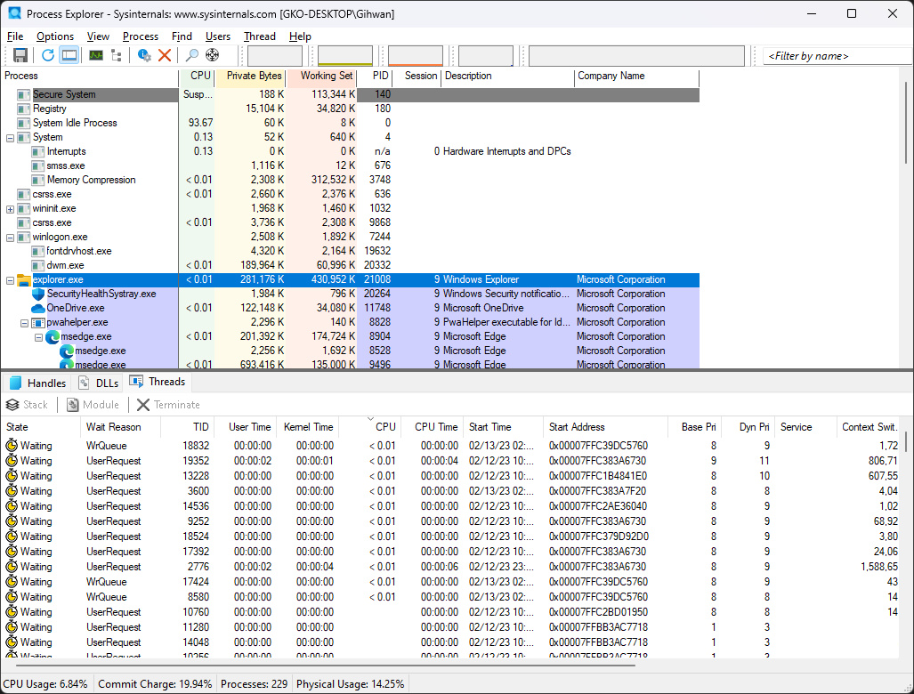

# 프로세스 탐색기
[프로세스 탐색기](https://learn.microsoft.com/en-us/sysinternals/downloads/process-explorer)(Process Explorer)는 현재 실행 중인 [프로세스](ko.Process.md)와 이에 관여되는 데이터(예를 들어 [핸들](ko.Process.md#핸들), [DLL](ko.C.md#라이브러리), [스레드](ko.Process.md#스레드) 등), 그리고 시스템 리소스 사용률을 실시간으로 확인할 수 있는 [Sysinternals](ko.Sysinternals.md) 유틸리티 프로그램이다. 다시 말해, 더 많은 기능을 내포하는 고급 [작업 관리자](https://ko.wikipedia.org/wiki/작업_관리자_(윈도우))라고 간주할 수 있다.

> 사용자의 선호도에 따라 작업 관리자를 대신하여 프로세스 탐색기가 실행되도록 레지스트리를 설정하는 옵션을 제공한다.
