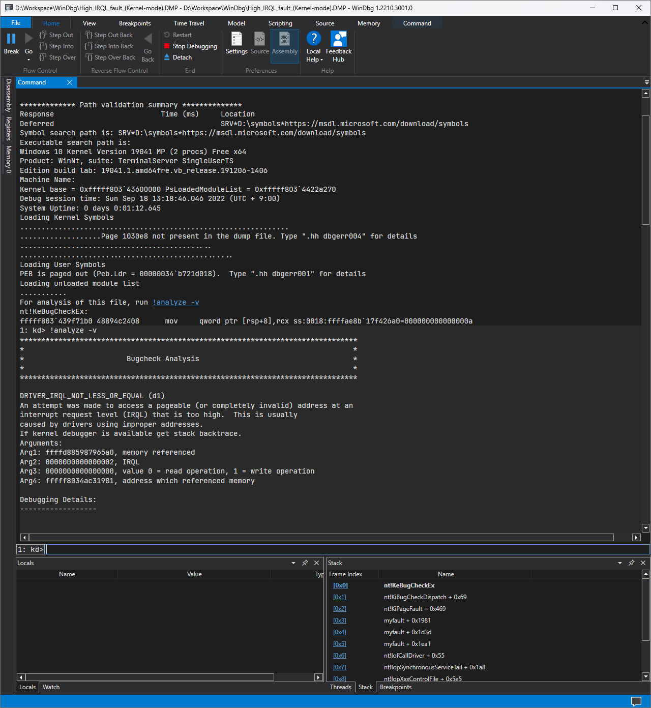

# WinDbg
[WinDbg](https://ko.wikipedia.org/wiki/WinDbg)<sub>([다운로드](https://apps.microsoft.com/store/detail/windbg-preview/9PGJGD53TN86))</sub>, 일명 윈도우 디버거(Windows Debugger)는 [윈도우](ko.Windows.md)에서 실행되는 [어플리케이션](ko.Process.md) 및 시스템 전체를 [디버깅](https://ko.wikipedia.org/wiki/디버그)하는 트러블슈팅 프로그램이다.

> 만일 윈도우 7 혹은 8.1 운영체제를 사용하거나, 혹은 Preview가 아닌 버전을 설치하려면 윈도우 [SDK](https://developer.microsoft.com/en-us/windows/downloads/windows-sdk/)를 통해 설치를 진행한다.



WinDbg는 흔히 어플리케이션 충돌이나 [블루스크린](ko.BSOD.md)으로 생성된 [덤프](ko.Dump.md) 파일을 분석하는 데 사용되며, 그 외에도 실시간 디버깅 및 TTD (Time Travel Debugging; 시간여행 디버깅) 등이 가능하다. 단, WinDbg는 [근본적인 원인 분석](https://en.wikipedia.org/wiki/Root_cause_analysis)을 위한 보조 도구에 불과하며 윈도우에서 발생한 모든 문제를 해결해 주는 게 아니다. 덤프에 남겨진 단서로부터 논리적이고 체계적인 방법론을 동원하여 합리적인 견해를 주장 및 조치 방안을 제시할 수 있어야 한다.

### 환경 변수 설정
WinDbg로부터 원활한 디버깅 작업을 진행하려면 아래와 같이 시스템 환경 변수를 설정하기를 권장한다.

<table style="width: 80%; margin: auto;">
<caption style="caption-side: top;">WinDbg 관련 환경 변수</caption>
<colgroup><col style="width: 30%;"/><col style="width: 70%;"/></colgroup>
<thead><tr><th style="text-align: center;">환경 변수</th><th style="text-align: center;">설명</th></tr></thead>
<tbody><tr><td style="text-align: center;"><code>_NT_SYMBOL_PATH</code></td><td><a href="ko.Symbol.md">심볼</a>(symbol) 서버 및 캐시 경로를 지정한다.</td></tr><tr><td style="text-align: center;"><code>_NT_DEBUGGER_EXTENSION_PATH</code></td><td>WinDbg 디버깅 확장도구가 위치한 폴더 경로를 명시한다: <a href="https://www.microsoft.com/en-us/download/details.aspx?id=53304">MEX</a> 확장도구 등</td></tr></tbody>
</table>

## !analyze 확장도구
[!analyze](https://learn.microsoft.com/en-us/windows-hardware/drivers/debugger/-analyze)는 WinDbg에 기본적으로 탑재된 확장도구 중에서도 증상을 개략적으로 파악하는 데 유용하다. 하지만 해당 확장도구 또한 WinDbg와 마찬가지로 문제의 원인을 제시하는 도구가 아니며, 본 내용은 !analyze가 제시하는 자동 진단 내용에 무엇이 있는지 소개한다. !analyze 확장도구의 진단 내용은 [마이크로소프트 공식 문서](https://learn.microsoft.com/en-us/windows-hardware/drivers/debugger/using-the--analyze-extension)에서 확인할 수 있다.

아래는 [C](ko.C.md) 프로그래밍 언어로 [예외](ko.C.md#예외)를 의도적으로 유발하여 충돌시킨 `ForceAppCrash.exe` 어플리케이션의 덤프를 !analyze로 진단한다.

```windbg
0:000> !analyze -v
*******************************************************************************
*                                                                             *
*                        Exception Analysis                                   *
*                                                                             *
*******************************************************************************

EXCEPTION_RECORD:  (.exr -1)
ExceptionAddress: 00007ff6ecfc1002 (ForceAppCrash!main+0x0000000000000002)
   ExceptionCode: c0000005 (Access violation)
  ExceptionFlags: 00000000
NumberParameters: 2
   Parameter[0]: 0000000000000001
   Parameter[1]: 0000000000000000
Attempt to write to address 0000000000000000
```

!analyze는 예외가 발생한 메모리 주소와 [NTSTATUS](https://learn.microsoft.com/en-us/openspecs/windows_protocols/ms-erref/596a1078-e883-4972-9bbc-49e60bebca55) 코드를 알려주며, 그리고 구체적으로 예외가 발생한 정황을 매개변수로 설명한다. 특히 NTSTATUS는 어떤 오류인지 알려주는 중요한 정보이며, 위의 덤프에서는 0xC0000005 STATUS_ACCESS_VIOLATION이란 유효하지 않은 메모리 접근을 확인하였다.

한편, 아래는 [NotMyFault](ko.NotMyFault.md)로 의도적으로 발생된 [블루스크린](ko.BSOD.md)에 의해 수집된 덤프를 !analyze로 진단한다.

```windbg
0: kd> !analyze -v
*******************************************************************************
*                                                                             *
*                        Bugcheck Analysis                                    *
*                                                                             *
*******************************************************************************

DRIVER_IRQL_NOT_LESS_OR_EQUAL (d1)
An attempt was made to access a pageable (or completely invalid) address at an
interrupt request level (IRQL) that is too high.  This is usually
caused by drivers using improper addresses.
If kernel debugger is available get stack backtrace.
Arguments:
Arg1: ffffc4899e155720, memory referenced
Arg2: 0000000000000002, IRQL
Arg3: 0000000000000000, value 0 = read operation, 1 = write operation
Arg4: fffff803999612d0, address which referenced memory
```

커널 덤프의 경우에는 NTSTATUS가 아닌 [bugcheck](https://learn.microsoft.com/en-us/windows-hardware/drivers/debugger/bug-check-code-reference2), 일명 중지코드와 함께 구체적인 정황을 소개하는 네 개의 매개변수를 알려준다. 위의 덤프는 bugcheck 0xD1 DRIVER_IRQL_NOT_LESS_OR_EQUAL이란 DISPATCH_LEVEL 이상의 IRQL에서 특정 메모리 주소(여기서는 `ffffc4899e155720`)를 접근하려는 시도를 포착하였다.

이렇게 어플리케이션과 커널 덤프에서 각각 오류에 대한 간단한 소개 이후, 분석에 필요한 추가 정보를 제공한다:

* 문제 발생 직전의 레지스트리

    ```windbg
    TRAP_FRAME:  ffff9e81031476e0 -- (.trap 0xffff9e81031476e0)
    rax=00000000d34a8f72 rbx=0000000000000000 rcx=0000000000000000
    rdx=ffffc4899d02bc60 rsi=0000000000000000 rdi=0000000000000000
    rip=fffff803999612d0 rsp=ffff9e8103147870 rbp=ffff9e8103147ae1
     r8=0000000000000002  r9=ffffc4899e100000 r10=ffffc48997600300
    r11=ffffc4899e14c710 r12=0000000000000000 r13=0000000000000000
    r14=0000000000000000 r15=0000000000000000
    iopl=0         nv up ei pl zr na po nc
    myfault+0x12d0:
    fffff803`999612d0 8b03            mov     eax,dword ptr [rbx] ds:00000000`00000000=????????
    ```

* 문제가 발생한 스택

    ```windbg
    STACK_TEXT:  
    ffff9e81`03147598 fffff803`7aa3e2a9     : 00000000`0000000a ffffc489`9e155720 00000000`00000002 00000000`00000000 : nt!KeBugCheckEx
    ffff9e81`031475a0 fffff803`7aa39934     : 00000000`00000fff 00000000`00001001 00000000`00000001 00007ffe`00000000 : nt!KiBugCheckDispatch+0x69
    ffff9e81`031476e0 fffff803`999612d0     : 00000000`656e6f4e ffffc489`9e14c720 ffff9e81`00000003 00000000`00000880 : nt!KiPageFault+0x474
    ffff9e81`03147870 fffff803`9996168e     : fffff803`d34a8f72 ffff9e81`031478f8 00000000`00000000 00000000`00000000 : myfault+0x12d0
    ffff9e81`031478a0 fffff803`999617f1     : ffffe681`038f55d0 fffff803`7b0e83a9 ffffe681`07a04db0 ffff9e81`031479a0 : myfault+0x168e
    ffff9e81`031479e0 fffff803`7a8cf765     : ffffe681`038f55d0 00000000`00000002 00000000`0000000c ffff9e81`03147b20 : myfault+0x17f1
    ffff9e81`03147a40 fffff803`7acddfc0     : ffffe681`038f55d0 ffff9e81`03147ae1 ffffe681`038f55d0 ffffe681`07a5fd60 : nt!IofCallDriver+0x55
    ffff9e81`03147a80 fffff803`7acdc58c     : 00000000`00000000 00000000`83360018 ffff9e81`03147ea0 ffffe681`038f55d0 : nt!IopSynchronousServiceTail+0x1d0
    ffff9e81`03147b30 fffff803`7acda866     : 00000000`00000000 00000000`00000000 00000000`00000000 00000000`00000000 : nt!IopXxxControlFile+0x72c
    ffff9e81`03147d40 fffff803`7aa3d9e8     : 00000000`00000000 00000000`00000000 ffff75ba`5f10e2ea ffff9e81`03147ea0 : nt!NtDeviceIoControlFile+0x56
    ffff9e81`03147db0 00007ffe`81aaeee4     : 00000000`00000000 00000000`00000000 00000000`00000000 00000000`00000000 : nt!KiSystemServiceCopyEnd+0x28
    0000008e`15fbe968 00000000`00000000     : 00000000`00000000 00000000`00000000 00000000`00000000 00000000`00000000 : 0x00007ffe`81aaeee4
    ```

위의 내용들은 각각 [어셈블리](ko.Assembly.md)와 스택 기반의 [메모리](ko.Memory.md) 할당 등의 컴퓨터공학 및 윈도우 운영체제에 대한 이해도가 요구된다. 본 문서에서는 언급한 이론들을 설명하지 않을 것이며, WinDbg를 사용하여 분석하기 위해 알아야 할 사항과 명령, 그리고 방법론을 위주로 소개한다.

# 같이 보기
* [Debugger Commands - Windows drivers &#124; Microsoft Learn](https://learn.microsoft.com/en-us/windows-hardware/drivers/debugger/debugger-commands)
